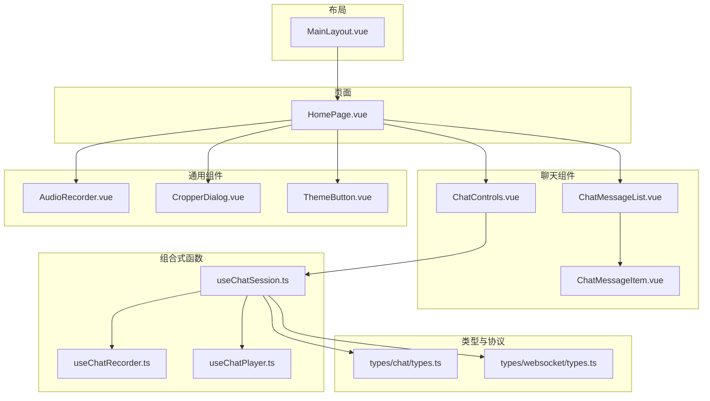
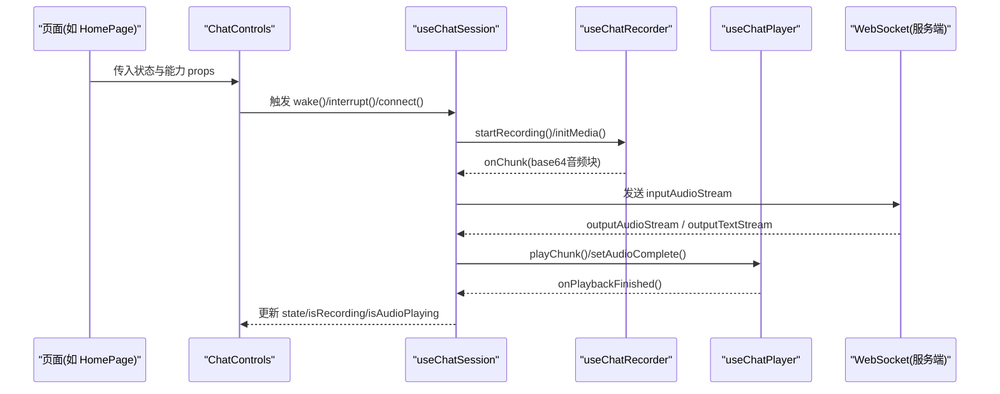
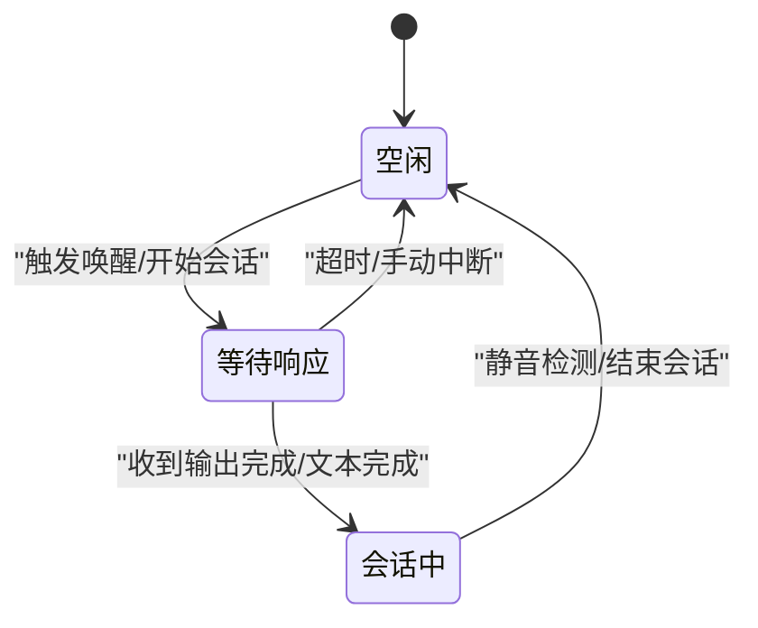
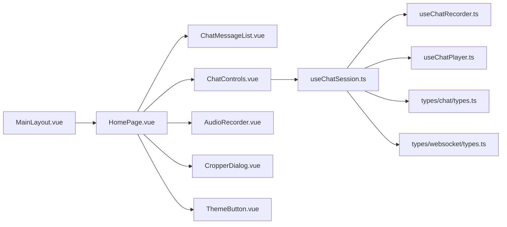

# 组件系统

<cite>
**本文引用的文件**
- [src/components/chat/ChatMessageItem.vue](file://src/components/chat/ChatMessageItem.vue)
- [src/components/chat/ChatMessageList.vue](file://src/components/chat/ChatMessageList.vue)
- [src/components/chat/ChatControls.vue](file://src/components/chat/ChatControls.vue)
- [src/components/navigations.ts](file://src/components/navigations.ts)
- [src/components/vpr-relationships.ts](file://src/components/vpr-relationships.ts)
- [src/components/AudioRecorder.vue](file://src/components/AudioRecorder.vue)
- [src/components/CropperDialog.vue](file://src/components/CropperDialog.vue)
- [src/components/ThemeButton.vue](file://src/components/ThemeButton.vue)
- [src/layouts/MainLayout.vue](file://src/layouts/MainLayout.vue)
- [src/pages/main/HomePage.vue](file://src/pages/main/HomePage.vue)
- [src/composables/useChatSession.ts](file://src/composables/useChatSession.ts)
- [src/composables/useChatRecorder.ts](file://src/composables/useChatRecorder.ts)
- [src/composables/useChatPlayer.ts](file://src/composables/useChatPlayer.ts)
- [src/types/chat/types.ts](file://src/types/chat/types.ts)
- [src/types/websocket/types.ts](file://src/types/websocket/types.ts)
</cite>

## 目录
1. [引言](#引言)
2. [项目结构](#项目结构)
3. [核心组件](#核心组件)
4. [架构总览](#架构总览)
5. [组件详解](#组件详解)
6. [依赖关系分析](#依赖关系分析)
7. [性能考量](#性能考量)
8. [故障排查指南](#故障排查指南)
9. [结论](#结论)
10. [附录](#附录)

## 引言
本设计文档面向 Le Bot 前端组件系统，目标是建立一套可复用、可维护、可扩展的组件设计与实现规范。文档从组件分类、命名与组织、通信模式、生命周期与状态管理、性能优化、API 设计与样式约定、可访问性支持、到与组合式函数协作模式进行系统化梳理，并提供使用示例、最佳实践与常见问题解决方案。

## 项目结构
前端采用按功能域分层的目录组织方式：
- 组件层：按功能域划分（chat、auth、home、me、settings 等），便于复用与边界清晰
- 布局层：MainLayout 等提供页面级容器与抽屉/页脚等通用布局
- 页面层：各路由页面，负责业务编排与数据拉取
- 组合式函数层：useChatSession、useChatRecorder、useChatPlayer 等封装横切能力
- 类型与常量：types 下统一定义消息、状态机、WebSocket 协议与超时参数
- 工具与国际化：i18n、common 工具等

图表来源
- [src/layouts/MainLayout.vue:1-51](file://src/layouts/MainLayout.vue#L1-L51)
- [src/pages/main/HomePage.vue:1-54](file://src/pages/main/HomePage.vue#L1-L54)
- [src/components/chat/ChatMessageList.vue:1-68](file://src/components/chat/ChatMessageList.vue#L1-L68)
- [src/components/chat/ChatMessageItem.vue:1-73](file://src/components/chat/ChatMessageItem.vue#L1-L73)
- [src/components/chat/ChatControls.vue:1-204](file://src/components/chat/ChatControls.vue#L1-L204)
- [src/composables/useChatSession.ts:1-589](file://src/composables/useChatSession.ts#L1-L589)
- [src/composables/useChatRecorder.ts:1-148](file://src/composables/useChatRecorder.ts#L1-L148)
- [src/composables/useChatPlayer.ts:1-161](file://src/composables/useChatPlayer.ts#L1-L161)
- [src/types/chat/types.ts:1-96](file://src/types/chat/types.ts#L1-L96)
- [src/types/websocket/types.ts:1-226](file://src/types/websocket/types.ts#L1-L226)

章节来源
- [src/layouts/MainLayout.vue:1-51](file://src/layouts/MainLayout.vue#L1-L51)
- [src/pages/main/HomePage.vue:1-54](file://src/pages/main/HomePage.vue#L1-L54)

## 核心组件
- 聊天组件族：ChatMessageItem、ChatMessageList、ChatControls，负责消息渲染、滚动与交互控制
- 通用组件：AudioRecorder、CropperDialog、ThemeButton，覆盖录音、图片裁剪与主题切换
- 布局与导航：MainLayout、navigations.ts、vpr-relationships.ts，提供页面容器与导航配置
- 组合式函数：useChatSession、useChatRecorder、useChatPlayer，封装会话、录音与播放的复杂状态与生命周期

章节来源
- [src/components/chat/ChatMessageItem.vue:1-73](file://src/components/chat/ChatMessageItem.vue#L1-L73)
- [src/components/chat/ChatMessageList.vue:1-68](file://src/components/chat/ChatMessageList.vue#L1-L68)
- [src/components/chat/ChatControls.vue:1-204](file://src/components/chat/ChatControls.vue#L1-L204)
- [src/components/AudioRecorder.vue:1-113](file://src/components/AudioRecorder.vue#L1-L113)
- [src/components/CropperDialog.vue:1-154](file://src/components/CropperDialog.vue#L1-L154)
- [src/components/ThemeButton.vue:1-28](file://src/components/ThemeButton.vue#L1-L28)
- [src/components/navigations.ts:1-95](file://src/components/navigations.ts#L1-L95)
- [src/components/vpr-relationships.ts:1-19](file://src/components/vpr-relationships.ts#L1-L19)
- [src/composables/useChatSession.ts:1-589](file://src/composables/useChatSession.ts#L1-L589)
- [src/composables/useChatRecorder.ts:1-148](file://src/composables/useChatRecorder.ts#L1-L148)
- [src/composables/useChatPlayer.ts:1-161](file://src/composables/useChatPlayer.ts#L1-L161)

## 架构总览
组件系统围绕“页面 + 组件 + 组合式函数 + 类型/协议”的分层架构展开。页面负责业务编排与路由跳转；组件负责 UI 展示与交互；组合式函数封装跨页面的复杂状态与生命周期；类型与协议定义统一的数据结构与通信契约。

图表来源
- [src/pages/main/HomePage.vue:1-54](file://src/pages/main/HomePage.vue#L1-L54)
- [src/components/chat/ChatControls.vue:1-204](file://src/components/chat/ChatControls.vue#L1-L204)
- [src/composables/useChatSession.ts:1-589](file://src/composables/useChatSession.ts#L1-L589)
- [src/composables/useChatRecorder.ts:1-148](file://src/composables/useChatRecorder.ts#L1-L148)
- [src/composables/useChatPlayer.ts:1-161](file://src/composables/useChatPlayer.ts#L1-L161)
- [src/types/websocket/types.ts:1-226](file://src/types/websocket/types.ts#L1-L226)

## 组件详解

### 组件分类体系
- 页面组件：位于 pages 目录，负责业务编排与路由跳转，如 HomePage
- 业务组件：位于 components 目录下按领域划分，如 chat、auth、home、me、settings 等，如 ChatMessageItem、ChatMessageList、ChatControls
- 基础组件：通用 UI 组件，如 AudioRecorder、CropperDialog、ThemeButton
- 布局组件：提供页面容器与抽屉/页脚等，如 MainLayout

章节来源
- [src/pages/main/HomePage.vue:1-54](file://src/pages/main/HomePage.vue#L1-L54)
- [src/layouts/MainLayout.vue:1-51](file://src/layouts/MainLayout.vue#L1-L51)
- [src/components/chat/ChatMessageItem.vue:1-73](file://src/components/chat/ChatMessageItem.vue#L1-L73)
- [src/components/chat/ChatMessageList.vue:1-68](file://src/components/chat/ChatMessageList.vue#L1-L68)
- [src/components/chat/ChatControls.vue:1-204](file://src/components/chat/ChatControls.vue#L1-L204)
- [src/components/AudioRecorder.vue:1-113](file://src/components/AudioRecorder.vue#L1-L113)
- [src/components/CropperDialog.vue:1-154](file://src/components/CropperDialog.vue#L1-L154)
- [src/components/ThemeButton.vue:1-28](file://src/components/ThemeButton.vue#L1-L28)

### 组件通信模式
- Props 传递：父组件向子组件传递只读状态与回调，如 ChatControls 接收 state、isConnected、isMediaReady 等
- 事件发射：子组件通过 $emit 向父组件发送动作事件，如 ChatControls 发出 wake、interrupt、connect、disconnect
- 插槽使用：在需要扩展内容或自定义头像区域时使用具名插槽（例如 ChatMessageItem 的 avatar 插槽）
- provide/inject 模式：当前代码未直接使用 provide/inject，建议在深层嵌套场景中引入以降低 props 打洞成本

章节来源
- [src/components/chat/ChatControls.vue:1-204](file://src/components/chat/ChatControls.vue#L1-L204)
- [src/components/chat/ChatMessageItem.vue:1-73](file://src/components/chat/ChatMessageItem.vue#L1-L73)

### 生命周期管理与状态管理
- 页面级生命周期：页面组件在挂载前校验登录态，必要时重定向至认证页
- 组件级生命周期：通用组件在 onMounted 获取媒体流，在 onBeforeUnmount 释放资源
- 组合式函数生命周期：useChatSession 在 connect 时初始化录音、播放器与监听器；在 destroy/disconnect 时清理定时器、撤销 URL、关闭上下文
- 状态机：ChatState 定义 Idle/WaitingResponse/Active 三态，useChatSession 实现与服务器消息驱动的状态转换

图表来源
- [src/types/chat/types.ts:11-19](file://src/types/chat/types.ts#L11-L19)
- [src/composables/useChatSession.ts:244-303](file://src/composables/useChatSession.ts#L244-L303)

章节来源
- [src/pages/main/HomePage.vue:24-28](file://src/pages/main/HomePage.vue#L24-L28)
- [src/components/AudioRecorder.vue:69-86](file://src/components/AudioRecorder.vue#L69-L86)
- [src/composables/useChatSession.ts:427-447](file://src/composables/useChatSession.ts#L427-L447)
- [src/types/chat/types.ts:11-19](file://src/types/chat/types.ts#L11-L19)

### 组件 API 设计规范
- Props 命名：语义化、简洁，避免布尔翻转；如 isConnected、isMediaReady、isRecording
- Emits 命名：动词短语，明确意图；如 wake、interrupt、connect、disconnect
- 插槽命名：语义化，如 avatar
- 返回值：组合式函数返回统一的 UseXxxReturn 接口，暴露状态与方法

章节来源
- [src/components/chat/ChatControls.vue:6-28](file://src/components/chat/ChatControls.vue#L6-L28)
- [src/components/chat/ChatMessageItem.vue:6-8](file://src/components/chat/ChatMessageItem.vue#L6-L8)
- [src/composables/useChatSession.ts:32-61](file://src/composables/useChatSession.ts#L32-L61)

### 样式约定
- 使用 SCSS 并按组件作用域样式组织，避免全局污染
- 颜色与尺寸遵循 Quasar 变量与暗色主题适配
- 动画与指示器（脉冲、闪烁）仅在必要状态启用，避免过度动画影响性能

章节来源
- [src/components/chat/ChatMessageItem.vue:54-72](file://src/components/chat/ChatMessageItem.vue#L54-L72)
- [src/components/chat/ChatControls.vue:164-204](file://src/components/chat/ChatControls.vue#L164-L204)

### 可访问性支持
- 为按钮与图标提供语义化标签与提示
- 控制状态变化时保持焦点与屏幕阅读器友好
- 提供加载与空状态的视觉与文本提示

章节来源
- [src/components/ThemeButton.vue:13-25](file://src/components/ThemeButton.vue#L13-L25)
- [src/components/chat/ChatMessageList.vue:44-56](file://src/components/chat/ChatMessageList.vue#L44-L56)

### 与组合式函数的协作模式
- 页面组件通过组合式函数获取状态与方法，避免重复逻辑
- 组合式函数内部封装订阅、定时器、媒体上下文与 WebSocket 处理
- 通过统一的类型与协议约束，保证前后端一致性

章节来源
- [src/pages/main/HomePage.vue:1-54](file://src/pages/main/HomePage.vue#L1-L54)
- [src/composables/useChatSession.ts:1-589](file://src/composables/useChatSession.ts#L1-L589)
- [src/types/websocket/types.ts:1-226](file://src/types/websocket/types.ts#L1-L226)

### 组件使用示例与最佳实践
- 聊天页面：在页面中注入 useChatSession，将返回的状态与方法传给 ChatControls 与 ChatMessageList
- 录音组件：在需要录制音频的页面中使用 AudioRecorder，处理 start/stop/data 事件
- 图片裁剪：通过 CropperDialog 打开裁剪对话框，确认后回传裁剪结果
- 主题切换：在任意页面使用 ThemeButton 切换主题

章节来源
- [src/pages/main/HomePage.vue:1-54](file://src/pages/main/HomePage.vue#L1-L54)
- [src/components/AudioRecorder.vue:1-113](file://src/components/AudioRecorder.vue#L1-L113)
- [src/components/CropperDialog.vue:1-154](file://src/components/CropperDialog.vue#L1-L154)
- [src/components/ThemeButton.vue:1-28](file://src/components/ThemeButton.vue#L1-L28)

### 常见问题与解决方案
- 媒体权限被拒：在 onMounted 中捕获错误并通过通知组件提示用户授权
- 音频播放卡顿：确保在播放前解码完成，避免并发源过多；使用 stopPlayback 清理残留源
- WebSocket 连接异常：在连接建立后发送更新配置请求，并设置超时检查
- 资源泄漏：在 onBeforeUnmount 或 destroy 中释放媒体流、撤销 URL、关闭 AudioContext、清理定时器

章节来源
- [src/components/AudioRecorder.vue:52-58](file://src/components/AudioRecorder.vue#L52-L58)
- [src/composables/useChatPlayer.ts:107-123](file://src/composables/useChatPlayer.ts#L107-L123)
- [src/composables/useChatSession.ts:380-447](file://src/composables/useChatSession.ts#L380-L447)

## 依赖关系分析
- 页面依赖组件：HomePage 依赖 DeviceCard、TopicCard、ChatControls 等
- 组件依赖组合式函数：ChatControls、useChatSession、useChatRecorder、useChatPlayer
- 组件依赖类型与协议：ChatMessage、ChatState、WsAction、请求/响应类型
- 布局依赖通用组件：MainLayout 通过路由视图承载头部、侧边栏、页脚与主内容区

图表来源
- [src/pages/main/HomePage.vue:1-54](file://src/pages/main/HomePage.vue#L1-L54)
- [src/components/chat/ChatMessageList.vue:1-68](file://src/components/chat/ChatMessageList.vue#L1-L68)
- [src/components/chat/ChatControls.vue:1-204](file://src/components/chat/ChatControls.vue#L1-L204)
- [src/composables/useChatSession.ts:1-589](file://src/composables/useChatSession.ts#L1-L589)
- [src/composables/useChatRecorder.ts:1-148](file://src/composables/useChatRecorder.ts#L1-L148)
- [src/composables/useChatPlayer.ts:1-161](file://src/composables/useChatPlayer.ts#L1-L161)
- [src/types/chat/types.ts:1-96](file://src/types/chat/types.ts#L1-L96)
- [src/types/websocket/types.ts:1-226](file://src/types/websocket/types.ts#L1-L226)
- [src/layouts/MainLayout.vue:1-51](file://src/layouts/MainLayout.vue#L1-L51)

章节来源
- [src/pages/main/HomePage.vue:1-54](file://src/pages/main/HomePage.vue#L1-L54)
- [src/layouts/MainLayout.vue:1-51](file://src/layouts/MainLayout.vue#L1-L51)

## 性能考量
- 按需渲染：列表组件基于消息长度与最后一条消息文本变更触发滚动，避免全量重绘
- 资源释放：录音、播放、WebSocket、定时器与对象 URL 在销毁阶段统一清理
- 媒体上下文：复用 AudioContext，避免频繁创建导致延迟
- 状态机节流：等待响应超时与取消冷却时间避免频繁操作
- 滚动优化：仅在新增消息或最后一条消息文本更新时滚动到底部

章节来源
- [src/components/chat/ChatMessageList.vue:14-41](file://src/components/chat/ChatMessageList.vue#L14-L41)
- [src/composables/useChatSession.ts:346-365](file://src/composables/useChatSession.ts#L346-L365)
- [src/composables/useChatPlayer.ts:35-160](file://src/composables/useChatPlayer.ts#L35-L160)
- [src/composables/useChatRecorder.ts:36-148](file://src/composables/useChatRecorder.ts#L36-L148)

## 故障排查指南
- 无法录音：检查浏览器权限与设备可用性；在 onMounted 中捕获错误并提示
- 播放无声：确认解码成功与 AudioContext 正常；检查是否调用 setAudioComplete
- 连接失败：确认 WebSocket 地址与 token；检查服务端握手与心跳
- 内存泄漏：确保在组件卸载时调用 destroy/disconnect，撤销所有 URL

章节来源
- [src/components/AudioRecorder.vue:52-58](file://src/components/AudioRecorder.vue#L52-L58)
- [src/composables/useChatPlayer.ts:98-105](file://src/composables/useChatPlayer.ts#L98-L105)
- [src/composables/useChatSession.ts:379-447](file://src/composables/useChatSession.ts#L379-L447)

## 结论
该组件系统通过清晰的分层与职责划分，结合组合式函数对复杂状态与生命周期的封装，实现了高内聚、低耦合的可复用组件体系。配合统一的类型与协议、完善的生命周期与资源管理策略，能够稳定支撑聊天、录音、裁剪、主题切换等核心业务场景。

## 附录
- 导航配置：MAIN_NAVIGATIONS 与 STACK_NAVIGATIONS 提供多套导航选项，支持国际化标签
- 关系映射：RELATIONSHIP_MAPPINGS 与 RELATIONSHIP_OPTIONS 提供枚举与选项列表，便于表单选择

章节来源
- [src/components/navigations.ts:12-94](file://src/components/navigations.ts#L12-L94)
- [src/components/vpr-relationships.ts:5-19](file://src/components/vpr-relationships.ts#L5-L19)