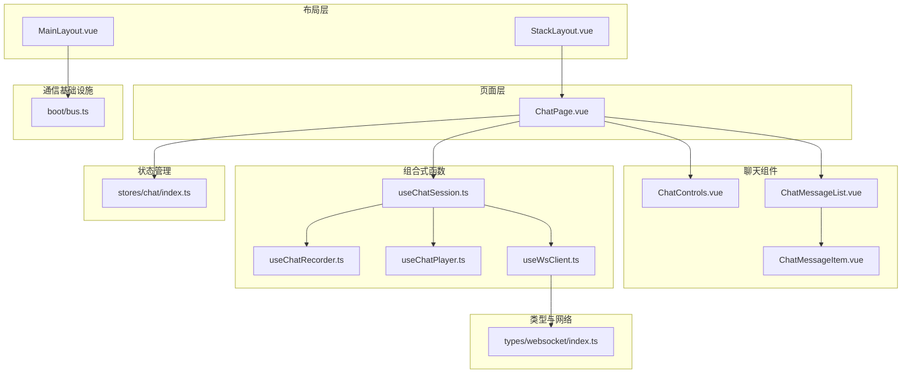
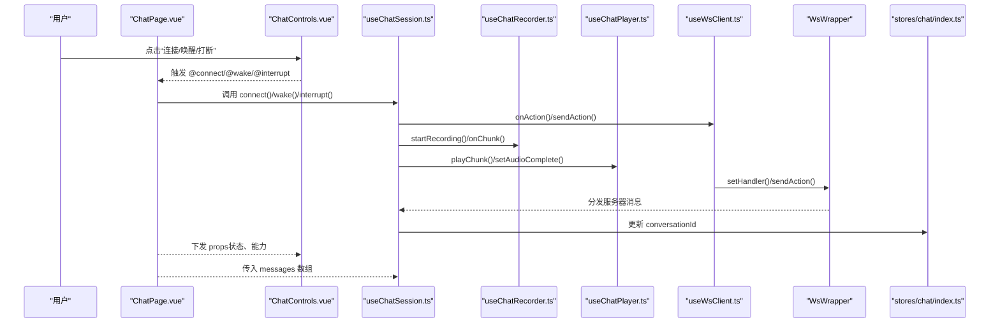
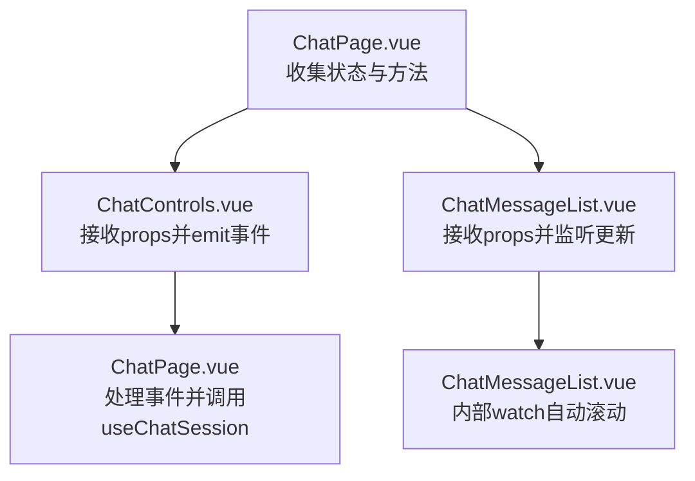
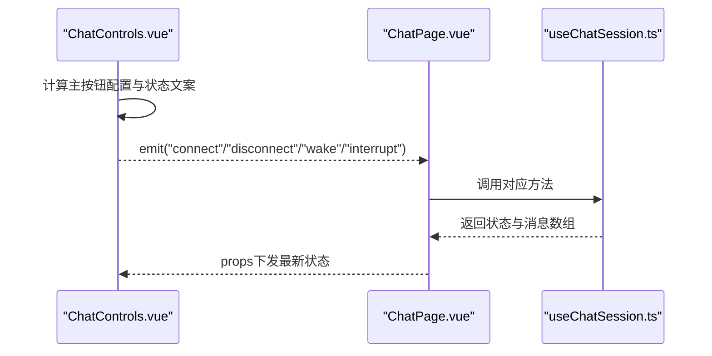
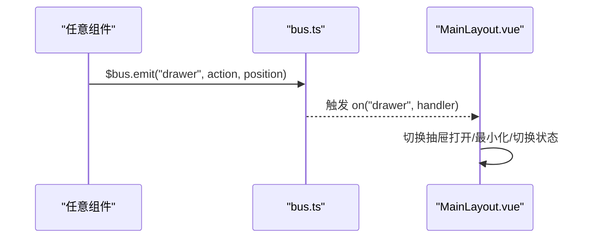
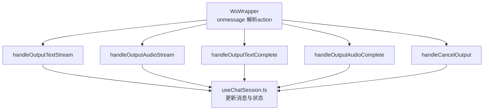
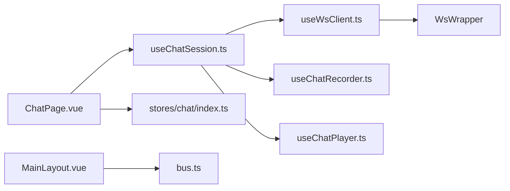

# 组件通信模式

<cite>
**本文引用的文件**
- [src/pages/stack/ChatPage.vue](file://src/pages/stack/ChatPage.vue)
- [src/components/chat/ChatControls.vue](file://src/components/chat/ChatControls.vue)
- [src/components/chat/ChatMessageList.vue](file://src/components/chat/ChatMessageList.vue)
- [src/components/chat/ChatMessageItem.vue](file://src/components/chat/ChatMessageItem.vue)
- [src/composables/useChatSession.ts](file://src/composables/useChatSession.ts)
- [src/composables/useChatRecorder.ts](file://src/composables/useChatRecorder.ts)
- [src/composables/useChatPlayer.ts](file://src/composables/useChatPlayer.ts)
- [src/composables/useWsClient.ts](file://src/composables/useWsClient.ts)
- [src/types/websocket/index.ts](file://src/types/websocket/index.ts)
- [src/stores/chat/index.ts](file://src/stores/chat/index.ts)
- [src/boot/bus.ts](file://src/boot/bus.ts)
- [src/layouts/MainLayout.vue](file://src/layouts/MainLayout.vue)
- [src/layouts/StackLayout.vue](file://src/layouts/StackLayout.vue)
</cite>

## 目录
1. [引言](#引言)
2. [项目结构](#项目结构)
3. [核心组件](#核心组件)
4. [架构总览](#架构总览)
5. [详细组件分析](#详细组件分析)
6. [依赖关系分析](#依赖关系分析)
7. [性能考量](#性能考量)
8. [故障排查指南](#故障排查指南)
9. [结论](#结论)
10. [附录：通信模式选择与最佳实践](#附录通信模式选择与最佳实践)

## 引言
本文件系统性梳理 Le Bot 前端的组件通信模式，围绕 props 传递、事件发射、插槽使用、provide/inject 模式以及事件总线等进行深入解析。结合聊天页面的实际实现，给出适用场景、性能特征、使用限制与最佳实践，并提供可直接定位到源码路径的参考位置，帮助开发者在父子、兄弟与跨层级场景中做出合理选择。

## 项目结构
本项目采用基于功能域的组织方式，聊天相关逻辑集中在 pages/stack/ChatPage.vue 及其子组件中；通过组合式函数（composables）封装状态与行为，通过 Pinia store 管理共享状态；通过全局事件总线实现跨层级通信。

图表来源
- [src/pages/stack/ChatPage.vue:1-179](file://src/pages/stack/ChatPage.vue#L1-L179)
- [src/components/chat/ChatControls.vue:1-204](file://src/components/chat/ChatControls.vue#L1-L204)
- [src/components/chat/ChatMessageList.vue:1-68](file://src/components/chat/ChatMessageList.vue#L1-L68)
- [src/components/chat/ChatMessageItem.vue:1-73](file://src/components/chat/ChatMessageItem.vue#L1-L73)
- [src/composables/useChatSession.ts:1-589](file://src/composables/useChatSession.ts#L1-L589)
- [src/composables/useChatRecorder.ts:1-148](file://src/composables/useChatRecorder.ts#L1-L148)
- [src/composables/useChatPlayer.ts:1-161](file://src/composables/useChatPlayer.ts#L1-L161)
- [src/composables/useWsClient.ts:1-102](file://src/composables/useWsClient.ts#L1-L102)
- [src/types/websocket/index.ts:1-91](file://src/types/websocket/index.ts#L1-L91)
- [src/stores/chat/index.ts:1-17](file://src/stores/chat/index.ts#L1-L17)
- [src/boot/bus.ts:1-18](file://src/boot/bus.ts#L1-L18)
- [src/layouts/MainLayout.vue:1-51](file://src/layouts/MainLayout.vue#L1-L51)
- [src/layouts/StackLayout.vue:1-17](file://src/layouts/StackLayout.vue#L1-L17)

章节来源
- [src/pages/stack/ChatPage.vue:1-179](file://src/pages/stack/ChatPage.vue#L1-L179)
- [src/layouts/StackLayout.vue:1-17](file://src/layouts/StackLayout.vue#L1-L17)

## 核心组件
- 聊天页面 ChatPage.vue：作为根容器，聚合 useChatSession 的状态与方法，向下分发 props 并接收子组件事件，同时负责生命周期资源释放。
- 控件区 ChatControls.vue：接收状态 props，向上发射用户交互事件（如连接、唤醒、打断、断开），承担 UI 行为编排。
- 消息列表 ChatMessageList.vue：接收消息数组 props，内部监听长度与最后一条消息文本变化，自动滚动到底部。
- 消息项 ChatMessageItem.vue：接收单条消息 props，渲染文本、音频与状态指示。
- 会话组合式 useChatSession.ts：统一编排 WebSocket、录音、播放、静音检测与唤醒词，维护三态机与消息流。
- 录音组合式 useChatRecorder.ts：提供麦克风初始化、200ms 音频块回调与静音分析节点。
- 播放组合式 useChatPlayer.ts：解码并调度连续音频块，支持中断与完成标记。
- WebSocket 客户端 useWsClient.ts：封装 WsWrapper，提供连接状态、动作订阅与请求发送。
- WebSocket 封装 WsWrapper：负责连接、重连、消息分发与动作处理器注册。
- 聊天 store：持久化 conversationId，用于 UI 展示与上下文清理。
- 全局事件总线 bus.ts：提供抽屉控制事件，供布局层响应。

章节来源
- [src/pages/stack/ChatPage.vue:1-179](file://src/pages/stack/ChatPage.vue#L1-L179)
- [src/components/chat/ChatControls.vue:1-204](file://src/components/chat/ChatControls.vue#L1-L204)
- [src/components/chat/ChatMessageList.vue:1-68](file://src/components/chat/ChatMessageList.vue#L1-L68)
- [src/components/chat/ChatMessageItem.vue:1-73](file://src/components/chat/ChatMessageItem.vue#L1-L73)
- [src/composables/useChatSession.ts:1-589](file://src/composables/useChatSession.ts#L1-L589)
- [src/composables/useChatRecorder.ts:1-148](file://src/composables/useChatRecorder.ts#L1-L148)
- [src/composables/useChatPlayer.ts:1-161](file://src/composables/useChatPlayer.ts#L1-L161)
- [src/composables/useWsClient.ts:1-102](file://src/composables/useWsClient.ts#L1-L102)
- [src/types/websocket/index.ts:1-91](file://src/types/websocket/index.ts#L1-L91)
- [src/stores/chat/index.ts:1-17](file://src/stores/chat/index.ts#L1-L17)
- [src/boot/bus.ts:1-18](file://src/boot/bus.ts#L1-L18)

## 架构总览
下图展示从用户交互到服务端响应的完整链路，以及各通信方式在其中的角色。

图表来源
- [src/pages/stack/ChatPage.vue:1-179](file://src/pages/stack/ChatPage.vue#L1-L179)
- [src/components/chat/ChatControls.vue:1-204](file://src/components/chat/ChatControls.vue#L1-L204)
- [src/composables/useChatSession.ts:1-589](file://src/composables/useChatSession.ts#L1-L589)
- [src/composables/useChatRecorder.ts:1-148](file://src/composables/useChatRecorder.ts#L1-L148)
- [src/composables/useChatPlayer.ts:1-161](file://src/composables/useChatPlayer.ts#L1-L161)
- [src/composables/useWsClient.ts:1-102](file://src/composables/useWsClient.ts#L1-L102)
- [src/types/websocket/index.ts:1-91](file://src/types/websocket/index.ts#L1-L91)
- [src/stores/chat/index.ts:1-17](file://src/stores/chat/index.ts#L1-L17)

## 详细组件分析

### 父子组件通信：props 传递与事件发射
- ChatPage.vue 向 ChatControls.vue 传递只读状态 props，向 ChatMessageList.vue 传递消息数组 props。
- ChatControls.vue 通过 emit 向上抛出用户操作事件（connect、disconnect、wake、interrupt），由 ChatPage.vue 接收并调用 useChatSession 的方法。
- ChatMessageList.vue 内部监听 props 变化以触发自动滚动，不向外发射事件。

图表来源
- [src/pages/stack/ChatPage.vue:1-179](file://src/pages/stack/ChatPage.vue#L1-L179)
- [src/components/chat/ChatControls.vue:1-204](file://src/components/chat/ChatControls.vue#L1-L204)
- [src/components/chat/ChatMessageList.vue:1-68](file://src/components/chat/ChatMessageList.vue#L1-L68)

章节来源
- [src/pages/stack/ChatPage.vue:1-179](file://src/pages/stack/ChatPage.vue#L1-L179)
- [src/components/chat/ChatControls.vue:1-204](file://src/components/chat/ChatControls.vue#L1-L204)
- [src/components/chat/ChatMessageList.vue:1-68](file://src/components/chat/ChatMessageList.vue#L1-L68)

### 事件发射：从按钮到会话控制
- ChatControls.vue 使用 defineEmits 声明事件签名，根据当前状态动态决定主按钮行为与禁用态。
- ChatPage.vue 在模板中绑定 @connect/@disconnect/@wake/@interrupt，分别映射到 connect/disconnect/wake/interrupt 方法。
- useChatSession 在 connect 中注册录音块回调与静音检测回调，在 wake 中创建用户消息并启动会话。

图表来源
- [src/components/chat/ChatControls.vue:1-204](file://src/components/chat/ChatControls.vue#L1-L204)
- [src/pages/stack/ChatPage.vue:1-179](file://src/pages/stack/ChatPage.vue#L1-L179)
- [src/composables/useChatSession.ts:1-589](file://src/composables/useChatSession.ts#L1-L589)

章节来源
- [src/components/chat/ChatControls.vue:1-204](file://src/components/chat/ChatControls.vue#L1-L204)
- [src/pages/stack/ChatPage.vue:1-179](file://src/pages/stack/ChatPage.vue#L1-L179)
- [src/composables/useChatSession.ts:1-589](file://src/composables/useChatSession.ts#L1-L589)

### 插槽使用：内容投影与自定义头像
- ChatMessageItem.vue 使用具名插槽 #avatar 投影自定义头像区域，实现消息项的可扩展外观。
- ChatMessageList.vue 通过 v-for 渲染多个 ChatMessageItem，每个项接收独立的 message props。

章节来源
- [src/components/chat/ChatMessageItem.vue:1-73](file://src/components/chat/ChatMessageItem.vue#L1-L73)
- [src/components/chat/ChatMessageList.vue:1-68](file://src/components/chat/ChatMessageList.vue#L1-L68)

### provide/inject 模式：全局事件总线
- boot/bus.ts 创建全局 EventBus 实例，并将其挂载到全局配置，供任意组件访问。
- MainLayout.vue 注册 bus.on('drawer', ...)，接收抽屉控制事件，实现跨层级抽屉状态同步。
- StackLayout.vue 作为页面容器，不直接参与抽屉逻辑，但承载路由视图。

图表来源
- [src/boot/bus.ts:1-18](file://src/boot/bus.ts#L1-L18)
- [src/layouts/MainLayout.vue:1-51](file://src/layouts/MainLayout.vue#L1-L51)

章节来源
- [src/boot/bus.ts:1-18](file://src/boot/bus.ts#L1-L18)
- [src/layouts/MainLayout.vue:1-51](file://src/layouts/MainLayout.vue#L1-L51)

### 事件总线：跨层级通信
- 事件总线适用于非直系祖先-后代关系的组件通信，例如布局层与页面层之间的抽屉控制。
- 事件总线的优势在于解耦性强、使用简单；缺点是可追踪性较弱，需谨慎命名与作用域管理。

章节来源
- [src/boot/bus.ts:1-18](file://src/boot/bus.ts#L1-L18)
- [src/layouts/MainLayout.vue:1-51](file://src/layouts/MainLayout.vue#L1-L51)

### WebSocket 通信：typed 动作与状态同步
- useWsClient.ts 提供 onAction/sendAction/isConnected 等接口，封装 WsWrapper 的连接与消息分发。
- WsWrapper 在 onmessage 中按 action 分发给已注册处理器，未匹配时发出通知并记录日志。
- useChatSession.ts 在 connect 前后注册各类动作处理器，处理文本流、音频流、完成与取消等事件，驱动三态机与消息数组更新。

图表来源
- [src/composables/useWsClient.ts:1-102](file://src/composables/useWsClient.ts#L1-L102)
- [src/types/websocket/index.ts:1-91](file://src/types/websocket/index.ts#L1-L91)
- [src/composables/useChatSession.ts:1-589](file://src/composables/useChatSession.ts#L1-L589)

章节来源
- [src/composables/useWsClient.ts:1-102](file://src/composables/useWsClient.ts#L1-L102)
- [src/types/websocket/index.ts:1-91](file://src/types/websocket/index.ts#L1-L91)
- [src/composables/useChatSession.ts:1-589](file://src/composables/useChatSession.ts#L1-L589)

### 数据流向与状态同步策略
- 单向数据流：ChatPage.vue 作为状态汇聚点，将 reactive 状态通过 props 下发至子组件；子组件仅通过事件向上反馈。
- 事件驱动：useChatSession 通过 onAction 注册的处理器响应服务器推送，更新消息数组与状态机，进而触发 UI 重新渲染。
- store 同步：conversationId 通过 store 持久化并在 UI 展示，便于上下文清理与调试。

章节来源
- [src/pages/stack/ChatPage.vue:1-179](file://src/pages/stack/ChatPage.vue#L1-L179)
- [src/composables/useChatSession.ts:1-589](file://src/composables/useChatSession.ts#L1-L589)
- [src/stores/chat/index.ts:1-17](file://src/stores/chat/index.ts#L1-L17)

## 依赖关系分析
- 组件依赖：ChatPage.vue 依赖 useChatSession，后者进一步依赖 useWsClient、useChatRecorder、useChatPlayer。
- 网络依赖：useWsClient 依赖 WsWrapper，后者依赖原生 WebSocket。
- 状态依赖：ChatPage.vue 依赖 Pinia store 以持久化 conversationId。
- 布局依赖：MainLayout.vue 依赖 bus.ts 实现抽屉控制。

图表来源
- [src/pages/stack/ChatPage.vue:1-179](file://src/pages/stack/ChatPage.vue#L1-L179)
- [src/composables/useChatSession.ts:1-589](file://src/composables/useChatSession.ts#L1-L589)
- [src/composables/useWsClient.ts:1-102](file://src/composables/useWsClient.ts#L1-L102)
- [src/composables/useChatRecorder.ts:1-148](file://src/composables/useChatRecorder.ts#L1-L148)
- [src/composables/useChatPlayer.ts:1-161](file://src/composables/useChatPlayer.ts#L1-L161)
- [src/types/websocket/index.ts:1-91](file://src/types/websocket/index.ts#L1-L91)
- [src/stores/chat/index.ts:1-17](file://src/stores/chat/index.ts#L1-L17)
- [src/layouts/MainLayout.vue:1-51](file://src/layouts/MainLayout.vue#L1-L51)
- [src/boot/bus.ts:1-18](file://src/boot/bus.ts#L1-L18)

章节来源
- [src/pages/stack/ChatPage.vue:1-179](file://src/pages/stack/ChatPage.vue#L1-L179)
- [src/composables/useChatSession.ts:1-589](file://src/composables/useChatSession.ts#L1-L589)
- [src/composables/useWsClient.ts:1-102](file://src/composables/useWsClient.ts#L1-L102)
- [src/types/websocket/index.ts:1-91](file://src/types/websocket/index.ts#L1-L91)
- [src/stores/chat/index.ts:1-17](file://src/stores/chat/index.ts#L1-L17)
- [src/layouts/MainLayout.vue:1-51](file://src/layouts/MainLayout.vue#L1-L51)
- [src/boot/bus.ts:1-18](file://src/boot/bus.ts#L1-L18)

## 性能考量
- props 传递：适合稳定、低频更新的数据；避免在 props 中传递大型对象或频繁变化的引用，减少不必要的重渲染。
- 事件发射：事件数量应受控，避免在高频循环中频繁触发；必要时使用防抖/节流。
- 插槽使用：尽量保持插槽内容轻量，避免在插槽中执行复杂计算。
- 事件总线：事件命名需唯一且语义明确；避免在热路径中滥用；及时注销监听器。
- WebSocket：动作处理器应快速返回，避免阻塞消息处理；对音频/文本流处理应异步化，避免主线程阻塞。
- 录音与播放：录音块大小与播放调度需平衡延迟与稳定性；播放完成后及时释放资源。

## 故障排查指南
- 连接问题：检查 useWsClient 的连接状态与 onOpen 回调是否触发；确认 WsWrapper 的重连逻辑与 onclose 处理。
- 消息不显示：确认 ChatMessageList 是否正确接收 messages；检查 watch 对 props.length 与最后一条消息文本的监听是否生效。
- 音频异常：核对 useChatPlayer 的 playChunk 解码流程与 setAudioComplete 标记；检查录音块拼接与 URL 释放。
- 事件未响应：核对 ChatControls 的 emit 与 ChatPage 的事件绑定；检查 useChatSession 的方法调用链。
- 抽屉不工作：确认 bus 的事件名与参数一致；检查 MainLayout 的监听器是否注册成功。

章节来源
- [src/composables/useWsClient.ts:1-102](file://src/composables/useWsClient.ts#L1-L102)
- [src/types/websocket/index.ts:1-91](file://src/types/websocket/index.ts#L1-L91)
- [src/components/chat/ChatMessageList.vue:1-68](file://src/components/chat/ChatMessageList.vue#L1-L68)
- [src/composables/useChatPlayer.ts:1-161](file://src/composables/useChatPlayer.ts#L1-L161)
- [src/components/chat/ChatControls.vue:1-204](file://src/components/chat/ChatControls.vue#L1-L204)
- [src/composables/useChatSession.ts:1-589](file://src/composables/useChatSession.ts#L1-L589)
- [src/boot/bus.ts:1-18](file://src/boot/bus.ts#L1-L18)
- [src/layouts/MainLayout.vue:1-51](file://src/layouts/MainLayout.vue#L1-L51)

## 结论
本项目在组件通信上形成了清晰的层次：以 props 为主的数据下行、以 emit 为主的事件上行、以事件总线实现跨层级联动、以组合式函数与 store 实现状态与行为的集中管理。遵循单向数据流与事件驱动原则，配合合理的性能优化策略，可在复杂交互场景中保持良好的可维护性与可扩展性。

## 附录：通信模式选择与最佳实践
- 父子组件通信
  - 优先使用 props 传递只读数据，emit 上报用户行为。
  - 适用场景：父子层级明确、数据流向单一。
  - 性能与限制：props 传递成本低，但不适合跨多级传递。
  - 参考路径：[ChatPage.vue:1-179](file://src/pages/stack/ChatPage.vue#L1-L179)，[ChatControls.vue:1-204](file://src/components/chat/ChatControls.vue#L1-L204)，[ChatMessageList.vue:1-68](file://src/components/chat/ChatMessageList.vue#L1-L68)

- 兄弟组件通信
  - 通过共同父组件中转事件，或使用事件总线。
  - 适用场景：无直接父子关系的组件需要协作。
  - 性能与限制：事件总线简单易用，但需注意命名与作用域。
  - 参考路径：[bus.ts:1-18](file://src/boot/bus.ts#L1-L18)，[MainLayout.vue:1-51](file://src/layouts/MainLayout.vue#L1-L51)

- 跨层级组件通信
  - 使用事件总线或 Pinia store；避免深层 props 下传。
  - 适用场景：布局层与页面层、工具栏与内容区等。
  - 性能与限制：store 更利于可观测与调试，事件总线更灵活。
  - 参考路径：[bus.ts:1-18](file://src/boot/bus.ts#L1-L18)，[stores/chat/index.ts:1-17](file://src/stores/chat/index.ts#L1-L17)

- 事件总线
  - 命名规范：使用语义化事件名，限定参数类型。
  - 生命周期：在 onBeforeUnmount 中注销监听，避免内存泄漏。
  - 参考路径：[bus.ts:1-18](file://src/boot/bus.ts#L1-L18)，[MainLayout.vue:1-51](file://src/layouts/MainLayout.vue#L1-L51)

- WebSocket 通信
  - 动作处理器：快速分发、避免阻塞；错误与未知动作统一提示。
  - 状态同步：以 store 保存关键标识（如 conversationId），UI 展示与清理。
  - 参考路径：[useWsClient.ts:1-102](file://src/composables/useWsClient.ts#L1-L102)，[WsWrapper:1-91](file://src/types/websocket/index.ts#L1-L91)，[useChatSession.ts:1-589](file://src/composables/useChatSession.ts#L1-L589)

- 数据流向与状态同步
  - 单向数据流：父组件聚合状态，props 下发，事件上行。
  - 状态同步：store 持久化关键状态，组件只读消费。
  - 参考路径：[ChatPage.vue:1-179](file://src/pages/stack/ChatPage.vue#L1-L179)，[stores/chat/index.ts:1-17](file://src/stores/chat/index.ts#L1-L17)