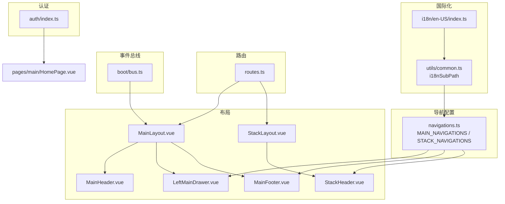
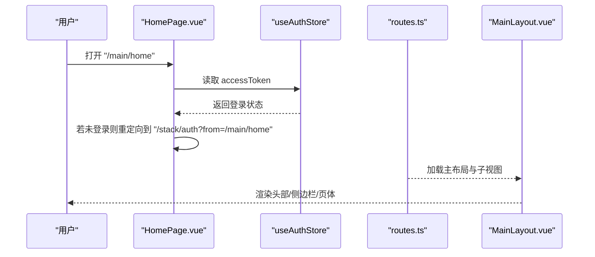
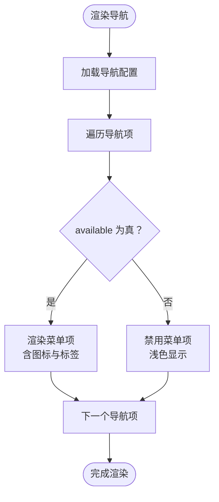
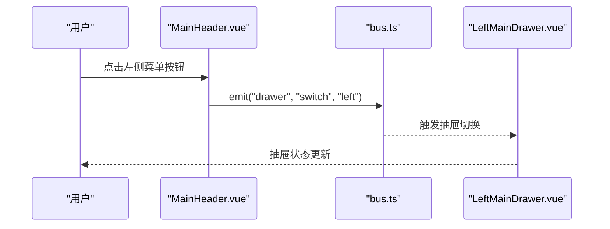
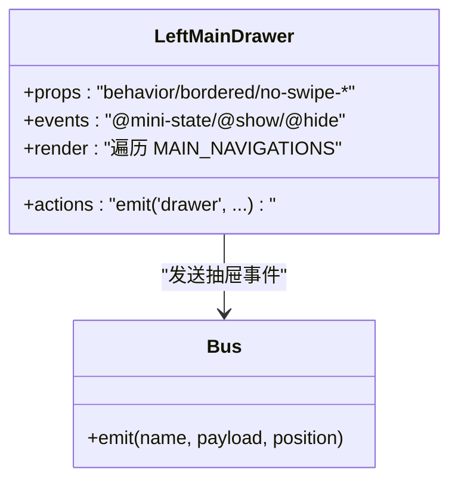
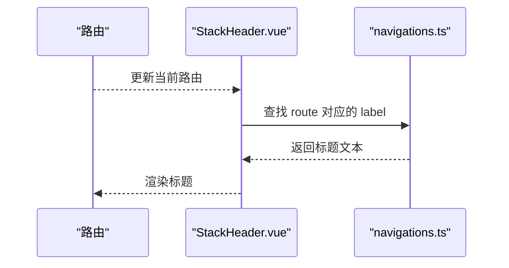
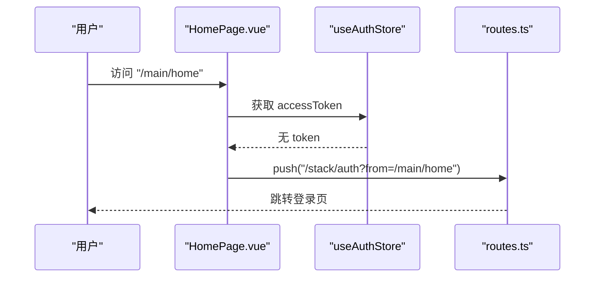
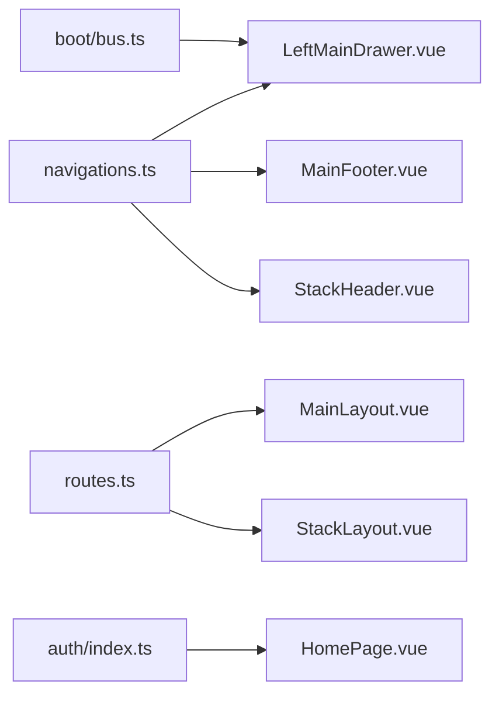

# 导航管理

<cite>
**本文引用的文件**
- [src/components/navigations.ts](file://src/components/navigations.ts)
- [src/layouts/MainLayout.vue](file://src/layouts/MainLayout.vue)
- [src/layouts/drawers/LeftMainDrawer.vue](file://src/layouts/drawers/LeftMainDrawer.vue)
- [src/layouts/headers/MainHeader.vue](file://src/layouts/headers/MainHeader.vue)
- [src/layouts/footers/MainFooter.vue](file://src/layouts/footers/MainFooter.vue)
- [src/layouts/StackLayout.vue](file://src/layouts/StackLayout.vue)
- [src/layouts/headers/StackHeader.vue](file://src/layouts/headers/StackHeader.vue)
- [src/router/routes.ts](file://src/router/routes.ts)
- [src/stores/auth/index.ts](file://src/stores/auth/index.ts)
- [src/boot/bus.ts](file://src/boot/bus.ts)
- [src/utils/common.ts](file://src/utils/common.ts)
- [src/i18n/en-US/index.ts](file://src/i18n/en-US/index.ts)
- [src/pages/main/HomePage.vue](file://src/pages/main/HomePage.vue)
- [src/pages/main/MePage.vue](file://src/pages/main/MePage.vue)
- [src/pages/stack/SettingsPage.vue](file://src/pages/stack/SettingsPage.vue)
</cite>

## 目录
1. [简介](#简介)
2. [项目结构](#项目结构)
3. [核心组件](#核心组件)
4. [架构总览](#架构总览)
5. [详细组件分析](#详细组件分析)
6. [依赖关系分析](#依赖关系分析)
7. [性能考量](#性能考量)
8. [故障排查指南](#故障排查指南)
9. [结论](#结论)
10. [附录](#附录)

## 简介
本文件系统化梳理 Le Bot 前端的导航管理体系，覆盖以下关键主题：
- 动态导航菜单生成：基于统一配置的数据驱动导航项，支持可用性开关与国际化标签。
- 权限与登录状态集成：通过认证状态在页面级进行访问控制与路由跳转。
- 头部导航、侧边栏导航与底部导航的设计模式：统一布局容器与多视图渲染。
- 导航状态管理与活动路由标识：通过路由名称与 exact 匹配实现高亮。
- 面包屑生成思路：基于当前路由名与导航配置映射标题。
- 动画与过渡：基于 Quasar 组件的内置交互与抽屉切换事件。
- 可复用性与扩展：模块化导航配置、布局与事件总线，便于新增页面与导航项。

## 项目结构
导航体系由“导航配置 + 布局 + 路由 + 认证 + 国际化”协同构成：
- 导航配置：集中于导航配置文件，提供主/栈式两类导航集合。
- 布局层：主布局与堆叠布局分别承载头部、侧边栏、页体与底部等区域。
- 路由层：定义页面与布局的组合关系，并按设备类型选择不同子视图。
- 认证层：Pinia Store 提供登录状态，用于页面级访问控制。
- 国际化层：i18n 子路径函数统一加载导航文案。

图表来源
- [src/components/navigations.ts:1-95](file://src/components/navigations.ts#L1-L95)
- [src/layouts/MainLayout.vue:1-51](file://src/layouts/MainLayout.vue#L1-L51)
- [src/layouts/drawers/LeftMainDrawer.vue:1-35](file://src/layouts/drawers/LeftMainDrawer.vue#L1-L35)
- [src/layouts/headers/MainHeader.vue:1-27](file://src/layouts/headers/MainHeader.vue#L1-L27)
- [src/layouts/footers/MainFooter.vue:1-28](file://src/layouts/footers/MainFooter.vue#L1-L28)
- [src/layouts/StackLayout.vue:1-17](file://src/layouts/StackLayout.vue#L1-L17)
- [src/layouts/headers/StackHeader.vue:1-38](file://src/layouts/headers/StackHeader.vue#L1-L38)
- [src/router/routes.ts:1-160](file://src/router/routes.ts#L1-L160)
- [src/stores/auth/index.ts:1-35](file://src/stores/auth/index.ts#L1-L35)
- [src/boot/bus.ts:1-18](file://src/boot/bus.ts#L1-L18)
- [src/utils/common.ts:1-52](file://src/utils/common.ts#L1-L52)
- [src/i18n/en-US/index.ts:1-413](file://src/i18n/en-US/index.ts#L1-L413)

章节来源
- [src/components/navigations.ts:1-95](file://src/components/navigations.ts#L1-L95)
- [src/router/routes.ts:1-160](file://src/router/routes.ts#L1-L160)

## 核心组件
- 导航配置数据结构
  - 字段：label（国际化键）、icon（图标名）、available（是否可用）、route（路由名）。
  - 主导航与栈式导航分别定义在不同数组中，便于按布局复用。
- 布局容器
  - MainLayout：统一承载头部、左侧抽屉、右侧抽屉与底部（移动端）。
  - StackLayout：仅承载头部与页体，适合堆叠式页面。
- 事件总线
  - 通过全局 EventBus 在头部按钮与抽屉组件间传递开合/最小化事件。
- 页面级访问控制
  - 认证 Store 暴露登录状态；首页在挂载前检查并重定向至登录页。

章节来源
- [src/components/navigations.ts:12-37](file://src/components/navigations.ts#L12-L37)
- [src/components/navigations.ts:39-94](file://src/components/navigations.ts#L39-L94)
- [src/layouts/MainLayout.vue:40-49](file://src/layouts/MainLayout.vue#L40-L49)
- [src/layouts/StackLayout.vue:7-13](file://src/layouts/StackLayout.vue#L7-L13)
- [src/boot/bus.ts:11-17](file://src/boot/bus.ts#L11-L17)
- [src/pages/main/HomePage.vue:24-28](file://src/pages/main/HomePage.vue#L24-L28)

## 架构总览
导航系统采用“配置驱动 + 布局分发 + 路由编排”的分层设计：
- 配置层：统一维护导航项，支持国际化与可用性控制。
- 布局层：通过具名 router-view 将头部、侧边栏、底部与页体组合。
- 路由层：根据设备类型选择不同子视图，实现桌面与移动端差异化体验。
- 认证层：在页面生命周期内进行访问控制，未登录自动跳转登录页。

图表来源
- [src/pages/main/HomePage.vue:14-28](file://src/pages/main/HomePage.vue#L14-L28)
- [src/stores/auth/index.ts:9-29](file://src/stores/auth/index.ts#L9-L29)
- [src/router/routes.ts:4-40](file://src/router/routes.ts#L4-L40)
- [src/layouts/MainLayout.vue:40-49](file://src/layouts/MainLayout.vue#L40-L49)

## 详细组件分析

### 导航配置与动态生成
- 数据结构
  - 使用接口定义导航项，包含标签、图标、可用性与路由名。
  - 通过国际化子路径函数加载文案，确保多语言一致。
- 动态生成
  - 侧边栏与底部导航直接遍历配置数组，按 available 控制禁用与样式。
  - 栈式头部通过当前路由名匹配配置项以显示标题。

图表来源
- [src/components/navigations.ts:12-37](file://src/components/navigations.ts#L12-L37)
- [src/layouts/drawers/LeftMainDrawer.vue:19-30](file://src/layouts/drawers/LeftMainDrawer.vue#L19-L30)
- [src/layouts/footers/MainFooter.vue:12-23](file://src/layouts/footers/MainFooter.vue#L12-L23)
- [src/layouts/headers/StackHeader.vue:13-15](file://src/layouts/headers/StackHeader.vue#L13-L15)

章节来源
- [src/components/navigations.ts:1-95](file://src/components/navigations.ts#L1-L95)
- [src/layouts/drawers/LeftMainDrawer.vue:19-30](file://src/layouts/drawers/LeftMainDrawer.vue#L19-L30)
- [src/layouts/footers/MainFooter.vue:12-23](file://src/layouts/footers/MainFooter.vue#L12-L23)
- [src/layouts/headers/StackHeader.vue:13-15](file://src/layouts/headers/StackHeader.vue#L13-L15)

### 头部导航设计模式
- 主头部
  - 左右两侧提供菜单按钮，通过事件总线触发抽屉开合。
  - 中央区域显示应用标题，右侧集成主题切换按钮。
- 栈式头部
  - 显示返回按钮与当前页面标题，标题来源于导航配置与当前路由名的映射。

图表来源
- [src/layouts/headers/MainHeader.vue:10-22](file://src/layouts/headers/MainHeader.vue#L10-L22)
- [src/boot/bus.ts:11-17](file://src/boot/bus.ts#L11-L17)
- [src/layouts/drawers/LeftMainDrawer.vue:15-17](file://src/layouts/drawers/LeftMainDrawer.vue#L15-L17)

章节来源
- [src/layouts/headers/MainHeader.vue:1-27](file://src/layouts/headers/MainHeader.vue#L1-L27)
- [src/layouts/headers/StackHeader.vue:1-38](file://src/layouts/headers/StackHeader.vue#L1-L38)

### 侧边栏导航设计模式
- 左侧主抽屉
  - 通过具名 router-view 注入，支持桌面端常驻与移动端手势控制。
  - 列表项使用路由跳转，exact 匹配保证激活态准确。
  - mini 状态切换时通过事件总线同步布局状态。

图表来源
- [src/layouts/drawers/LeftMainDrawer.vue:6-31](file://src/layouts/drawers/LeftMainDrawer.vue#L6-L31)
- [src/boot/bus.ts:11-17](file://src/boot/bus.ts#L11-L17)

章节来源
- [src/layouts/drawers/LeftMainDrawer.vue:1-35](file://src/layouts/drawers/LeftMainDrawer.vue#L1-L35)

### 底部导航设计模式
- 移动端底部标签栏
  - 使用路由标签组件，绑定图标与标签，exact 匹配当前路由。
  - 通过 available 控制禁用态，保持与顶部导航一致性。

图表来源
- [src/layouts/footers/MainFooter.vue:12-23](file://src/layouts/footers/MainFooter.vue#L12-L23)
- [src/components/navigations.ts:12-37](file://src/components/navigations.ts#L12-L37)

章节来源
- [src/layouts/footers/MainFooter.vue:1-28](file://src/layouts/footers/MainFooter.vue#L1-L28)

### 导航状态管理与活动路由标识
- 激活态判定
  - 侧边栏与底部导航均使用 exact 属性，确保精确匹配当前路由。
- 标题联动
  - 栈式头部通过当前路由名在导航配置中查找对应 label，实现标题动态更新。

图表来源
- [src/layouts/headers/StackHeader.vue:13-15](file://src/layouts/headers/StackHeader.vue#L13-L15)
- [src/components/navigations.ts:12-37](file://src/components/navigations.ts#L12-L37)

章节来源
- [src/layouts/headers/StackHeader.vue:13-15](file://src/layouts/headers/StackHeader.vue#L13-L15)

### 面包屑生成算法（设计建议）
- 当前实现
  - 未在代码中直接实现面包屑组件，但可通过以下方式设计：
    - 以当前路由名为索引，从导航配置中提取层级标题。
    - 结合路由参数（如详情页的 ID）动态拼接最终标题。
- 设计要点
  - 优先使用导航配置中的 label 作为层级名称，确保国际化一致。
  - 对于嵌套路由，按父子顺序逐级映射，避免硬编码路径。

（本节为概念性设计，不直接分析具体文件）

### 导航动画与过渡效果
- 抽屉切换
  - 通过抽屉组件的最小化/最大化事件与事件总线联动，实现平滑切换。
- 路由过渡
  - 页面切换由路由系统负责，可在路由配置中增加过渡类名或使用全局过渡设置。
- 交互反馈
  - 按钮点击与抽屉状态变更均通过事件总线即时响应，提升操作反馈。

章节来源
- [src/layouts/drawers/LeftMainDrawer.vue:15-17](file://src/layouts/drawers/LeftMainDrawer.vue#L15-L17)
- [src/boot/bus.ts:11-17](file://src/boot/bus.ts#L11-L17)

### 用户认证状态集成与权限控制
- 登录状态检查
  - 首页在挂载前读取认证 Store 的登录状态，若未登录则重定向至登录页并携带来源地址。
- 设置页联动
  - 设置页根据是否存在用户档案决定菜单项的可用性与跳转目标。
- 权限验证机制
  - 页面级访问控制：未登录禁止进入需要登录的页面。
  - 功能级可用性：菜单项的 available 字段可用于控制功能可见性。

图表来源
- [src/pages/main/HomePage.vue:24-28](file://src/pages/main/HomePage.vue#L24-L28)
- [src/stores/auth/index.ts:9-29](file://src/stores/auth/index.ts#L9-L29)
- [src/router/routes.ts:4-40](file://src/router/routes.ts#L4-L40)

章节来源
- [src/pages/main/HomePage.vue:24-28](file://src/pages/main/HomePage.vue#L24-L28)
- [src/pages/stack/SettingsPage.vue:12-92](file://src/pages/stack/SettingsPage.vue#L12-L92)
- [src/stores/auth/index.ts:1-35](file://src/stores/auth/index.ts#L1-L35)

### 可复用性设计与自定义扩展
- 可复用性
  - 导航配置集中管理，布局通过具名 router-view 注入，便于跨页面共享。
  - 事件总线解耦头部与抽屉，降低组件间耦合度。
- 自定义扩展
  - 新增导航项：在对应导航数组中添加新项，即可在所有布局中复用。
  - 新增页面：在路由配置中注册页面与布局组合，按需选择子视图。
  - 国际化：通过 i18n 子路径函数统一加载文案，确保新增项文案一致。

章节来源
- [src/components/navigations.ts:12-37](file://src/components/navigations.ts#L12-L37)
- [src/router/routes.ts:41-149](file://src/router/routes.ts#L41-L149)
- [src/utils/common.ts:31-38](file://src/utils/common.ts#L31-L38)
- [src/i18n/en-US/index.ts:129-147](file://src/i18n/en-US/index.ts#L129-L147)

## 依赖关系分析
- 组件耦合
  - LeftMainDrawer 依赖 navigations.ts 与 bus.ts。
  - MainFooter 依赖 navigations.ts。
  - StackHeader 依赖 navigations.ts 与路由。
- 路由耦合
  - routes.ts 定义了页面与布局的组合关系，Desktop/Mobile 分支选择不同子视图。
- 认证耦合
  - 页面通过 useAuthStore 进行访问控制，store 持久化登录状态。

图表来源
- [src/components/navigations.ts:1-95](file://src/components/navigations.ts#L1-L95)
- [src/layouts/drawers/LeftMainDrawer.vue:1-35](file://src/layouts/drawers/LeftMainDrawer.vue#L1-L35)
- [src/layouts/footers/MainFooter.vue:1-28](file://src/layouts/footers/MainFooter.vue#L1-L28)
- [src/layouts/headers/StackHeader.vue:1-38](file://src/layouts/headers/StackHeader.vue#L1-L38)
- [src/boot/bus.ts:1-18](file://src/boot/bus.ts#L1-L18)
- [src/router/routes.ts:1-160](file://src/router/routes.ts#L1-L160)
- [src/stores/auth/index.ts:1-35](file://src/stores/auth/index.ts#L1-L35)
- [src/pages/main/HomePage.vue:1-54](file://src/pages/main/HomePage.vue#L1-L54)

章节来源
- [src/router/routes.ts:1-160](file://src/router/routes.ts#L1-L160)

## 性能考量
- 渲染优化
  - 导航列表使用 v-for + key，避免重复渲染。
  - available 字段提前过滤不可用项，减少无效 DOM。
- 路由懒加载
  - 页面组件采用动态导入，降低首屏体积。
- 事件总线
  - 通过事件总线传递抽屉状态，避免深层 props 传递带来的性能损耗。

（本节为通用指导，不直接分析具体文件）

## 故障排查指南
- 抽屉无法切换
  - 检查事件总线是否正确注入与监听。
  - 确认抽屉组件的 @mini-state/@show/@hide 事件是否触发。
- 导航项不可点击
  - 检查 available 是否为 true。
  - 确认路由名与导航配置一致。
- 栈式头部标题不显示
  - 检查当前路由名是否存在于导航配置中。
  - 确认国际化键是否存在且已加载。
- 登录后仍被重定向
  - 检查认证 Store 的 accessToken 是否持久化成功。
  - 确认重定向逻辑是否携带正确的来源地址。

章节来源
- [src/boot/bus.ts:11-17](file://src/boot/bus.ts#L11-L17)
- [src/layouts/drawers/LeftMainDrawer.vue:15-17](file://src/layouts/drawers/LeftMainDrawer.vue#L15-L17)
- [src/components/navigations.ts:12-37](file://src/components/navigations.ts#L12-L37)
- [src/layouts/headers/StackHeader.vue:13-15](file://src/layouts/headers/StackHeader.vue#L13-L15)
- [src/stores/auth/index.ts:31-34](file://src/stores/auth/index.ts#L31-L34)
- [src/pages/main/HomePage.vue:24-28](file://src/pages/main/HomePage.vue#L24-L28)

## 结论
该导航系统通过“配置驱动 + 布局分发 + 路由编排 + 认证集成”的架构实现了高内聚、低耦合的导航管理。其优势在于：
- 导航项集中管理，易于扩展与国际化；
- 布局与路由解耦，支持桌面与移动端差异化；
- 事件总线简化组件通信；
- 页面级访问控制保障安全；
- 可复用性强，便于后续迭代与定制。

## 附录
- 国际化键命名规范
  - 主导航：components.navigations.main.*
  - 栈式导航：components.navigations.stack.*
- 导航项字段说明
  - label：国际化键
  - icon：图标名
  - available：是否可用
  - route：路由名

章节来源
- [src/i18n/en-US/index.ts:129-147](file://src/i18n/en-US/index.ts#L129-L147)
- [src/components/navigations.ts:3-8](file://src/components/navigations.ts#L3-L8)