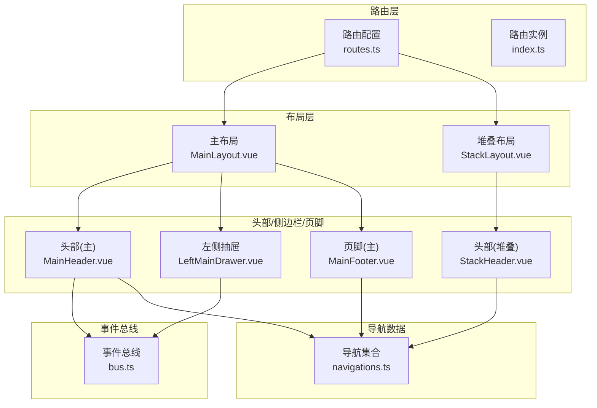
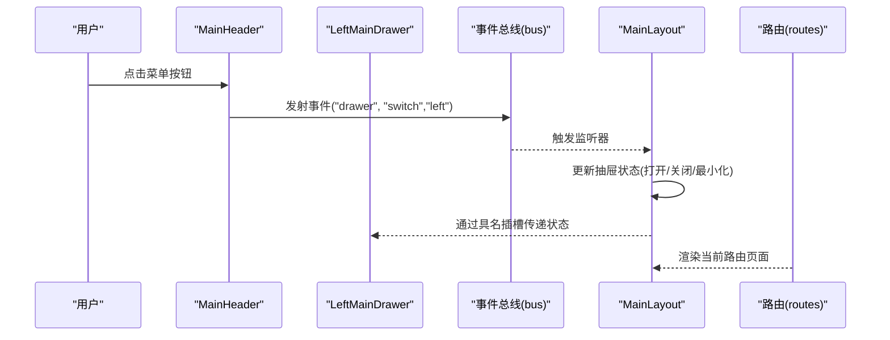
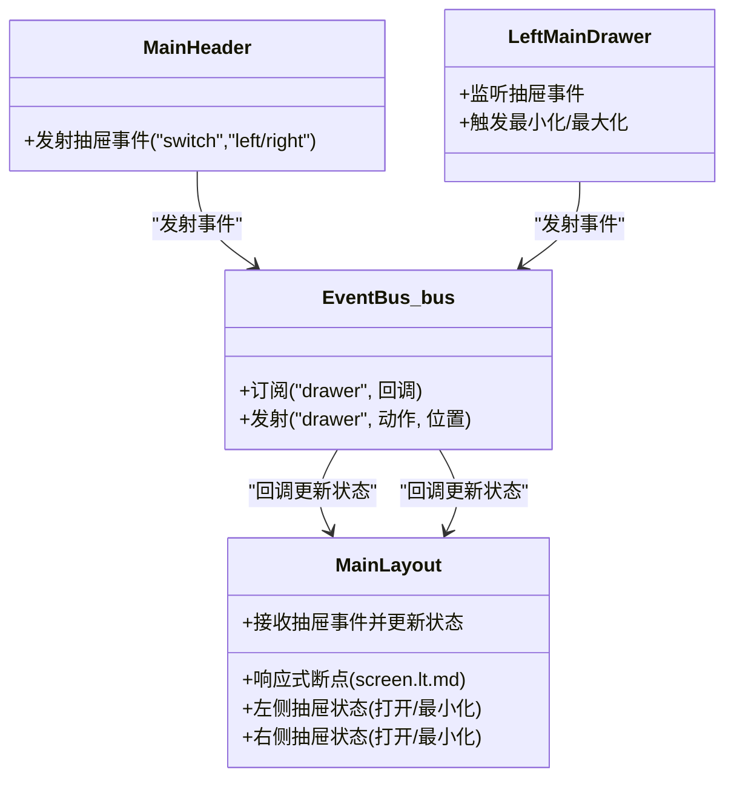
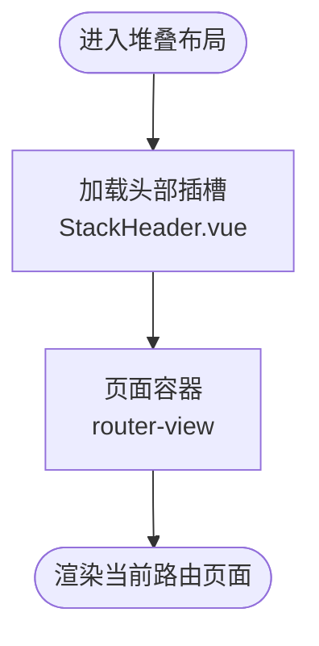
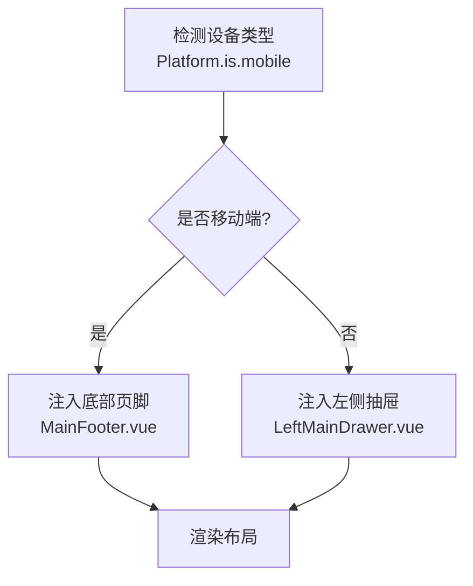
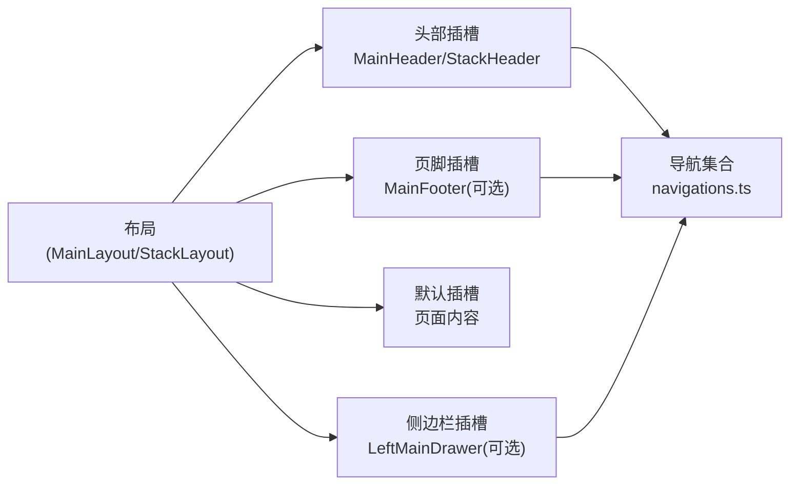
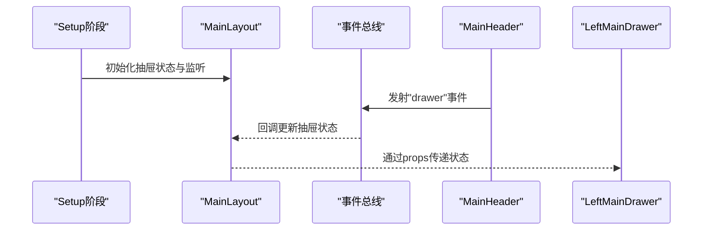
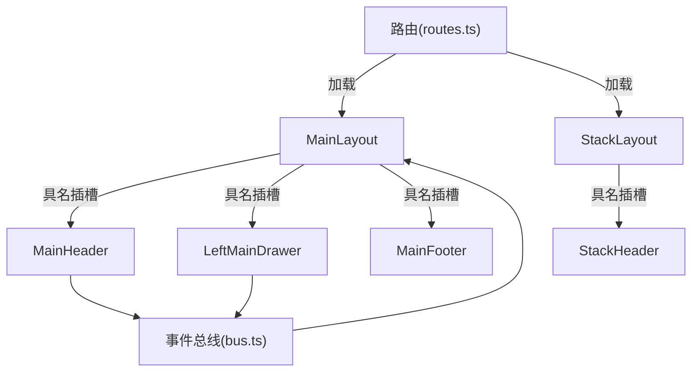

# 布局系统

<cite>
**本文引用的文件**
- [MainLayout.vue](file://src/layouts/MainLayout.vue)
- [StackLayout.vue](file://src/layouts/StackLayout.vue)
- [LeftMainDrawer.vue](file://src/layouts/drawers/LeftMainDrawer.vue)
- [MainHeader.vue](file://src/layouts/headers/MainHeader.vue)
- [StackHeader.vue](file://src/layouts/headers/StackHeader.vue)
- [MainFooter.vue](file://src/layouts/footers/MainFooter.vue)
- [navigations.ts](file://src/components/navigations.ts)
- [bus.ts](file://src/boot/bus.ts)
- [routes.ts](file://src/router/routes.ts)
- [quasar.config.ts](file://quasar.config.ts)
- [index.ts](file://src/router/index.ts)
- [common.ts](file://src/utils/common.ts)
</cite>

## 目录
1. [简介](#简介)
2. [项目结构](#项目结构)
3. [核心组件](#核心组件)
4. [架构总览](#架构总览)
5. [详细组件分析](#详细组件分析)
6. [依赖关系分析](#依赖关系分析)
7. [性能考量](#性能考量)
8. [故障排查指南](#故障排查指南)
9. [结论](#结论)
10. [附录](#附录)

## 简介
本文件系统性梳理 Le Bot 前端的布局体系，重点覆盖以下方面：
- 主布局（MainLayout）与堆叠布局（StackLayout）的设计架构与使用场景
- 响应式布局切换机制：移动端与桌面端的差异实现
- 多插槽布局系统：默认插槽、头部插槽、侧边栏插槽、页脚插槽的使用方法
- 布局组件的生命周期管理与状态传递机制
- 布局嵌套规则、组件复用策略与性能优化方案
- Quasar 平台检测机制在布局适配中的应用

## 项目结构
布局系统围绕两个根布局展开，并通过路由的具名插槽将头部、侧边栏、页脚等模块化拼装到页面中。整体采用“布局 + 具名插槽 + 路由”的组合模式，实现高内聚、低耦合的界面组织方式。

图表来源
- [routes.ts:1-160](file://src/router/routes.ts#L1-L160)
- [MainLayout.vue:1-51](file://src/layouts/MainLayout.vue#L1-L51)
- [StackLayout.vue:1-17](file://src/layouts/StackLayout.vue#L1-L17)
- [MainHeader.vue:1-27](file://src/layouts/headers/MainHeader.vue#L1-L27)
- [StackHeader.vue:1-38](file://src/layouts/headers/StackHeader.vue#L1-L38)
- [LeftMainDrawer.vue:1-35](file://src/layouts/drawers/LeftMainDrawer.vue#L1-L35)
- [MainFooter.vue:1-28](file://src/layouts/footers/MainFooter.vue#L1-L28)
- [navigations.ts:1-95](file://src/components/navigations.ts#L1-L95)
- [bus.ts:1-18](file://src/boot/bus.ts#L1-L18)

章节来源
- [routes.ts:1-160](file://src/router/routes.ts#L1-L160)
- [quasar.config.ts:1-278](file://quasar.config.ts#L1-L278)

## 核心组件
- 主布局（MainLayout）
  - 提供完整的头部、左右抽屉、页脚与页面容器，支持响应式视图与抽屉状态管理。
  - 使用 Quasar 的 screen 工具判断断点，向具名插槽传递 mobile 参数。
  - 通过全局事件总线接收抽屉事件，驱动抽屉的打开/关闭/最小化/最大化等状态。
- 堆叠布局（StackLayout）
  - 仅包含头部与页面容器，适合移动端或单列流程型页面。
  - 同样通过 screen.lt.md 控制移动端行为。

章节来源
- [MainLayout.vue:1-51](file://src/layouts/MainLayout.vue#L1-L51)
- [StackLayout.vue:1-17](file://src/layouts/StackLayout.vue#L1-L17)

## 架构总览
布局系统以“布局组件 + 具名插槽 + 路由”为核心，配合 Quasar 的 Platform/screen 能力，实现跨设备一致体验。

图表来源
- [MainHeader.vue:1-27](file://src/layouts/headers/MainHeader.vue#L1-L27)
- [LeftMainDrawer.vue:1-35](file://src/layouts/drawers/LeftMainDrawer.vue#L1-L35)
- [bus.ts:1-18](file://src/boot/bus.ts#L1-L18)
- [MainLayout.vue:1-51](file://src/layouts/MainLayout.vue#L1-L51)
- [routes.ts:1-160](file://src/router/routes.ts#L1-L160)

## 详细组件分析

### 主布局（MainLayout）设计与实现
- 视图模型与响应式
  - 使用 Quasar 的 screen 工具，向具名插槽传递 mobile 参数，用于头部/页脚等组件按断点渲染。
- 抽屉状态管理
  - 维护左右抽屉的打开/最小化状态，通过事件总线集中处理抽屉动作。
- 插槽布局
  - 头部、左抽屉、页面容器、右抽屉、页脚均通过具名 router-view 挂载，形成完整页面骨架。

图表来源
- [MainLayout.vue:1-51](file://src/layouts/MainLayout.vue#L1-L51)
- [MainHeader.vue:1-27](file://src/layouts/headers/MainHeader.vue#L1-L27)
- [LeftMainDrawer.vue:1-35](file://src/layouts/drawers/LeftMainDrawer.vue#L1-L35)
- [bus.ts:1-18](file://src/boot/bus.ts#L1-L18)

章节来源
- [MainLayout.vue:1-51](file://src/layouts/MainLayout.vue#L1-L51)
- [bus.ts:1-18](file://src/boot/bus.ts#L1-L18)

### 堆叠布局（StackLayout）设计与实现
- 设计目标
  - 面向移动端或单列流程页面，减少横向空间占用，强调垂直信息流。
- 结构组成
  - 仅包含头部与页面容器，无左右抽屉与页脚。
  - 通过 screen.lt.md 控制移动端行为，保持一致的交互体验。

图表来源
- [StackLayout.vue:1-17](file://src/layouts/StackLayout.vue#L1-L17)
- [StackHeader.vue:1-38](file://src/layouts/headers/StackHeader.vue#L1-L38)

章节来源
- [StackLayout.vue:1-17](file://src/layouts/StackLayout.vue#L1-L17)

### 响应式布局切换机制
- Quasar Platform/screen
  - 在路由配置中根据 Platform.is.mobile 决定是否注入底部页脚或左侧抽屉。
  - 在布局模板中通过 screen.lt.md 将断点信息传递给具名插槽组件。
- 移动端与桌面端差异
  - 桌面端：显示左侧抽屉与顶部导航；移动端：使用底部页脚替代导航。
  - 堆叠布局统一使用头部，不引入抽屉，简化移动端交互。

图表来源
- [routes.ts:1-160](file://src/router/routes.ts#L1-L160)
- [MainFooter.vue:1-28](file://src/layouts/footers/MainFooter.vue#L1-L28)
- [LeftMainDrawer.vue:1-35](file://src/layouts/drawers/LeftMainDrawer.vue#L1-L35)

章节来源
- [routes.ts:1-160](file://src/router/routes.ts#L1-L160)
- [quasar.config.ts:140-144](file://quasar.config.ts#L140-L144)

### 多插槽布局系统
- 插槽定义与用途
  - 默认插槽：承载页面主体内容。
  - 头部插槽：承载顶部工具栏/标题栏。
  - 侧边栏插槽：承载左侧抽屉（主布局）。
  - 页脚插槽：承载底部导航（移动端）。
- 插槽参数传递
  - 布局向具名插槽传递 mobile、model-value、mini 等参数，用于组件内部条件渲染与样式控制。
- 导航数据共享
  - 所有头部/页脚组件共享同一份导航集合，确保跨布局一致性。

图表来源
- [MainLayout.vue:1-51](file://src/layouts/MainLayout.vue#L1-L51)
- [StackLayout.vue:1-17](file://src/layouts/StackLayout.vue#L1-L17)
- [MainHeader.vue:1-27](file://src/layouts/headers/MainHeader.vue#L1-L27)
- [StackHeader.vue:1-38](file://src/layouts/headers/StackHeader.vue#L1-L38)
- [LeftMainDrawer.vue:1-35](file://src/layouts/drawers/LeftMainDrawer.vue#L1-L35)
- [MainFooter.vue:1-28](file://src/layouts/footers/MainFooter.vue#L1-L28)
- [navigations.ts:1-95](file://src/components/navigations.ts#L1-L95)

章节来源
- [navigations.ts:1-95](file://src/components/navigations.ts#L1-L95)

### 生命周期管理与状态传递
- 生命周期
  - 布局组件在 setup 中初始化状态与事件监听，在模板中通过具名插槽完成挂载。
- 状态传递
  - 通过事件总线在头部/抽屉组件与布局之间传递抽屉状态变更。
  - 通过 props 将断点信息与双向绑定值传递给具名插槽组件。

图表来源
- [MainLayout.vue:1-51](file://src/layouts/MainLayout.vue#L1-L51)
- [bus.ts:1-18](file://src/boot/bus.ts#L1-L18)
- [MainHeader.vue:1-27](file://src/layouts/headers/MainHeader.vue#L1-L27)
- [LeftMainDrawer.vue:1-35](file://src/layouts/drawers/LeftMainDrawer.vue#L1-L35)

章节来源
- [MainLayout.vue:1-51](file://src/layouts/MainLayout.vue#L1-L51)
- [bus.ts:1-18](file://src/boot/bus.ts#L1-L18)

### 布局嵌套规则与组件复用
- 嵌套规则
  - 根布局作为路由组件，子路由通过具名插槽挂载头部/抽屉/页脚等模块。
  - 不同业务域（/main 与 /stack）分别对应不同根布局，便于差异化适配。
- 组件复用
  - 导航集合在多个头部/页脚组件间共享，避免重复维护。
  - 头部/页脚组件通过 props 接收断点与主题状态，提升复用性。

章节来源
- [routes.ts:1-160](file://src/router/routes.ts#L1-L160)
- [navigations.ts:1-95](file://src/components/navigations.ts#L1-L95)

## 依赖关系分析
- 路由到布局
  - 路由配置决定加载哪个根布局，并在不同设备上注入不同的具名插槽组件。
- 布局到插槽
  - 布局通过具名 router-view 加载头部/抽屉/页脚，形成页面骨架。
- 事件总线
  - 头部/抽屉组件通过事件总线与布局通信，实现解耦的状态同步。

图表来源
- [routes.ts:1-160](file://src/router/routes.ts#L1-L160)
- [MainLayout.vue:1-51](file://src/layouts/MainLayout.vue#L1-L51)
- [StackLayout.vue:1-17](file://src/layouts/StackLayout.vue#L1-L17)
- [MainHeader.vue:1-27](file://src/layouts/headers/MainHeader.vue#L1-L27)
- [LeftMainDrawer.vue:1-35](file://src/layouts/drawers/LeftMainDrawer.vue#L1-L35)
- [MainFooter.vue:1-28](file://src/layouts/footers/MainFooter.vue#L1-L28)
- [bus.ts:1-18](file://src/boot/bus.ts#L1-L18)

章节来源
- [routes.ts:1-160](file://src/router/routes.ts#L1-L160)
- [index.ts:1-37](file://src/router/index.ts#L1-L37)

## 性能考量
- 路由懒加载
  - 路由与布局均采用动态导入，减少首屏体积，提升加载速度。
- 条件渲染
  - 通过 Platform.is.mobile 与 screen.lt.md 控制组件渲染，避免不必要的 DOM。
- 事件总线轻量通信
  - 使用事件总线进行布局与插槽组件间的通信，降低组件间直接依赖，提高可维护性。
- 页面容器高度固定
  - 页面容器设置固定高度，有助于滚动性能与布局稳定性。

章节来源
- [routes.ts:1-160](file://src/router/routes.ts#L1-L160)
- [MainLayout.vue:1-51](file://src/layouts/MainLayout.vue#L1-L51)
- [StackLayout.vue:1-17](file://src/layouts/StackLayout.vue#L1-L17)

## 故障排查指南
- 抽屉无法打开/关闭
  - 检查事件总线是否正确注册与发射，确认布局监听器是否生效。
  - 确认具名插槽是否正确接收 model-value 与 mini 参数。
- 移动端布局异常
  - 检查 Platform.is.mobile 判断逻辑与 screen.lt.md 传参是否一致。
  - 确认路由配置中是否正确注入了底部页脚或左侧抽屉。
- 导航不一致
  - 检查导航集合是否被正确导入并在各组件中共享。
- 路由跳转问题
  - 检查路由历史模式与基础路径配置，确保在不同环境下访问正常。

章节来源
- [bus.ts:1-18](file://src/boot/bus.ts#L1-L18)
- [routes.ts:1-160](file://src/router/routes.ts#L1-L160)
- [quasar.config.ts:140-144](file://quasar.config.ts#L140-L144)
- [index.ts:1-37](file://src/router/index.ts#L1-L37)

## 结论
该布局系统通过“根布局 + 具名插槽 + 路由”的组合，结合 Quasar 的平台检测与屏幕断点能力，实现了主/堆叠两种布局形态，并在移动端与桌面端之间平滑切换。借助事件总线与共享导航数据，系统在保证功能完整性的同时，具备良好的可扩展性与可维护性。

## 附录
- Quasar 平台检测与屏幕断点
  - Platform.is.mobile 用于判断设备类型，影响路由插槽注入。
  - screen.lt.md 用于判断断点，向具名插槽传递 mobile 参数，驱动组件条件渲染。
- 国际化辅助
  - 通过通用国际化函数生成子路径翻译，便于头部/页脚等组件本地化展示。

章节来源
- [routes.ts:1-160](file://src/router/routes.ts#L1-L160)
- [quasar.config.ts:140-144](file://quasar.config.ts#L140-L144)
- [common.ts:1-52](file://src/utils/common.ts#L1-L52)