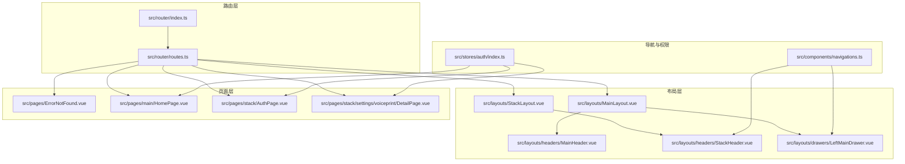
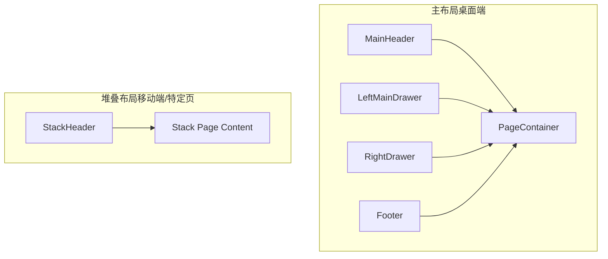
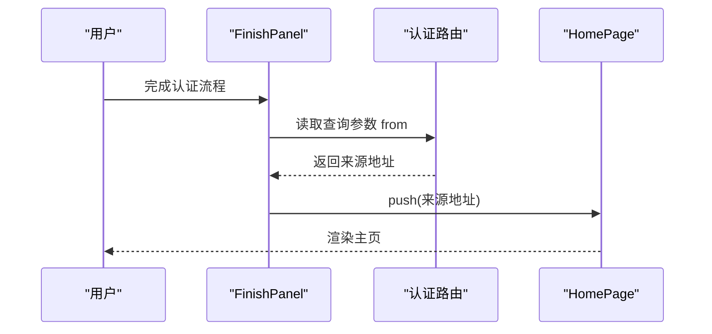
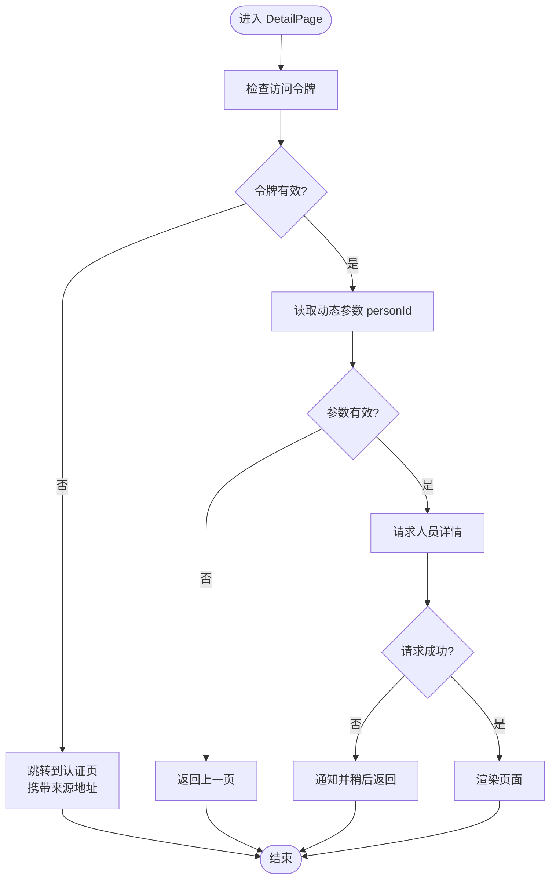
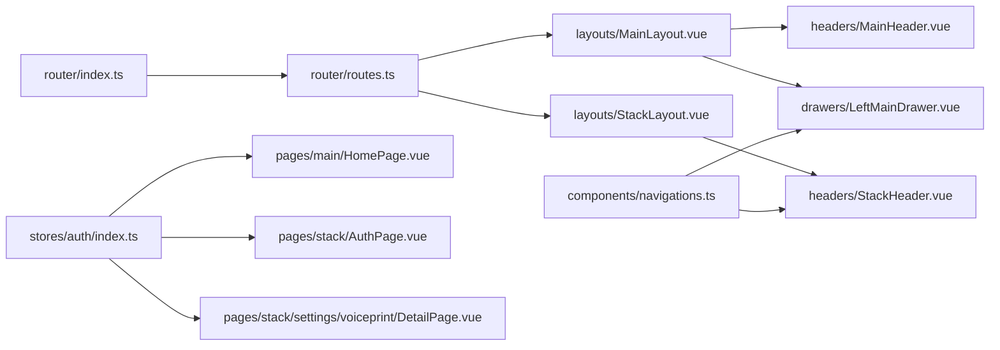

# 路由与导航

<cite>
**本文引用的文件**
- [src/router/index.ts](file://src/router/index.ts)
- [src/router/routes.ts](file://src/router/routes.ts)
- [src/layouts/MainLayout.vue](file://src/layouts/MainLayout.vue)
- [src/layouts/StackLayout.vue](file://src/layouts/StackLayout.vue)
- [src/layouts/headers/MainHeader.vue](file://src/layouts/headers/MainHeader.vue)
- [src/layouts/headers/StackHeader.vue](file://src/layouts/headers/StackHeader.vue)
- [src/layouts/drawers/LeftMainDrawer.vue](file://src/layouts/drawers/LeftMainDrawer.vue)
- [src/components/navigations.ts](file://src/components/navigations.ts)
- [src/pages/ErrorNotFound.vue](file://src/pages/ErrorNotFound.vue)
- [src/stores/auth/index.ts](file://src/stores/auth/index.ts)
- [src/pages/stack/AuthPage.vue](file://src/pages/stack/AuthPage.vue)
- [src/components/auth/FinishPanel.vue](file://src/components/auth/FinishPanel.vue)
- [src/pages/main/HomePage.vue](file://src/pages/main/HomePage.vue)
- [src/pages/stack/settings/voiceprint/DetailPage.vue](file://src/pages/stack/settings/voiceprint/DetailPage.vue)
</cite>

## 目录
1. [简介](#简介)
2. [项目结构](#项目结构)
3. [核心组件](#核心组件)
4. [架构总览](#架构总览)
5. [详细组件分析](#详细组件分析)
6. [依赖关系分析](#依赖关系分析)
7. [性能考虑](#性能考虑)
8. [故障排查指南](#故障排查指南)
9. [结论](#结论)
10. [附录](#附录)

## 简介
本文件系统性梳理 Le Bot 前端的路由与导航体系，围绕 Vue Router 5 的配置策略、嵌套路由设计、布局系统（主布局、堆叠布局与响应式切换）、导航守卫与权限控制、路由参数与查询字符串处理、导航菜单与面包屑、页面标题管理、懒加载与性能优化、以及错误页处理进行深入解析。文档以“可读性优先”的原则，既面向开发者也兼顾非技术读者。

## 项目结构
路由系统由“路由器实例”“路由表定义”“布局层”“页面层”“导航与权限”等模块协同构成。整体采用按域分层的组织方式：路由层负责路径与视图映射；布局层负责容器与多命名视图；页面层承载业务功能；导航与权限通过全局状态与路由跳转配合实现。

图表来源
- [src/router/index.ts:1-38](file://src/router/index.ts#L1-L38)
- [src/router/routes.ts:1-160](file://src/router/routes.ts#L1-L160)
- [src/layouts/MainLayout.vue:1-51](file://src/layouts/MainLayout.vue#L1-L51)
- [src/layouts/StackLayout.vue:1-17](file://src/layouts/StackLayout.vue#L1-L17)
- [src/layouts/headers/MainHeader.vue:1-27](file://src/layouts/headers/MainHeader.vue#L1-L27)
- [src/layouts/headers/StackHeader.vue:1-38](file://src/layouts/headers/StackHeader.vue#L1-L38)
- [src/layouts/drawers/LeftMainDrawer.vue:1-35](file://src/layouts/drawers/LeftMainDrawer.vue#L1-L35)
- [src/components/navigations.ts:1-95](file://src/components/navigations.ts#L1-L95)
- [src/pages/ErrorNotFound.vue:1-26](file://src/pages/ErrorNotFound.vue#L1-L26)
- [src/stores/auth/index.ts:1-35](file://src/stores/auth/index.ts#L1-L35)
- [src/pages/main/HomePage.vue:1-54](file://src/pages/main/HomePage.vue#L1-L54)
- [src/pages/stack/AuthPage.vue:1-69](file://src/pages/stack/AuthPage.vue#L1-L69)
- [src/pages/stack/settings/voiceprint/DetailPage.vue:1-180](file://src/pages/stack/settings/voiceprint/DetailPage.vue#L1-L180)

章节来源
- [src/router/index.ts:1-38](file://src/router/index.ts#L1-L38)
- [src/router/routes.ts:1-160](file://src/router/routes.ts#L1-L160)

## 核心组件
- 路由器实例：根据运行环境选择历史模式（内存/HTML5/Hash），统一导出 router 实例，并设置滚动行为。
- 路由表：集中定义路径、重定向、嵌套路由、命名视图、动态路由与通配符错误页。
- 布局系统：主布局支持多命名视图（头部、左抽屉、页内容、右抽屉、底部）；堆叠布局仅含头部与页内容。
- 导航与权限：导航清单与路由名称一一对应；权限通过访问令牌判断并在页面生命周期中强制跳转。
- 页面与错误页：各业务页面在挂载时校验登录态；404 错误页提供返回首页能力。

章节来源
- [src/router/index.ts:19-33](file://src/router/index.ts#L19-L33)
- [src/router/routes.ts:4-157](file://src/router/routes.ts#L4-L157)
- [src/layouts/MainLayout.vue:40-49](file://src/layouts/MainLayout.vue#L40-L49)
- [src/layouts/StackLayout.vue:7-13](file://src/layouts/StackLayout.vue#L7-L13)
- [src/components/navigations.ts:12-94](file://src/components/navigations.ts#L12-L94)
- [src/stores/auth/index.ts:6-34](file://src/stores/auth/index.ts#L6-L34)
- [src/pages/ErrorNotFound.vue:1-26](file://src/pages/ErrorNotFound.vue#L1-L26)

## 架构总览
下图展示路由系统在不同设备与布局下的交互关系：主布局在桌面端启用左右抽屉与底部栏，在移动端通过命名视图切换为底部栏或左侧抽屉；堆叠布局用于移动端或特定页面，仅保留头部与页内容。

图表来源
- [src/layouts/MainLayout.vue:40-49](file://src/layouts/MainLayout.vue#L40-L49)
- [src/layouts/StackLayout.vue:7-13](file://src/layouts/StackLayout.vue#L7-L13)
- [src/layouts/headers/MainHeader.vue:10-23](file://src/layouts/headers/MainHeader.vue#L10-L23)
- [src/layouts/headers/StackHeader.vue:18-34](file://src/layouts/headers/StackHeader.vue#L18-L34)
- [src/layouts/drawers/LeftMainDrawer.vue:6-31](file://src/layouts/drawers/LeftMainDrawer.vue#L6-L31)

## 详细组件分析

### 路由器与历史模式
- 历史模式选择：服务端渲染使用内存历史；开发/生产默认 Hash 模式；可通过构建配置切换为 HTML5 History。
- 滚动行为：每次路由切换后滚动至顶部，提升用户体验一致性。
- 导出策略：通过 defineRouter 包装导出，便于 Quasar 集成与 SSR 支持。

章节来源
- [src/router/index.ts:19-33](file://src/router/index.ts#L19-L33)

### 路由表与嵌套路由
- 根路径重定向：空路径重定向到主域首页，保证初始访问一致性。
- 主域路由：以“/main”为根，子路由包含首页与我的页面；移动端与桌面端通过命名视图差异化呈现（底部栏 vs 左侧抽屉）。
- 堆叠域路由：以“/stack”为根，子路由覆盖关于、认证、聊天、成长数据、个人资料、设备配置、设置及声纹子域；设置域内进一步嵌套，形成多级子路由。
- 动态路由：声纹详情页使用动态段捕获人员标识。
- 通配符错误页：兜底未匹配路径，统一跳转至 404 页面。

章节来源
- [src/router/routes.ts:4-157](file://src/router/routes.ts#L4-L157)

### 布局系统与命名视图
- 主布局：支持多命名视图（header/leftDrawer/default/rightDrawer/footer），通过 router-view 的 name 属性绑定；抽屉开关通过事件总线联动。
- 堆叠布局：仅包含 header 与 page container，适合移动端或单列页面。
- 头部组件：主头部提供左右抽屉开关；堆叠头部显示当前路由标题并提供返回按钮。
- 抽屉组件：左侧抽屉绑定导航清单，点击项直接跳转到对应路由。

章节来源
- [src/layouts/MainLayout.vue:40-49](file://src/layouts/MainLayout.vue#L40-L49)
- [src/layouts/StackLayout.vue:7-13](file://src/layouts/StackLayout.vue#L7-L13)
- [src/layouts/headers/MainHeader.vue:10-23](file://src/layouts/headers/MainHeader.vue#L10-L23)
- [src/layouts/headers/StackHeader.vue:13-15](file://src/layouts/headers/StackHeader.vue#L13-L15)
- [src/layouts/drawers/LeftMainDrawer.vue:20-29](file://src/layouts/drawers/LeftMainDrawer.vue#L20-L29)

### 导航菜单与面包屑
- 导航清单：主域与堆叠域分别维护导航项数组，包含标签、图标、可用性与路由名。
- 绑定关系：主布局抽屉与堆叠头部均从导航清单读取，确保菜单与路由一致。
- 面包屑：当前代码未实现自动面包屑生成，建议通过路由元信息与路由变更监听计算生成。

章节来源
- [src/components/navigations.ts:12-94](file://src/components/navigations.ts#L12-L94)
- [src/layouts/drawers/LeftMainDrawer.vue:20-29](file://src/layouts/drawers/LeftMainDrawer.vue#L20-L29)
- [src/layouts/headers/StackHeader.vue:13-15](file://src/layouts/headers/StackHeader.vue#L13-L15)

### 页面标题管理
- 堆叠头部标题：通过当前路由名称在导航清单中查找对应标签作为标题。
- 主头部标题：来自国际化资源键，体现应用品牌信息。
- 建议：可在路由元信息中加入标题键，结合路由守卫统一设置文档标题。

章节来源
- [src/layouts/headers/StackHeader.vue:13-15](file://src/layouts/headers/StackHeader.vue#L13-L15)
- [src/layouts/headers/MainHeader.vue:13-18](file://src/layouts/headers/MainHeader.vue#L13-L18)

### 导航守卫与权限控制
- 访问令牌存储：使用 Pinia 存储访问令牌与发送验证码冷却时间。
- 登录态校验：主页与声纹详情页在挂载阶段检查令牌存在性，缺失则跳转到认证页并携带来源地址。
- 认证流程完成：认证完成面板在初始化完成后读取查询参数中的来源地址并跳转。

章节来源
- [src/stores/auth/index.ts:6-34](file://src/stores/auth/index.ts#L6-L34)
- [src/pages/main/HomePage.vue:24-28](file://src/pages/main/HomePage.vue#L24-L28)
- [src/pages/stack/settings/voiceprint/DetailPage.vue:85-99](file://src/pages/stack/settings/voiceprint/DetailPage.vue#L85-L99)
- [src/components/auth/FinishPanel.vue:39-47](file://src/components/auth/FinishPanel.vue#L39-L47)

### 路由参数传递、查询字符串处理与动态路由
- 动态路由：声纹详情页使用动态段捕获人员标识，页面在挂载时读取并校验参数有效性。
- 查询字符串：认证完成面板读取查询参数中的来源地址，作为跳转目标。
- 参数校验：若参数无效，页面执行回退操作（返回上一页或提示）。

章节来源
- [src/router/routes.ts:122-126](file://src/router/routes.ts#L122-L126)
- [src/pages/stack/settings/voiceprint/DetailPage.vue:85-99](file://src/pages/stack/settings/voiceprint/DetailPage.vue#L85-L99)
- [src/components/auth/FinishPanel.vue:44-47](file://src/components/auth/FinishPanel.vue#L44-L47)

### 导航流程时序（示例：认证完成后的跳转）

图表来源
- [src/components/auth/FinishPanel.vue:39-47](file://src/components/auth/FinishPanel.vue#L39-L47)
- [src/pages/main/HomePage.vue:24-28](file://src/pages/main/HomePage.vue#L24-L28)

### 动态路由匹配流程（示例：声纹详情页）

图表来源
- [src/pages/stack/settings/voiceprint/DetailPage.vue:85-99](file://src/pages/stack/settings/voiceprint/DetailPage.vue#L85-L99)

### 错误页面与兜底策略
- 通配符路由：所有未匹配路径统一跳转至 404 页面。
- 404 页面：提供醒目的提示与返回首页按钮，改善用户感知。

章节来源
- [src/router/routes.ts:153-156](file://src/router/routes.ts#L153-L156)
- [src/pages/ErrorNotFound.vue:1-26](file://src/pages/ErrorNotFound.vue#L1-L26)

## 依赖关系分析
- 路由器依赖路由表：路由器实例在创建时注入路由表。
- 路由表依赖布局与页面：通过异步导入实现代码分割与懒加载。
- 布局依赖命名视图：通过 router-view 的 name 属性与路由表 children 对应。
- 导航依赖路由名称：导航清单中的 route 字段与路由表 name 对应。
- 权限依赖访问令牌：页面在挂载阶段读取存储中的令牌决定是否跳转。

图表来源
- [src/router/index.ts:1-38](file://src/router/index.ts#L1-L38)
- [src/router/routes.ts:1-160](file://src/router/routes.ts#L1-L160)
- [src/layouts/MainLayout.vue:1-51](file://src/layouts/MainLayout.vue#L1-L51)
- [src/layouts/StackLayout.vue:1-17](file://src/layouts/StackLayout.vue#L1-L17)
- [src/layouts/headers/MainHeader.vue:1-27](file://src/layouts/headers/MainHeader.vue#L1-L27)
- [src/layouts/headers/StackHeader.vue:1-38](file://src/layouts/headers/StackHeader.vue#L1-L38)
- [src/layouts/drawers/LeftMainDrawer.vue:1-35](file://src/layouts/drawers/LeftMainDrawer.vue#L1-L35)
- [src/components/navigations.ts:1-95](file://src/components/navigations.ts#L1-L95)
- [src/stores/auth/index.ts:1-35](file://src/stores/auth/index.ts#L1-L35)
- [src/pages/main/HomePage.vue:1-54](file://src/pages/main/HomePage.vue#L1-L54)
- [src/pages/stack/AuthPage.vue:1-69](file://src/pages/stack/AuthPage.vue#L1-L69)
- [src/pages/stack/settings/voiceprint/DetailPage.vue:1-180](file://src/pages/stack/settings/voiceprint/DetailPage.vue#L1-L180)

## 性能考虑
- 懒加载与代码分割：路由表中通过异步导入页面与布局，减少首屏体积，提升加载速度。
- 历史模式选择：Hash 模式无需服务器配置，适合静态部署；如需 SEO 或更佳 URL 语义，可切换为 HTML5 History（需服务端回退配置）。
- 滚动行为：统一滚动至顶部避免页面状态残留，但可能影响长列表定位体验，可按需调整。
- 响应式布局：通过 Quasar 的屏幕断点与命名视图切换，减少不必要的 DOM 重绘与渲染。

章节来源
- [src/router/routes.ts:10-11](file://src/router/routes.ts#L10-L11)
- [src/router/routes.ts:42-43](file://src/router/routes.ts#L42-L43)
- [src/router/index.ts:25-26](file://src/router/index.ts#L25-L26)

## 故障排查指南
- 访问受限页面：若出现频繁跳转到认证页，检查访问令牌是否过期或未正确持久化。
- 动态路由参数缺失：当动态段为空或类型不符时，页面会回退到上一页，请确认调用方传参格式。
- 404 页面：若出现未匹配路由，请核对路由表定义与导航清单是否一致。
- 布局异常：若命名视图未显示，请检查路由表 children 与布局中 router-view 的 name 是否匹配。

章节来源
- [src/stores/auth/index.ts:6-34](file://src/stores/auth/index.ts#L6-L34)
- [src/pages/stack/settings/voiceprint/DetailPage.vue:85-99](file://src/pages/stack/settings/voiceprint/DetailPage.vue#L85-L99)
- [src/router/routes.ts:153-156](file://src/router/routes.ts#L153-L156)
- [src/layouts/MainLayout.vue:40-49](file://src/layouts/MainLayout.vue#L40-L49)

## 结论
该路由系统以清晰的域划分与嵌套路由为核心，结合命名视图与响应式布局，实现了主/堆叠双布局体系。通过访问令牌驱动的权限控制与懒加载策略，兼顾了可维护性与性能。建议后续补充路由元信息与自动面包屑、文档标题统一管理，以进一步完善导航体验。

## 附录
- 路由表概览（节选）
  - 主域：/main/home、/main/me（移动端/桌面端命名视图差异）
  - 堆叠域：/stack/about、/stack/auth、/stack/chat、/stack/growth-data、/stack/profile、/stack/device-config、/stack/settings 及其子域
  - 动态路由：/stack/settings/voiceprint/detail/:personId
  - 错误页：/:catchAll(.*)*

章节来源
- [src/router/routes.ts:4-157](file://src/router/routes.ts#L4-L157)