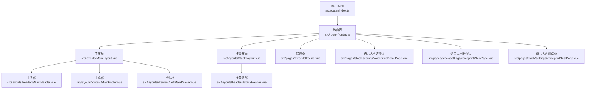
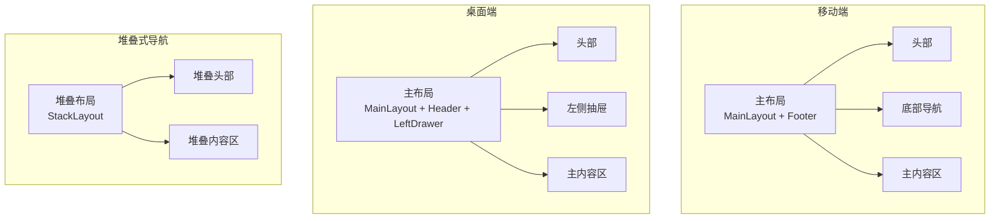
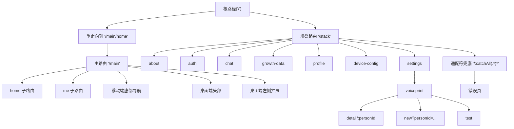
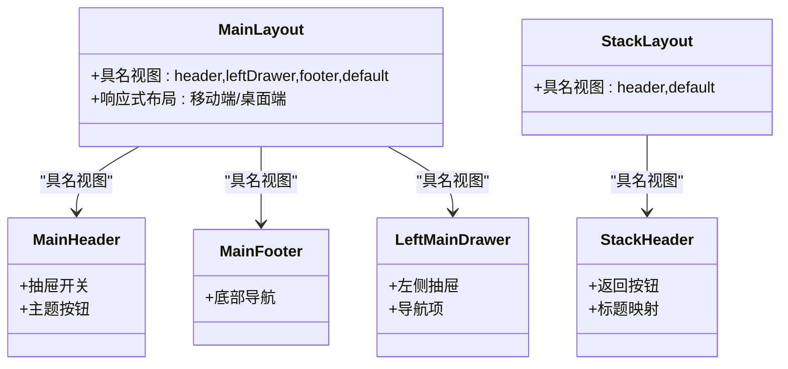
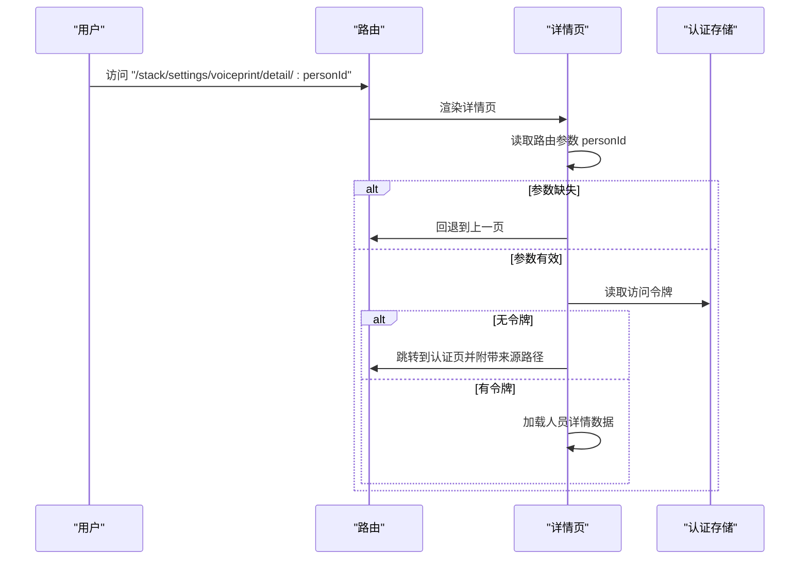
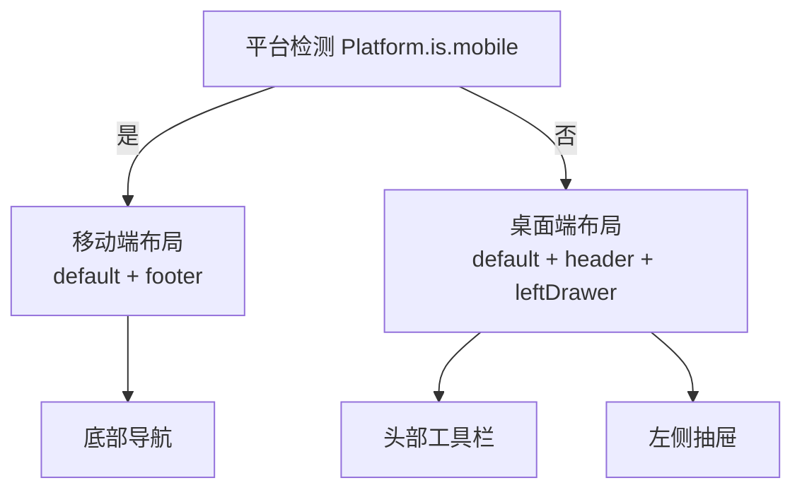
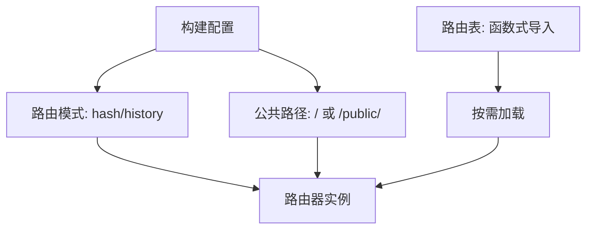
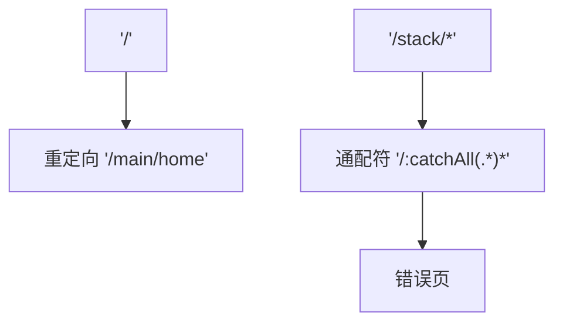
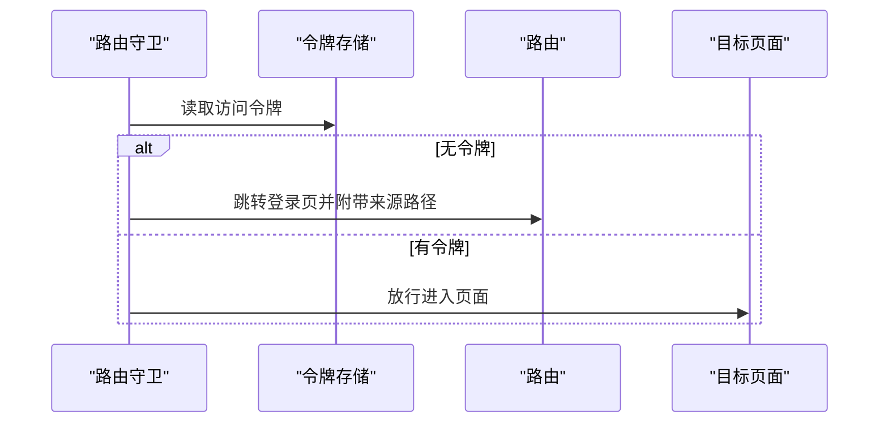
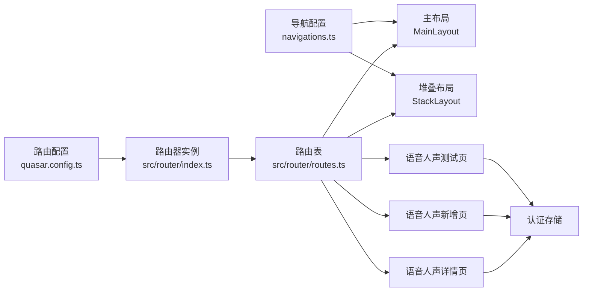

# 路由配置

<cite>
**本文引用的文件**
- [src/router/index.ts](file://src/router/index.ts)
- [src/router/routes.ts](file://src/router/routes.ts)
- [src/layouts/MainLayout.vue](file://src/layouts/MainLayout.vue)
- [src/layouts/StackLayout.vue](file://src/layouts/StackLayout.vue)
- [src/layouts/headers/MainHeader.vue](file://src/layouts/headers/MainHeader.vue)
- [src/layouts/headers/StackHeader.vue](file://src/layouts/headers/StackHeader.vue)
- [src/layouts/footers/MainFooter.vue](file://src/layouts/footers/MainFooter.vue)
- [src/layouts/drawers/LeftMainDrawer.vue](file://src/layouts/drawers/LeftMainDrawer.vue)
- [src/pages/ErrorNotFound.vue](file://src/pages/ErrorNotFound.vue)
- [src/pages/stack/settings/voiceprint/DetailPage.vue](file://src/pages/stack/settings/voiceprint/DetailPage.vue)
- [src/pages/stack/settings/voiceprint/NewPage.vue](file://src/pages/stack/settings/voiceprint/NewPage.vue)
- [src/pages/stack/settings/voiceprint/TestPage.vue](file://src/pages/stack/settings/voiceprint/TestPage.vue)
- [src/components/navigations.ts](file://src/components/navigations.ts)
- [src/boot/bus.ts](file://src/boot/bus.ts)
- [src/stores/auth/index.ts](file://src/stores/auth/index.ts)
- [src/utils/api/auth.ts](file://src/utils/api/auth.ts)
- [quasar.config.ts](file://quasar.config.ts)
</cite>

## 目录
1. [简介](#简介)
2. [项目结构](#项目结构)
3. [核心组件](#核心组件)
4. [架构总览](#架构总览)
5. [详细组件分析](#详细组件分析)
6. [依赖关系分析](#依赖关系分析)
7. [性能考虑](#性能考虑)
8. [故障排查指南](#故障排查指南)
9. [结论](#结论)
10. [附录](#附录)

## 简介
本文件系统性梳理 Le Bot 前端的路由配置体系，围绕 Vue Router 5 的路由定义策略展开，重点覆盖：
- 嵌套路由与堆叠路由的设计理念与实现
- 动态路由匹配与路由参数（路径参数、查询参数）传递机制
- 移动端与桌面端差异化路由配置
- 路由懒加载与性能优化策略
- 路由重定向、通配符与错误页处理
- 路由命名规范、路径设计原则与最佳实践
- 路由元信息与权限控制集成思路

## 项目结构
路由系统由“路由器实例 + 路由表 + 布局与页面”三部分组成：
- 路由器实例：根据运行环境选择历史记录模式（内存/哈希/历史），统一导出供应用注入
- 路由表：集中定义主路由与堆叠路由，含重定向、嵌套子路由、通配符与错误页
- 布局与页面：通过具名视图（header/leftDrawer/footer/default）实现多窗格布局；页面内读取路由参数并进行权限校验

图表来源
- [src/router/index.ts:1-38](file://src/router/index.ts#L1-L38)
- [src/router/routes.ts:1-160](file://src/router/routes.ts#L1-L160)
- [src/layouts/MainLayout.vue:1-51](file://src/layouts/MainLayout.vue#L1-L51)
- [src/layouts/StackLayout.vue:1-17](file://src/layouts/StackLayout.vue#L1-L17)
- [src/layouts/headers/MainHeader.vue:1-27](file://src/layouts/headers/MainHeader.vue#L1-L27)
- [src/layouts/headers/StackHeader.vue:1-38](file://src/layouts/headers/StackHeader.vue#L1-L38)
- [src/layouts/footers/MainFooter.vue:1-28](file://src/layouts/footers/MainFooter.vue#L1-L28)
- [src/layouts/drawers/LeftMainDrawer.vue:1-35](file://src/layouts/drawers/LeftMainDrawer.vue#L1-L35)
- [src/pages/ErrorNotFound.vue:1-26](file://src/pages/ErrorNotFound.vue#L1-L26)
- [src/pages/stack/settings/voiceprint/DetailPage.vue:1-180](file://src/pages/stack/settings/voiceprint/DetailPage.vue#L1-L180)
- [src/pages/stack/settings/voiceprint/NewPage.vue:1-54](file://src/pages/stack/settings/voiceprint/NewPage.vue#L1-L54)
- [src/pages/stack/settings/voiceprint/TestPage.vue:1-124](file://src/pages/stack/settings/voiceprint/TestPage.vue#L1-L124)

章节来源
- [src/router/index.ts:1-38](file://src/router/index.ts#L1-L38)
- [src/router/routes.ts:1-160](file://src/router/routes.ts#L1-L160)

## 核心组件
- 路由器实例：按环境选择历史记录模式，统一滚动行为，注入路由表
- 路由表：包含根重定向、主路由（/main）、堆叠路由（/stack）、通配符错误页
- 主布局与堆叠布局：通过具名视图渲染 header/leftDrawer/footer/default 区域
- 导航配置：集中维护主/堆叠导航项，用于菜单与标签页
- 页面组件：在挂载阶段读取路由参数（params/query），执行权限校验与数据加载

章节来源
- [src/router/index.ts:19-33](file://src/router/index.ts#L19-L33)
- [src/router/routes.ts:4-157](file://src/router/routes.ts#L4-L157)
- [src/components/navigations.ts:12-94](file://src/components/navigations.ts#L12-L94)

## 架构总览
下图展示路由系统在不同设备上的布局差异与导航联动：

图表来源
- [src/layouts/MainLayout.vue:40-49](file://src/layouts/MainLayout.vue#L40-L49)
- [src/layouts/StackLayout.vue:7-13](file://src/layouts/StackLayout.vue#L7-L13)
- [src/layouts/headers/MainHeader.vue:10-23](file://src/layouts/headers/MainHeader.vue#L10-L23)
- [src/layouts/footers/MainFooter.vue:9-24](file://src/layouts/footers/MainFooter.vue#L9-L24)
- [src/layouts/drawers/LeftMainDrawer.vue:6-31](file://src/layouts/drawers/LeftMainDrawer.vue#L6-L31)

## 详细组件分析

### 路由表与嵌套路由
- 根重定向：访问根路径时自动跳转到主首页
- 主路由（/main）：根据平台选择不同布局组合（移动端仅默认+底部；桌面端增加头部与左侧抽屉）
- 堆叠路由（/stack）：以栈式方式组织页面，统一使用堆叠头部，便于返回导航
- 子路由层级：settings.voiceprint 下进一步细分详情、新增、测试等页面，体现模块化与可扩展性
- 通配符与错误页：兜底捕获所有未匹配路径，统一跳转至错误页

图表来源
- [src/router/routes.ts:4-157](file://src/router/routes.ts#L4-L157)

章节来源
- [src/router/routes.ts:4-157](file://src/router/routes.ts#L4-L157)

### 布局与具名视图
- 主布局（MainLayout）：通过具名视图渲染 header/leftDrawer/footer/default，支持移动端底部导航与桌面端抽屉联动
- 堆叠布局（StackLayout）：统一的堆叠导航容器，仅包含 header 与主内容区
- 头部组件：主头部与堆叠头部分别负责抽屉切换与返回导航
- 底部与抽屉：移动端使用底部导航；桌面端使用左侧抽屉，通过事件总线与布局联动

图表来源
- [src/layouts/MainLayout.vue:40-49](file://src/layouts/MainLayout.vue#L40-L49)
- [src/layouts/StackLayout.vue:7-13](file://src/layouts/StackLayout.vue#L7-L13)
- [src/layouts/headers/MainHeader.vue:10-23](file://src/layouts/headers/MainHeader.vue#L10-L23)
- [src/layouts/headers/StackHeader.vue:18-34](file://src/layouts/headers/StackHeader.vue#L18-L34)
- [src/layouts/footers/MainFooter.vue:9-24](file://src/layouts/footers/MainFooter.vue#L9-L24)
- [src/layouts/drawers/LeftMainDrawer.vue:6-31](file://src/layouts/drawers/LeftMainDrawer.vue#L6-L31)

章节来源
- [src/layouts/MainLayout.vue:1-51](file://src/layouts/MainLayout.vue#L1-L51)
- [src/layouts/StackLayout.vue:1-17](file://src/layouts/StackLayout.vue#L1-L17)
- [src/layouts/headers/MainHeader.vue:1-27](file://src/layouts/headers/MainHeader.vue#L1-L27)
- [src/layouts/headers/StackHeader.vue:1-38](file://src/layouts/headers/StackHeader.vue#L1-L38)
- [src/layouts/footers/MainFooter.vue:1-28](file://src/layouts/footers/MainFooter.vue#L1-L28)
- [src/layouts/drawers/LeftMainDrawer.vue:1-35](file://src/layouts/drawers/LeftMainDrawer.vue#L1-L35)

### 动态路由与参数传递
- 路径参数：语音人声详情页使用 detail/:personId 捕获人员标识
- 查询参数：语音人声新增页使用 ?personId=... 传递关联参数
- 页面内读取：在挂载阶段读取路由参数，若缺失或无效则回退或跳转登录页
- 权限校验：无访问令牌时统一跳转到认证页，并携带来源路径以便登录后回跳

图表来源
- [src/pages/stack/settings/voiceprint/DetailPage.vue:85-99](file://src/pages/stack/settings/voiceprint/DetailPage.vue#L85-L99)
- [src/stores/auth/index.ts:6-34](file://src/stores/auth/index.ts#L6-L34)
- [src/utils/api/auth.ts:21-27](file://src/utils/api/auth.ts#L21-L27)

章节来源
- [src/pages/stack/settings/voiceprint/DetailPage.vue:1-180](file://src/pages/stack/settings/voiceprint/DetailPage.vue#L1-L180)
- [src/pages/stack/settings/voiceprint/NewPage.vue:19-27](file://src/pages/stack/settings/voiceprint/NewPage.vue#L19-L27)
- [src/pages/stack/settings/voiceprint/TestPage.vue:84-89](file://src/pages/stack/settings/voiceprint/TestPage.vue#L84-L89)
- [src/stores/auth/index.ts:1-34](file://src/stores/auth/index.ts#L1-L34)
- [src/utils/api/auth.ts:1-27](file://src/utils/api/auth.ts#L1-L27)

### 移动端与桌面端差异化配置
- 平台检测：路由表根据平台判断是否启用移动端底部导航与桌面端头部/抽屉
- 响应式布局：布局组件通过 Quasar 的屏幕断点属性决定渲染内容
- 导航联动：移动端使用底部导航；桌面端使用抽屉菜单，二者均与导航配置保持一致

图表来源
- [src/router/routes.ts:15-37](file://src/router/routes.ts#L15-L37)
- [src/layouts/MainLayout.vue:40-49](file://src/layouts/MainLayout.vue#L40-L49)
- [src/layouts/footers/MainFooter.vue:9-24](file://src/layouts/footers/MainFooter.vue#L9-L24)
- [src/layouts/drawers/LeftMainDrawer.vue:6-31](file://src/layouts/drawers/LeftMainDrawer.vue#L6-L31)
- [src/components/navigations.ts:12-94](file://src/components/navigations.ts#L12-L94)

章节来源
- [src/router/routes.ts:15-37](file://src/router/routes.ts#L15-L37)
- [src/layouts/MainLayout.vue:1-51](file://src/layouts/MainLayout.vue#L1-L51)
- [src/components/navigations.ts:12-94](file://src/components/navigations.ts#L12-L94)

### 路由懒加载与性能优化
- 懒加载策略：路由表中所有布局与页面均采用函数式导入，按需加载，减少首屏体积
- 历史记录模式：根据构建环境选择内存/哈希/历史模式，确保开发与部署一致性
- 公共路径与基座：通过构建配置设置公共路径与基座，避免 PWA 图标与清单路径问题
- 滚动行为：统一滚动到顶部，提升用户体验

图表来源
- [src/router/index.ts:19-33](file://src/router/index.ts#L19-L33)
- [quasar.config.ts:82](file://quasar.config.ts#L82)
- [quasar.config.ts:98-104](file://quasar.config.ts#L98-L104)

章节来源
- [src/router/index.ts:1-38](file://src/router/index.ts#L1-L38)
- [quasar.config.ts:82](file://quasar.config.ts#L82)
- [quasar.config.ts:98-104](file://quasar.config.ts#L98-L104)

### 路由重定向、通配符与错误页
- 根重定向：访问根路径时自动跳转到主首页
- 通配符兜底：所有未匹配路径统一跳转到错误页
- 错误页：提供简洁的 404 页面与“回到首页”按钮

图表来源
- [src/router/routes.ts:6-8](file://src/router/routes.ts#L6-L8)
- [src/router/routes.ts:153-156](file://src/router/routes.ts#L153-L156)
- [src/pages/ErrorNotFound.vue:10-18](file://src/pages/ErrorNotFound.vue#L10-L18)

章节来源
- [src/router/routes.ts:6-8](file://src/router/routes.ts#L6-L8)
- [src/router/routes.ts:153-156](file://src/router/routes.ts#L153-L156)
- [src/pages/ErrorNotFound.vue:1-26](file://src/pages/ErrorNotFound.vue#L1-L26)

### 路由命名规范与路径设计原则
- 命名：堆叠路由统一使用语义化名称（如 about/auth/chat/profile/device-config/settings 等），子模块进一步细化（如 settings-voiceprint-detail/new/test）
- 路径：采用层级化路径，主路由 /main 与堆叠路由 /stack 分离；子模块路径清晰表达业务域
- 最佳实践：优先使用具名视图实现多窗格布局；在需要返回导航的场景使用堆叠头部；对敏感操作进行权限校验

章节来源
- [src/router/routes.ts:46-146](file://src/router/routes.ts#L46-L146)
- [src/components/navigations.ts:39-94](file://src/components/navigations.ts#L39-L94)

### 路由元信息与权限控制集成
- 元信息：当前路由表未显式声明元信息字段；可在后续扩展中加入 roles/access 控制
- 集成方案：在路由守卫中读取元信息，结合访问令牌与用户状态进行鉴权；无权限或令牌缺失时跳转登录页并保留来源路径
- 当前实现：页面组件在挂载阶段检查访问令牌，缺失时统一跳转认证页并附带来源路径，形成前端侧的“轻量权限控制”

图表来源
- [src/stores/auth/index.ts:6-34](file://src/stores/auth/index.ts#L6-L34)
- [src/pages/stack/settings/voiceprint/DetailPage.vue:85-89](file://src/pages/stack/settings/voiceprint/DetailPage.vue#L85-L89)
- [src/pages/stack/settings/voiceprint/NewPage.vue:19-23](file://src/pages/stack/settings/voiceprint/NewPage.vue#L19-L23)
- [src/pages/stack/settings/voiceprint/TestPage.vue:84-89](file://src/pages/stack/settings/voiceprint/TestPage.vue#L84-L89)

章节来源
- [src/stores/auth/index.ts:1-34](file://src/stores/auth/index.ts#L1-L34)
- [src/pages/stack/settings/voiceprint/DetailPage.vue:85-89](file://src/pages/stack/settings/voiceprint/DetailPage.vue#L85-L89)
- [src/pages/stack/settings/voiceprint/NewPage.vue:19-23](file://src/pages/stack/settings/voiceprint/NewPage.vue#L19-L23)
- [src/pages/stack/settings/voiceprint/TestPage.vue:84-89](file://src/pages/stack/settings/voiceprint/TestPage.vue#L84-L89)

## 依赖关系分析
- 路由器依赖路由表与构建配置中的历史记录模式与公共路径
- 路由表依赖 Quasar 平台检测与具名视图渲染
- 页面组件依赖路由参数与认证存储，实现参数校验与权限控制
- 导航配置为布局与菜单提供统一的路由名称与可用性标记

图表来源
- [quasar.config.ts:82](file://quasar.config.ts#L82)
- [src/router/index.ts:19-33](file://src/router/index.ts#L19-L33)
- [src/router/routes.ts:4-157](file://src/router/routes.ts#L4-L157)
- [src/stores/auth/index.ts:6-34](file://src/stores/auth/index.ts#L6-L34)
- [src/components/navigations.ts:12-94](file://src/components/navigations.ts#L12-L94)

章节来源
- [quasar.config.ts:82](file://quasar.config.ts#L82)
- [src/router/index.ts:19-33](file://src/router/index.ts#L19-L33)
- [src/router/routes.ts:4-157](file://src/router/routes.ts#L4-L157)
- [src/stores/auth/index.ts:6-34](file://src/stores/auth/index.ts#L6-L34)
- [src/components/navigations.ts:12-94](file://src/components/navigations.ts#L12-L94)

## 性能考虑
- 懒加载：所有布局与页面采用函数式导入，按需加载，降低首屏资源压力
- 历史记录模式：在非 SSR 环境下优先使用哈希模式，避免服务器配置复杂度
- 公共路径：构建阶段统一设置公共路径，避免 PWA 资源路径问题导致的二次请求失败
- 滚动行为：统一滚动到顶部，减少页面跳转后的视觉抖动

## 故障排查指南
- 404 页面：当访问不存在的路径时，会跳转到错误页；检查路由表通配符与页面是否存在
- 登录回跳：无访问令牌时跳转认证页并附带来源路径；确认认证存储中令牌状态与 API 校验接口
- 参数缺失：详情页与新增页在缺少必要参数时会回退或跳转；检查调用方传参是否正确
- 抽屉/底部导航异常：检查布局具名视图与导航配置是否一致；确认平台检测逻辑与屏幕断点

章节来源
- [src/pages/ErrorNotFound.vue:10-18](file://src/pages/ErrorNotFound.vue#L10-L18)
- [src/pages/stack/settings/voiceprint/DetailPage.vue:85-99](file://src/pages/stack/settings/voiceprint/DetailPage.vue#L85-L99)
- [src/pages/stack/settings/voiceprint/NewPage.vue:19-27](file://src/pages/stack/settings/voiceprint/NewPage.vue#L19-L27)
- [src/stores/auth/index.ts:6-34](file://src/stores/auth/index.ts#L6-L34)

## 结论
该路由系统以清晰的分层与具名视图为核心，结合移动端与桌面端差异化布局，实现了良好的可维护性与扩展性。通过函数式导入与构建期配置，兼顾了性能与部署灵活性。建议后续在路由守卫中引入元信息与权限控制，进一步完善前端鉴权体系。

## 附录
- 路由命名与路径设计：遵循“主/堆叠/模块/子模块”的层级化命名，保证语义清晰
- 参数传递：优先使用路径参数承载关键标识，使用查询参数传递可选上下文
- 错误处理：统一兜底与错误页，确保用户获得明确的反馈与回跳入口