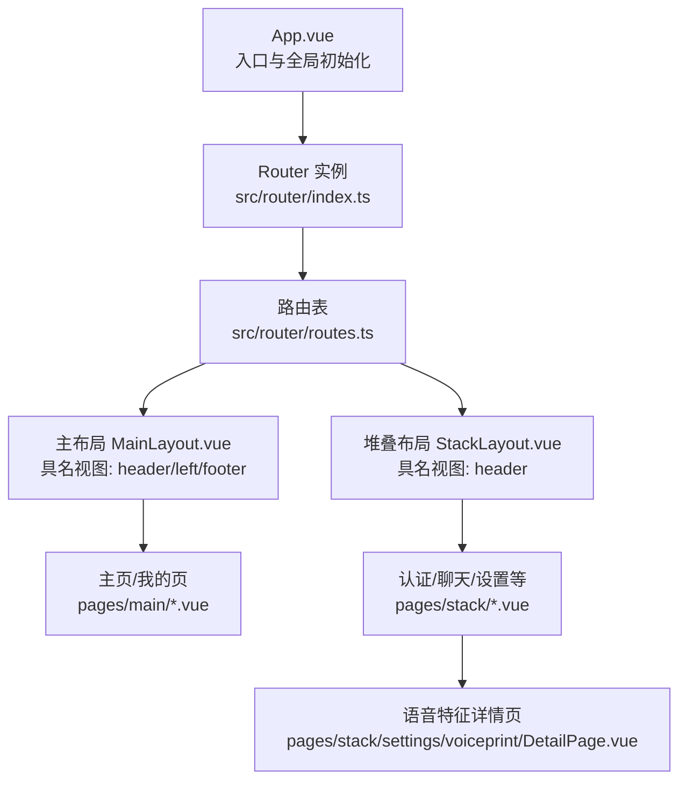
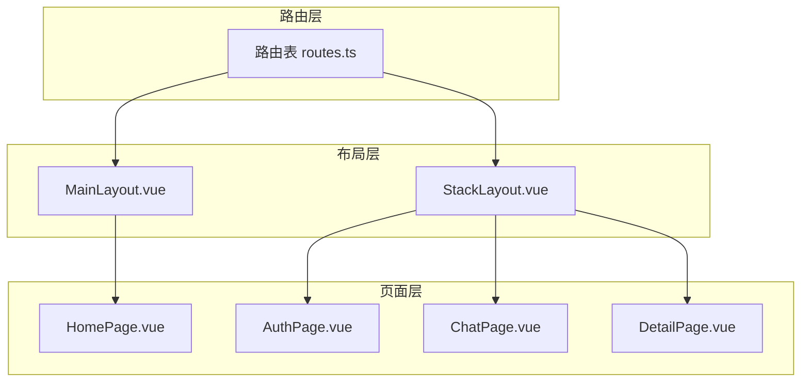
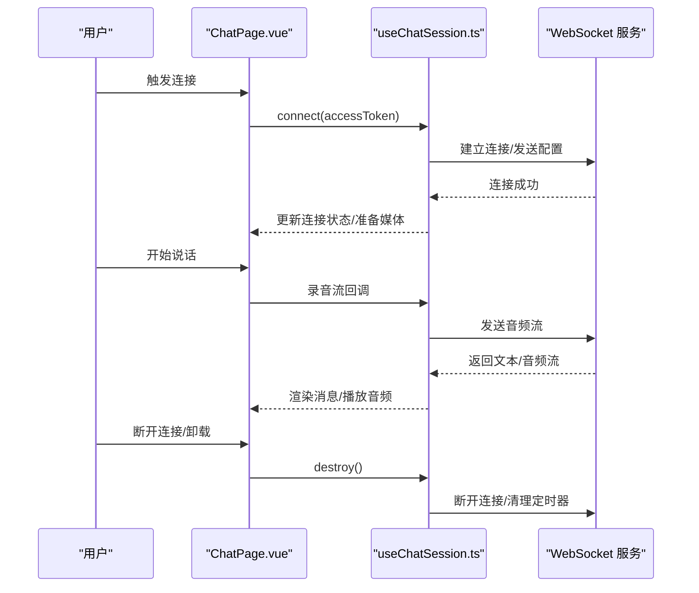
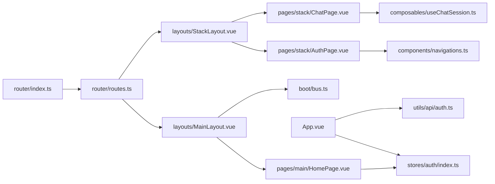

# 页面路由

<cite>
**本文引用的文件**
- [src/router/index.ts](file://src/router/index.ts)
- [src/router/routes.ts](file://src/router/routes.ts)
- [src/App.vue](file://src/App.vue)
- [src/layouts/MainLayout.vue](file://src/layouts/MainLayout.vue)
- [src/layouts/StackLayout.vue](file://src/layouts/StackLayout.vue)
- [src/pages/main/HomePage.vue](file://src/pages/main/HomePage.vue)
- [src/pages/stack/AuthPage.vue](file://src/pages/stack/AuthPage.vue)
- [src/pages/stack/ChatPage.vue](file://src/pages/stack/ChatPage.vue)
- [src/pages/stack/settings/voiceprint/DetailPage.vue](file://src/pages/stack/settings/voiceprint/DetailPage.vue)
- [src/components/navigations.ts](file://src/components/navigations.ts)
- [src/stores/auth/index.ts](file://src/stores/auth/index.ts)
- [src/utils/api/auth.ts](file://src/utils/api/auth.ts)
- [src/composables/useChatSession.ts](file://src/composables/useChatSession.ts)
- [src/boot/bus.ts](file://src/boot/bus.ts)
</cite>

## 目录
1. [简介](#简介)
2. [项目结构](#项目结构)
3. [核心组件](#核心组件)
4. [架构总览](#架构总览)
5. [详细组件分析](#详细组件分析)
6. [依赖分析](#依赖分析)
7. [性能考虑](#性能考虑)
8. [故障排查指南](#故障排查指南)
9. [结论](#结论)
10. [附录](#附录)

## 简介
本文件系统性梳理 Le Bot 前端页面路由体系，覆盖路由映射、组件加载机制、路由参数与查询字符串处理、路由监听与守卫、页面生命周期钩子（含缓存与状态保持）、权限校验与用户状态检查、导航方式与编程式导航、以及性能优化（懒加载、代码分割、内存管理）等主题。目标是帮助开发者快速理解并高效扩展路由功能。

## 项目结构
路由系统由三部分组成：
- 路由定义：集中于路由表文件，声明路径、布局与页面组件映射，并支持嵌套路由与命名路由。
- 路由实例：根据运行环境选择历史模式或哈希模式，统一导出路由器实例。
- 页面与布局：通过具名插槽组合多视图布局，配合路由参数与查询字符串实现灵活导航。

图表来源
- [src/App.vue:1-85](file://src/App.vue#L1-L85)
- [src/router/index.ts:1-38](file://src/router/index.ts#L1-L38)
- [src/router/routes.ts:1-160](file://src/router/routes.ts#L1-L160)
- [src/layouts/MainLayout.vue:1-51](file://src/layouts/MainLayout.vue#L1-L51)
- [src/layouts/StackLayout.vue:1-17](file://src/layouts/StackLayout.vue#L1-L17)
- [src/pages/stack/settings/voiceprint/DetailPage.vue:1-180](file://src/pages/stack/settings/voiceprint/DetailPage.vue#L1-L180)

章节来源
- [src/router/index.ts:1-38](file://src/router/index.ts#L1-L38)
- [src/router/routes.ts:1-160](file://src/router/routes.ts#L1-L160)
- [src/layouts/MainLayout.vue:1-51](file://src/layouts/MainLayout.vue#L1-L51)
- [src/layouts/StackLayout.vue:1-17](file://src/layouts/StackLayout.vue#L1-L17)

## 核心组件
- 路由器实例与历史模式选择：根据构建环境动态选择历史/哈希/内存历史模式，统一导出路由器。
- 路由表：定义根重定向、主区域与堆叠区域的路由树，支持移动端与桌面端差异化布局与具名视图。
- 应用入口：在挂载时进行访问令牌校验与用户资料初始化，未登录时引导至认证页。
- 布局组件：通过具名 router-view 组合头部、侧边栏、页脚等模块化视图。
- 页面组件：在生命周期中执行权限校验与导航跳转；部分页面使用路由参数与查询字符串。

章节来源
- [src/router/index.ts:19-33](file://src/router/index.ts#L19-L33)
- [src/router/routes.ts:4-156](file://src/router/routes.ts#L4-L156)
- [src/App.vue:58-80](file://src/App.vue#L58-L80)
- [src/layouts/MainLayout.vue:40-49](file://src/layouts/MainLayout.vue#L40-L49)
- [src/layouts/StackLayout.vue:7-13](file://src/layouts/StackLayout.vue#L7-L13)

## 架构总览
路由系统采用“布局 + 多视图 + 页面”的分层设计：
- 布局层：MainLayout/StackLayout 提供具名视图容器，按设备类型渲染不同子视图。
- 路由层：routes.ts 定义路由树，支持命名路由与嵌套路由，便于编程式导航与深度链接。
- 页面层：各页面组件负责业务逻辑、权限校验与导航跳转，必要时读取路由参数与查询字符串。

图表来源
- [src/router/routes.ts:41-149](file://src/router/routes.ts#L41-L149)
- [src/layouts/MainLayout.vue:40-49](file://src/layouts/MainLayout.vue#L40-L49)
- [src/layouts/StackLayout.vue:7-13](file://src/layouts/StackLayout.vue#L7-L13)
- [src/pages/main/HomePage.vue:1-54](file://src/pages/main/HomePage.vue#L1-L54)
- [src/pages/stack/AuthPage.vue:1-69](file://src/pages/stack/AuthPage.vue#L1-L69)
- [src/pages/stack/ChatPage.vue:1-179](file://src/pages/stack/ChatPage.vue#L1-L179)
- [src/pages/stack/settings/voiceprint/DetailPage.vue:1-180](file://src/pages/stack/settings/voiceprint/DetailPage.vue#L1-L180)

## 详细组件分析

### 路由映射与组件加载机制
- 根路径重定向：空路径重定向到主区域首页，保证初始访问体验一致。
- 主区域路由：以 /main 开头，使用 MainLayout 作为容器，子路由根据平台类型渲染不同子视图（移动端仅默认视图与底部栏；桌面端包含顶部栏与左抽屉）。
- 堆叠区域路由：以 /stack 开头，使用 StackLayout 作为容器，子路由包含多个独立页面（如认证、聊天、设置等），并支持嵌套子路由（如语音特征详情页）。
- 懒加载与代码分割：所有布局与页面均通过动态导入实现懒加载，减少首屏体积与初次渲染时间。
- 全局兜底：最后一条通配路由指向错误页，确保未知路径安全回退。

章节来源
- [src/router/routes.ts:4-156](file://src/router/routes.ts#L4-L156)

### 页面级路由参数传递与查询字符串处理
- 路由参数：语音特征详情页通过路由参数 personId 获取人员标识，组件在挂载阶段读取该参数并进行有效性校验，否则回退上一页。
- 查询字符串：主页与聊天页在未登录时会将当前路径作为查询参数传入认证页，以便登录后返回原页面。
- 导航方式：页面内按钮与链接使用 to 属性进行声明式导航；同时支持编程式导航（push/go）实现条件跳转与回退。

章节来源
- [src/pages/stack/settings/voiceprint/DetailPage.vue:85-99](file://src/pages/stack/settings/voiceprint/DetailPage.vue#L85-L99)
- [src/pages/main/HomePage.vue:24-28](file://src/pages/main/HomePage.vue#L24-L28)
- [src/pages/stack/ChatPage.vue:83-88](file://src/pages/stack/ChatPage.vue#L83-L88)

### 路由监听与守卫
- 全局前置守卫：当前实现未显式注册全局前置守卫。权限校验主要在页面生命周期中完成（例如 onBeforeMount/onMounted）。
- 页面级守卫：通过页面组件的生命周期钩子（如 onBeforeMount/onMounted）进行权限判断与导航跳转，形成“页面级守卫”效果。
- 访问令牌校验：应用入口在挂载时调用接口校验令牌有效性，失败则清空本地状态并可选刷新页面。

章节来源
- [src/App.vue:58-80](file://src/App.vue#L58-L80)
- [src/pages/main/HomePage.vue:24-28](file://src/pages/main/HomePage.vue#L24-L28)
- [src/pages/stack/ChatPage.vue:83-88](file://src/pages/stack/ChatPage.vue#L83-L88)
- [src/utils/api/auth.ts:21-27](file://src/utils/api/auth.ts#L21-L27)

### 页面生命周期钩子与状态管理
- 生命周期钩子：页面在 onBeforeMount/onMounted 中进行权限校验与必要时的路由跳转，避免无效渲染。
- 状态保持与缓存：路由层面未启用 keep-alive 缓存；页面内部通过 Pinia store 管理状态（如认证、设备、个人资料），并在应用入口处进行初始化与清理。
- 数据刷新策略：应用入口对设备列表与个人资料进行拉取与更新；页面组件在需要时重新请求数据。

章节来源
- [src/App.vue:29-56](file://src/App.vue#L29-L56)
- [src/stores/auth/index.ts:1-35](file://src/stores/auth/index.ts#L1-L35)

### 权限验证、用户状态检查与路由守卫
- 访问令牌持久化：认证状态通过 Pinia store 持久化存储，应用启动时读取并校验。
- 登录态校验：应用入口与多个页面组件在挂载时调用后端接口校验令牌有效性，若无效则清空登录状态并跳转认证页。
- 导航守卫：通过页面生命周期内的条件跳转实现“路由守卫”行为，避免未授权访问。

章节来源
- [src/stores/auth/index.ts:32-34](file://src/stores/auth/index.ts#L32-L34)
- [src/App.vue:61-76](file://src/App.vue#L61-L76)
- [src/pages/main/HomePage.vue:24-28](file://src/pages/main/HomePage.vue#L24-L28)
- [src/pages/stack/ChatPage.vue:83-88](file://src/pages/stack/ChatPage.vue#L83-L88)

### 页面间导航与编程式导航
- 声明式导航：页面内按钮与链接使用 to 属性直接跳转到命名路由或具体路径。
- 编程式导航：页面在未登录或参数不合法时使用 router.push/router.go 进行跳转与回退，确保用户体验连贯。
- 导航常量：导航菜单项通过统一的导航配置导出，便于维护与复用。

章节来源
- [src/pages/main/HomePage.vue:47-48](file://src/pages/main/HomePage.vue#L47-L48)
- [src/pages/stack/AuthPage.vue:42-62](file://src/pages/stack/AuthPage.vue#L42-L62)
- [src/pages/stack/ChatPage.vue:83-88](file://src/pages/stack/ChatPage.vue#L83-L88)
- [src/components/navigations.ts:12-94](file://src/components/navigations.ts#L12-L94)

### 性能优化：懒加载、代码分割与内存管理
- 懒加载与代码分割：路由表中所有布局与页面均采用动态导入，实现按需加载与打包分割，降低首屏负载。
- 内存管理：聊天会话组件在销毁时释放录音、播放、WebSocket 与定时器资源，并撤销音频 URL，防止内存泄漏。
- 首屏优化：通过具名视图与平台差异化渲染减少不必要的视图渲染；路由滚动行为统一归位，提升滚动一致性。

章节来源
- [src/router/routes.ts:10-149](file://src/router/routes.ts#L10-L149)
- [src/composables/useChatSession.ts:427-447](file://src/composables/useChatSession.ts#L427-L447)
- [src/composables/useChatSession.ts:491-493](file://src/composables/useChatSession.ts#L491-L493)

### 聊天页面路由与会话生命周期
聊天页面通过组合式函数管理会话生命周期：
- 连接建立：在连接成功后更新会话信息并准备麦克风与播放器。
- 录音与播放：在活跃状态下采集音频流并播放助手回复，支持静音检测与唤醒词触发。
- 错误处理：连接失败或操作异常时提示用户并记录日志。
- 资源清理：组件卸载时断开连接、停止录音与播放、清理定时器与消息列表。

图表来源
- [src/pages/stack/ChatPage.vue:1-179](file://src/pages/stack/ChatPage.vue#L1-L179)
- [src/composables/useChatSession.ts:379-425](file://src/composables/useChatSession.ts#L379-L425)
- [src/composables/useChatSession.ts:427-447](file://src/composables/useChatSession.ts#L427-L447)

## 依赖分析
- 路由器与路由表：index.ts 导入 routes.ts 并根据环境选择历史模式，最终导出路由器。
- 布局与页面：路由表中各路由组件均为动态导入，避免耦合；具名视图通过布局组件的 router-view name 对应。
- 权限与状态：页面组件依赖 Pinia store 与工具函数进行权限校验与状态管理；应用入口统一初始化与清理。
- 事件总线：布局组件通过事件总线控制抽屉开关，体现跨组件通信。

图表来源
- [src/router/index.ts:1-38](file://src/router/index.ts#L1-L38)
- [src/router/routes.ts:1-160](file://src/router/routes.ts#L1-L160)
- [src/layouts/MainLayout.vue:1-51](file://src/layouts/MainLayout.vue#L1-L51)
- [src/layouts/StackLayout.vue:1-17](file://src/layouts/StackLayout.vue#L1-L17)
- [src/pages/main/HomePage.vue:1-54](file://src/pages/main/HomePage.vue#L1-L54)
- [src/pages/stack/AuthPage.vue:1-69](file://src/pages/stack/AuthPage.vue#L1-L69)
- [src/pages/stack/ChatPage.vue:1-179](file://src/pages/stack/ChatPage.vue#L1-L179)
- [src/composables/useChatSession.ts:1-589](file://src/composables/useChatSession.ts#L1-L589)
- [src/components/navigations.ts:1-95](file://src/components/navigations.ts#L1-L95)
- [src/stores/auth/index.ts:1-35](file://src/stores/auth/index.ts#L1-L35)
- [src/utils/api/auth.ts:1-28](file://src/utils/api/auth.ts#L1-L28)
- [src/App.vue:1-85](file://src/App.vue#L1-L85)
- [src/boot/bus.ts:1-17](file://src/boot/bus.ts#L1-L17)

章节来源
- [src/router/index.ts:19-33](file://src/router/index.ts#L19-L33)
- [src/router/routes.ts:4-156](file://src/router/routes.ts#L4-L156)
- [src/App.vue:13-27](file://src/App.vue#L13-L27)

## 性能考虑
- 懒加载与代码分割：所有页面与布局均采用动态导入，建议结合路由级别的预加载策略（如 keep-alive 或预取）进一步优化频繁切换场景。
- 首屏渲染：通过具名视图与平台差异化渲染减少冗余视图；路由滚动行为统一归位，避免重复滚动导致的重排。
- 资源释放：聊天会话组件在销毁时释放录音、播放、WebSocket 与定时器，及时撤销音频 URL，防止内存泄漏。
- 缓存策略：当前未启用 keep-alive 缓存；对于高频访问且状态稳定的页面，可考虑引入缓存以减少重复渲染与请求。

## 故障排查指南
- 未登录跳转：若页面在挂载时检测到无访问令牌，将自动跳转至认证页并携带来源路径，登录成功后可返回原页面。
- 参数校验失败：语音特征详情页在挂载时校验路由参数，若无效则回退上一页；请确认路由参数是否正确传递。
- 连接失败：聊天页面在连接失败时提示错误并记录日志；请检查网络与后端服务状态。
- 令牌失效：应用入口在挂载时校验令牌，失败则清空登录状态并可选刷新页面；请确认令牌是否过期或被撤销。

章节来源
- [src/pages/main/HomePage.vue:24-28](file://src/pages/main/HomePage.vue#L24-L28)
- [src/pages/stack/ChatPage.vue:83-88](file://src/pages/stack/ChatPage.vue#L83-L88)
- [src/pages/stack/settings/voiceprint/DetailPage.vue:85-99](file://src/pages/stack/settings/voiceprint/DetailPage.vue#L85-L99)
- [src/App.vue:61-76](file://src/App.vue#L61-L76)

## 结论
本路由系统通过清晰的路由表、具名布局与动态导入，实现了模块化、可扩展的页面组织方式。页面级守卫与权限校验结合 Pinia 状态管理，保障了用户体验与安全性。未来可在路由级别引入 keep-alive 缓存、预加载与更细粒度的守卫策略，进一步提升性能与可维护性。

## 附录
- 命名路由与导航菜单：导航配置导出统一的导航项，便于在不同布局中复用。
- 抽屉事件总线：布局组件通过事件总线控制抽屉开关，体现跨组件通信能力。

章节来源
- [src/components/navigations.ts:12-94](file://src/components/navigations.ts#L12-L94)
- [src/layouts/MainLayout.vue:14-37](file://src/layouts/MainLayout.vue#L14-L37)
- [src/boot/bus.ts:11-17](file://src/boot/bus.ts#L11-L17)