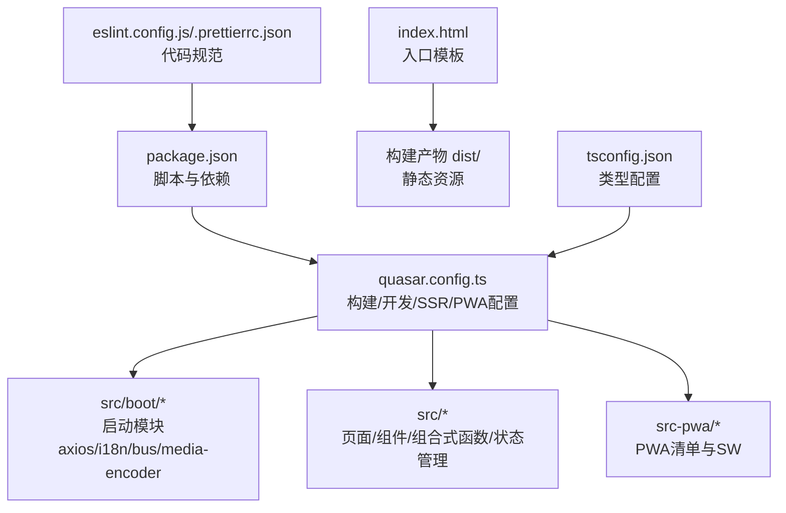
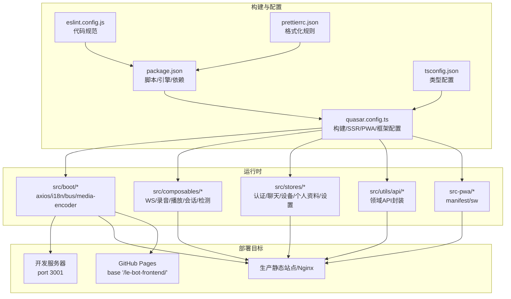
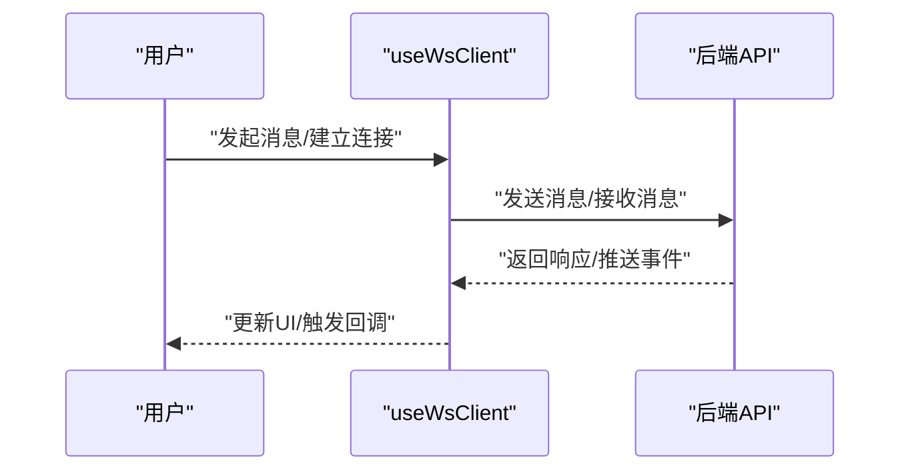
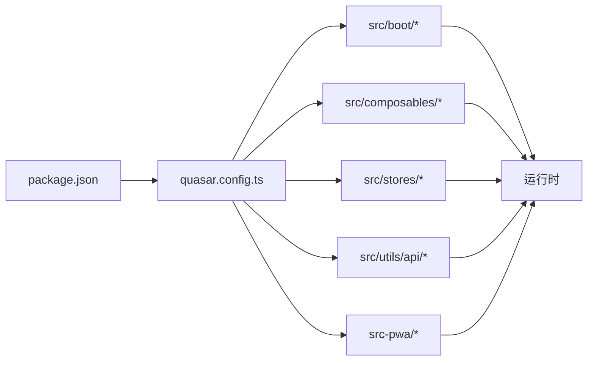

# 部署与运维

<cite>
**本文引用的文件**
- [package.json](file://package.json)
- [quasar.config.ts](file://quasar.config.ts)
- [index.html](file://index.html)
- [README.md](file://README.md)
- [eslint.config.js](file://eslint.config.js)
- [.prettierrc.json](file://.prettierrc.json)
- [tsconfig.json](file://tsconfig.json)
- [src/boot/axios.ts](file://src/boot/axios.ts)
- [src/boot/bus.ts](file://src/boot/bus.ts)
- [src/boot/i18n.ts](file://src/boot/i18n.ts)
- [src/boot/media-encoder.ts](file://src/boot/media-encoder.ts)
- [src-pwa/manifest.json](file://src-pwa/manifest.json)
- [src-pwa/register-service-worker.ts](file://src-pwa/register-service-worker.ts)
- [src-pwa/custom-service-worker.ts](file://src-pwa/custom-service-worker.ts)
- [src/types/websocket/index.ts](file://src/types/websocket/index.ts)
- [src/utils/api/auth.ts](file://src/utils/api/auth.ts)
- [src/utils/api/device.ts](file://src/utils/api/device.ts)
- [src/utils/api/profile.ts](file://src/utils/api/profile.ts)
- [src/utils/api/voiceprint.ts](file://src/utils/api/voiceprint.ts)
- [src/stores/auth/index.ts](file://src/stores/auth/index.ts)
- [src/stores/chat/index.ts](file://src/stores/chat/index.ts)
- [src/stores/device/index.ts](file://src/stores/device/index.ts)
- [src/stores/profile/index.ts](file://src/stores/profile/index.ts)
- [src/stores/settings/index.ts](file://src/stores/settings/index.ts)
- [src/composables/useWsClient.ts](file://src/composables/useWsClient.ts)
- [src/composables/useChatRecorder.ts](file://src/composables/useChatRecorder.ts)
- [src/composables/useChatPlayer.ts](file://src/composables/useChatPlayer.ts)
- [src/composables/useChatSession.ts](file://src/composables/useChatSession.ts)
- [src/composables/useSilenceDetector.ts](file://src/composables/useSilenceDetector.ts)
- [src/composables/useWakeWord.ts](file://src/composables/useWakeWord.ts)
</cite>

## 目录
1. [简介](#简介)
2. [项目结构](#项目结构)
3. [核心组件](#核心组件)
4. [架构总览](#架构总览)
5. [详细组件分析](#详细组件分析)
6. [依赖关系分析](#依赖关系分析)
7. [性能考虑](#性能考虑)
8. [故障排查指南](#故障排查指南)
9. [结论](#结论)
10. [附录](#附录)

## 简介
本指南面向Le Bot前端应用的部署与运维，覆盖生产环境部署流程、服务器与域名配置、CI/CD流水线与自动化部署/回滚、监控与告警、日志与错误追踪、负载均衡与缓存、安全加固、备份与灾备、容量规划与成本优化、运维工具与应急响应等。由于当前仓库为前端单页应用（SPA），部署通常通过静态托管或反向代理到Nginx/Apache实现；同时结合PWA能力与Service Worker进行离线与缓存策略。

## 项目结构
该前端项目基于Quasar Vite构建，采用Vue 3 + TypeScript，包含以下关键目录与文件：
- 构建与运行：package.json脚本、quasar.config.ts配置、tsconfig.json类型配置
- 源码组织：src/下按功能域划分（boot、components、composables、layouts、pages、stores、types、utils）
- PWA相关：src-pwa/下的manifest.json、register-service-worker.ts、custom-service-worker.ts
- 开发与质量：eslint.config.js、.prettierrc.json、index.html入口模板

图表来源
- [quasar.config.ts:10-278](file://quasar.config.ts#L10-L278)
- [package.json:9-16](file://package.json#L9-L16)
- [tsconfig.json:1-3](file://tsconfig.json#L1-L3)
- [index.html:1-22](file://index.html#L1-L22)

章节来源
- [README.md:1-41](file://README.md#L1-L41)
- [quasar.config.ts:10-278](file://quasar.config.ts#L10-L278)
- [package.json:1-61](file://package.json#L1-L61)
- [tsconfig.json:1-3](file://tsconfig.json#L1-L3)
- [index.html:1-22](file://index.html#L1-L22)

## 核心组件
- 启动模块（Boot）：axios用于HTTP请求封装；i18n国际化；bus事件总线；media-encoder媒体录制编码器初始化
- 组合式函数（Composables）：WebSocket客户端、录音/播放器、会话管理、静音检测、唤醒词检测等
- 状态管理（Stores）：认证、聊天、设备、个人资料、设置等
- API工具：按领域拆分的API封装（认证/设备/个人资料/声纹）
- PWA：Workbox注入模式，自定义Service Worker与清单文件

章节来源
- [quasar.config.ts:18](file://quasar.config.ts#L18)
- [src/boot/axios.ts](file://src/boot/axios.ts)
- [src/boot/i18n.ts](file://src/boot/i18n.ts)
- [src/boot/bus.ts](file://src/boot/bus.ts)
- [src/boot/media-encoder.ts](file://src/boot/media-encoder.ts)
- [src/composables/useWsClient.ts](file://src/composables/useWsClient.ts)
- [src/composables/useChatRecorder.ts](file://src/composables/useChatRecorder.ts)
- [src/composables/useChatPlayer.ts](file://src/composables/useChatPlayer.ts)
- [src/composables/useChatSession.ts](file://src/composables/useChatSession.ts)
- [src/composables/useSilenceDetector.ts](file://src/composables/useSilenceDetector.ts)
- [src/composables/useWakeWord.ts](file://src/composables/useWakeWord.ts)
- [src/stores/auth/index.ts](file://src/stores/auth/index.ts)
- [src/stores/chat/index.ts](file://src/stores/chat/index.ts)
- [src/stores/device/index.ts](file://src/stores/device/index.ts)
- [src/stores/profile/index.ts](file://src/stores/profile/index.ts)
- [src/stores/settings/index.ts](file://src/stores/settings/index.ts)
- [src/utils/api/auth.ts](file://src/utils/api/auth.ts)
- [src/utils/api/device.ts](file://src/utils/api/device.ts)
- [src/utils/api/profile.ts](file://src/utils/api/profile.ts)
- [src/utils/api/voiceprint.ts](file://src/utils/api/voiceprint.ts)
- [src-pwa/manifest.json](file://src-pwa/manifest.json)
- [src-pwa/register-service-worker.ts](file://src-pwa/register-service-worker.ts)
- [src-pwa/custom-service-worker.ts](file://src-pwa/custom-service-worker.ts)

## 架构总览
前端应用通过Quasar/Vite构建，支持Hash路由模式，PWA以InjectManifest方式集成Workbox。运行时通过环境变量注入后端HTTP与WebSocket基础地址，并在不同部署目标（本地/生产/GitHub Pages）下调整公共路径与基础路径。

图表来源
- [quasar.config.ts:10-278](file://quasar.config.ts#L10-L278)
- [package.json:9-16](file://package.json#L9-L16)
- [tsconfig.json:1-3](file://tsconfig.json#L1-L3)
- [eslint.config.js:1-91](file://eslint.config.js#L1-L91)
- [.prettierrc.json:1-5](file://.prettierrc.json#L1-L5)

## 详细组件分析

### 构建与部署配置（quasar.config.ts）
- 构建阶段afterBuild钩子：修复PWA图标与清单路径，确保在不同base路径下正确加载
- 环境变量注入：LE_BOT_BACKEND_HTTP_BASE_URL与LE_BOT_BACKEND_WS_BASE_URL根据DEPLOY_GITHUB_PAGE与开发/生产环境动态设置
- 公共路径：DEPLOY_GITHUB_PAGE时base为“/le-bot-frontend/”，生产非GitHub Pages时为“/public/”
- 目标浏览器：ES2022及主流现代浏览器
- SSR：启用生产端口与渲染中间件，禁用PWA（SSR场景）
- PWA：InjectManifest模式，自定义SW与清单
- 开发服务器：端口3001，默认不自动打开浏览器

章节来源
- [quasar.config.ts:44-56](file://quasar.config.ts#L44-L56)
- [quasar.config.ts:58-69](file://quasar.config.ts#L58-L69)
- [quasar.config.ts:98-104](file://quasar.config.ts#L98-L104)
- [quasar.config.ts:182-203](file://quasar.config.ts#L182-L203)
- [quasar.config.ts:206-216](file://quasar.config.ts#L206-L216)
- [quasar.config.ts:140-144](file://quasar.config.ts#L140-L144)

### 启动模块（Boot）
- axios：统一HTTP请求封装，便于拦截器、超时、重试等策略集中管理
- i18n：国际化初始化
- bus：全局事件总线
- media-encoder：媒体录制编码器初始化

章节来源
- [quasar.config.ts:18](file://quasar.config.ts#L18)
- [src/boot/axios.ts](file://src/boot/axios.ts)
- [src/boot/i18n.ts](file://src/boot/i18n.ts)
- [src/boot/bus.ts](file://src/boot/bus.ts)
- [src/boot/media-encoder.ts](file://src/boot/media-encoder.ts)

### 组合式函数（Composables）
- WebSocket客户端：封装连接、消息收发、重连与心跳
- 录音/播放器：音频录制与播放控制
- 会话管理：聊天上下文与历史维护
- 静音检测与唤醒词检测：语音交互前置处理

图表来源
- [src/composables/useWsClient.ts](file://src/composables/useWsClient.ts)
- [src/types/websocket/index.ts](file://src/types/websocket/index.ts)

章节来源
- [src/composables/useWsClient.ts](file://src/composables/useWsClient.ts)
- [src/composables/useChatRecorder.ts](file://src/composables/useChatRecorder.ts)
- [src/composables/useChatPlayer.ts](file://src/composables/useChatPlayer.ts)
- [src/composables/useChatSession.ts](file://src/composables/useChatSession.ts)
- [src/composables/useSilenceDetector.ts](file://src/composables/useSilenceDetector.ts)
- [src/composables/useWakeWord.ts](file://src/composables/useWakeWord.ts)
- [src/types/websocket/index.ts](file://src/types/websocket/index.ts)

### 状态管理（Stores）
- 认证：登录态、令牌、用户信息
- 聊天：消息列表、输入框状态、发送队列
- 设备：设备配置与状态
- 个人资料：头像、昵称、偏好
- 设置：主题、语言、通知等

章节来源
- [src/stores/auth/index.ts](file://src/stores/auth/index.ts)
- [src/stores/chat/index.ts](file://src/stores/chat/index.ts)
- [src/stores/device/index.ts](file://src/stores/device/index.ts)
- [src/stores/profile/index.ts](file://src/stores/profile/index.ts)
- [src/stores/settings/index.ts](file://src/stores/settings/index.ts)

### API工具（Utils/API）
- 按领域拆分的API封装，便于统一错误处理、鉴权与缓存策略

章节来源
- [src/utils/api/auth.ts](file://src/utils/api/auth.ts)
- [src/utils/api/device.ts](file://src/utils/api/device.ts)
- [src/utils/api/profile.ts](file://src/utils/api/profile.ts)
- [src/utils/api/voiceprint.ts](file://src/utils/api/voiceprint.ts)

### PWA与Service Worker
- Workbox模式：InjectManifest
- 自定义Service Worker与注册脚本
- 清单文件：包含图标、主题色、显示模式等

章节来源
- [quasar.config.ts:206-216](file://quasar.config.ts#L206-L216)
- [src-pwa/manifest.json](file://src-pwa/manifest.json)
- [src-pwa/register-service-worker.ts](file://src-pwa/register-service-worker.ts)
- [src-pwa/custom-service-worker.ts](file://src-pwa/custom-service-worker.ts)

## 依赖关系分析
- 构建链路：package.json脚本驱动Quasar/Vite构建；quasar.config.ts决定输出目录、公共路径、环境变量与PWA策略
- 运行链路：boot模块初始化axios/i18n等；composables与stores提供运行时能力；API工具对接后端
- PWA链路：Workbox注入自定义SW，注册Service Worker，实现离线与缓存策略

图表来源
- [package.json:9-16](file://package.json#L9-L16)
- [quasar.config.ts:10-278](file://quasar.config.ts#L10-L278)

章节来源
- [package.json:1-61](file://package.json#L1-L61)
- [quasar.config.ts:10-278](file://quasar.config.ts#L10-L278)

## 性能考虑
- 构建目标与浏览器兼容：ES2022与现代浏览器，减少polyfill体积
- Hash路由：避免对服务器重写规则的依赖，简化部署
- PWA缓存：通过Workbox策略控制静态资源与API缓存命中率
- 媒体处理：媒体录制编码器按需初始化，避免不必要的初始化开销
- 代码分割与懒加载：由Vite/Quasar默认策略保证

章节来源
- [quasar.config.ts:71-74](file://quasar.config.ts#L71-L74)
- [quasar.config.ts:82](file://quasar.config.ts#L82)
- [src/boot/media-encoder.ts](file://src/boot/media-encoder.ts)

## 故障排查指南
- 构建失败
  - 检查Node版本与包管理器是否满足引擎要求
  - 查看构建脚本与Vite配置中的base路径与环境变量
- 运行时错误
  - 校验axios拦截器与后端基础URL配置
  - 检查WebSocket连接与重连逻辑
- PWA问题
  - 确认Service Worker已注册且清单路径正确
  - 校验Workbox注入模式与缓存策略
- 代码质量
  - 使用ESLint与Prettier规则检查与格式化

章节来源
- [package.json:54-59](file://package.json#L54-L59)
- [quasar.config.ts:58-69](file://quasar.config.ts#L58-L69)
- [quasar.config.ts:206-216](file://quasar.config.ts#L206-L216)
- [eslint.config.js:1-91](file://eslint.config.js#L1-L91)
- [.prettierrc.json:1-5](file://.prettierrc.json#L1-L5)

## 结论
本指南从部署到运维全链路梳理了Le Bot前端应用的关键点：明确构建配置、运行时模块、PWA策略与环境变量注入；给出生产部署建议（静态托管/反向代理）、CI/CD落地思路、监控与告警、日志与错误追踪、负载均衡与缓存、安全加固、灾备与迁移、容量与成本优化以及运维工具与应急流程。实际落地时应结合后端服务与基础设施现状细化执行步骤。

## 附录

### 生产环境部署流程（建议）
- 准备静态托管或反向代理（Nginx/Apache）
- 在构建前设置环境变量（如DEPLOY_GITHUB_PAGE、后端HTTP/WS基础URL）
- 执行构建脚本生成dist目录
- 将dist目录部署至目标服务器或CDN
- 配置域名与HTTPS证书
- 验证PWA清单与Service Worker注册

章节来源
- [quasar.config.ts:44-56](file://quasar.config.ts#L44-L56)
- [quasar.config.ts:58-69](file://quasar.config.ts#L58-L69)
- [quasar.config.ts:98-104](file://quasar.config.ts#L98-L104)
- [README.md:34-37](file://README.md#L34-L37)

### CI/CD流水线与自动化部署/回滚（建议）
- 触发条件：push到主分支或发布标签
- 步骤：安装依赖 → Lint/Format → 构建 → 上传制品（dist/或静态托管）
- 回滚：保留最近N个版本，切换CNAME或反向代理指向目标版本

章节来源
- [package.json:9-16](file://package.json#L9-L16)
- [eslint.config.js:1-91](file://eslint.config.js#L1-L91)
- [.prettierrc.json:1-5](file://.prettierrc.json#L1-L5)

### 监控系统与告警（建议）
- 前端监控：核心指标（首屏时间、交互延迟、错误率、PWA缓存命中）
- 告警：阈值触发（错误率、缓存未命中、离线可用性下降）

章节来源
- [src-pwa/custom-service-worker.ts](file://src-pwa/custom-service-worker.ts)

### 日志管理与错误追踪（建议）
- 前端错误上报：捕获Promise Rejection与全局异常
- 用户行为分析：埋点上报（页面访问、交互事件、语音操作）

章节来源
- [src/boot/axios.ts](file://src/boot/axios.ts)
- [src/composables/useWsClient.ts](file://src/composables/useWsClient.ts)

### 负载均衡、缓存与安全（建议）
- 负载均衡：多实例部署，健康检查
- 缓存：静态资源强缓存、API缓存策略（ETag/Cache-Control）
- 安全：HTTPS、CSP、X-Frame-Options、X-Content-Type-Options

章节来源
- [quasar.config.ts:206-216](file://quasar.config.ts#L206-L216)
- [src-pwa/manifest.json](file://src-pwa/manifest.json)

### 备份、灾备与数据迁移（建议）
- 备份：构建产物与PWA缓存快照
- 灾备：多地域镜像与回切策略
- 数据迁移：前后端接口版本化与兼容策略

章节来源
- [src-pwa/custom-service-worker.ts](file://src-pwa/custom-service-worker.ts)

### 运维最佳实践与成本优化（建议）
- 最佳实践：灰度发布、变更评审、文档化
- 成本优化：CDN缓存、压缩传输、按量计费资源

章节来源
- [package.json:17-30](file://package.json#L17-L30)