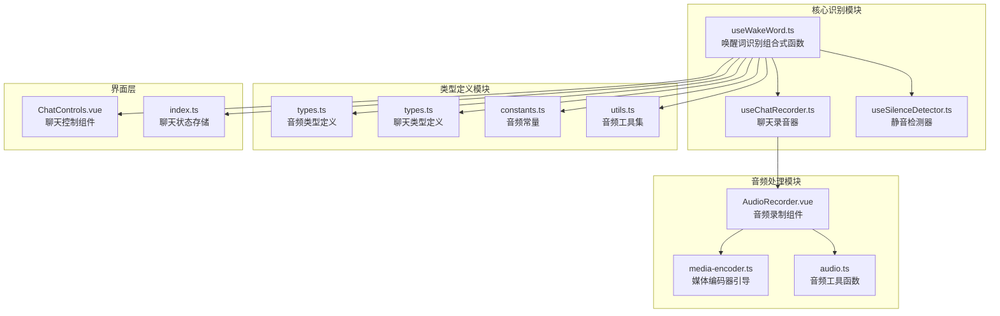
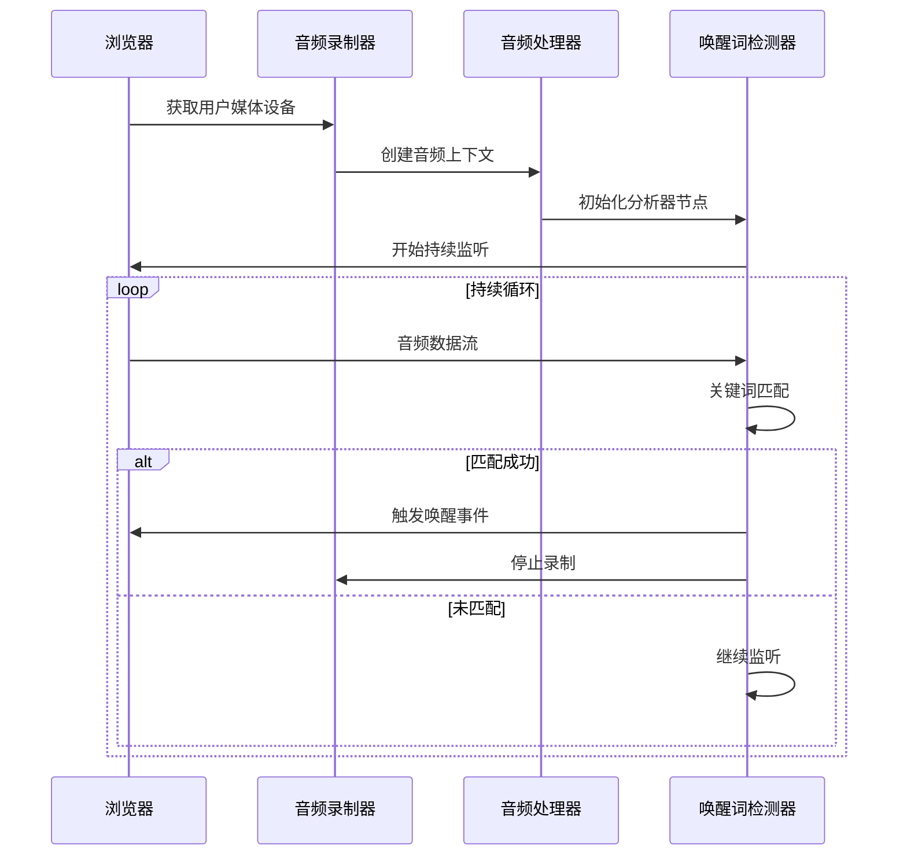
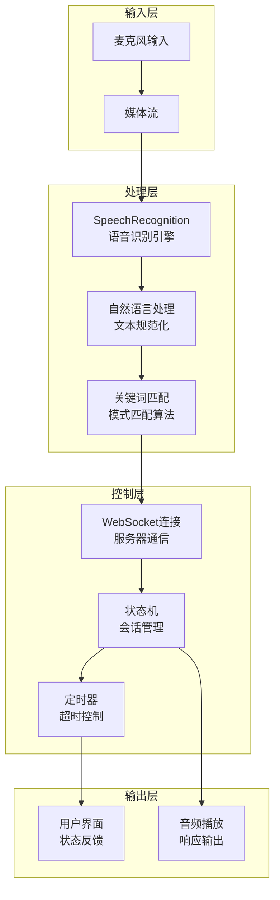
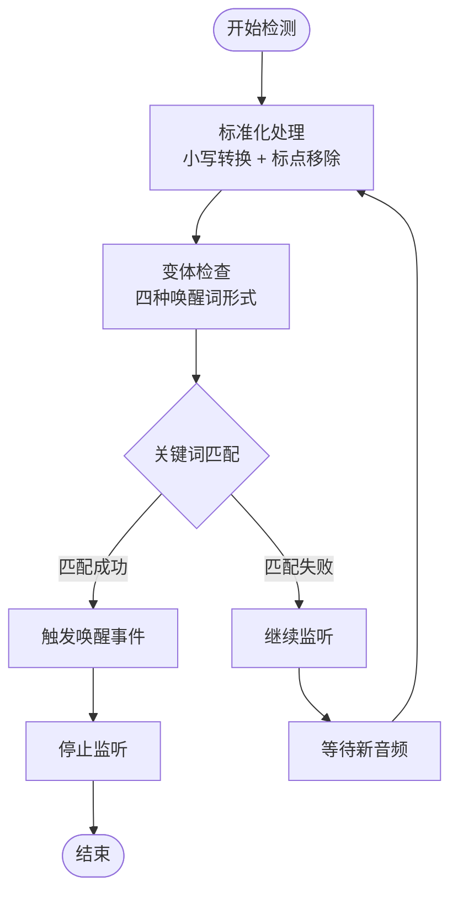
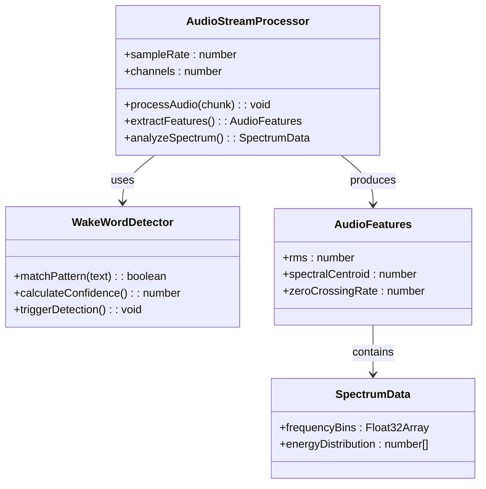
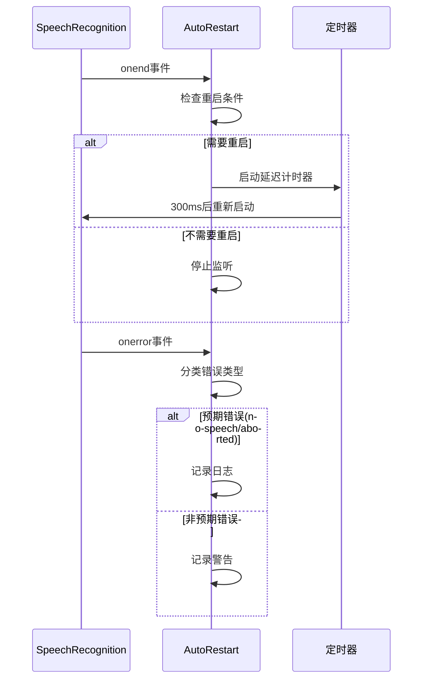
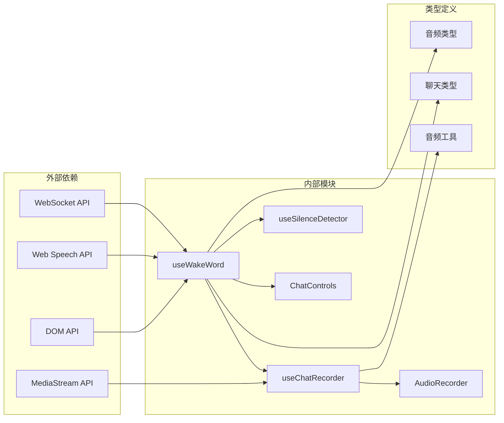

# 唤醒词识别系统

<cite>
**本文档引用的文件**
- [useWakeWord.ts](file://src/composables/useWakeWord.ts)
- [useChatRecorder.ts](file://src/composables/useChatRecorder.ts)
- [useSilenceDetector.ts](file://src/composables/useSilenceDetector.ts)
- [AudioRecorder.vue](file://src/components/AudioRecorder.vue)
- [media-encoder.ts](file://src/boot/media-encoder.ts)
- [audio.ts](file://src/utils/audio.ts)
- [types.ts](file://src/types/audio/types.ts)
- [utils.ts](file://src/types/audio/utils.ts)
- [constants.ts](file://src/types/audio/constants.ts)
- [types.ts](file://src/types/chat/types.ts)
- [ChatControls.vue](file://src/components/chat/ChatControls.vue)
- [index.ts](file://src/stores/chat/index.ts)
</cite>

## 目录
1. [简介](#简介)
2. [项目结构](#项目结构)
3. [核心组件](#核心组件)
4. [架构概览](#架构概览)
5. [详细组件分析](#详细组件分析)
6. [依赖关系分析](#依赖关系分析)
7. [性能考虑](#性能考虑)
8. [故障排除指南](#故障排除指南)
9. [结论](#结论)
10. [附录](#附录)

## 简介

唤醒词识别系统是一个基于浏览器的语音识别解决方案，专门用于检测用户发出的唤醒词"你好乐宝"。该系统采用Web Speech API技术，在Chrome和Edge浏览器中提供实时的语音转文字功能，支持中文普通话识别。

系统的核心目标是在用户说出特定唤醒词时触发聊天会话，同时确保低延迟响应和高准确性。通过结合音频流分析、关键词匹配和智能触发条件判断，系统能够在复杂的环境中准确识别用户的唤醒意图。

## 项目结构

唤醒词识别系统主要由以下模块组成：

**图表来源**
- [useWakeWord.ts:1-163](file://src/composables/useWakeWord.ts#L1-L163)
- [useChatRecorder.ts:1-148](file://src/composables/useChatRecorder.ts#L1-L148)
- [useSilenceDetector.ts:1-104](file://src/composables/useSilenceDetector.ts#L1-L104)
- [AudioRecorder.vue:1-113](file://src/components/AudioRecorder.vue#L1-L113)

**章节来源**
- [useWakeWord.ts:1-163](file://src/composables/useWakeWord.ts#L1-L163)
- [useChatRecorder.ts:1-148](file://src/composables/useChatRecorder.ts#L1-L148)
- [useSilenceDetector.ts:1-104](file://src/composables/useSilenceDetector.ts#L1-L104)

## 核心组件

### 唤醒词识别组合式函数

`useWakeWord`是系统的核心组件，负责实现唤醒词检测的所有逻辑。它提供了完整的API接口，包括状态管理、事件监听和生命周期控制。

**主要特性：**
- 支持多种唤醒词变体（包含标点符号和空格的不同形式）
- 实时音频流分析和关键词匹配
- 自动重启机制以应对识别中断
- 错误处理和边界情况管理

**关键接口：**
- `isSupported`: 浏览器兼容性检查
- `isListening`: 当前监听状态
- `start()`: 开始监听唤醒词
- `stop()`: 停止监听
- `onWakeDetected()`: 唤醒回调注册

### 音频流处理系统

系统采用分层的音频处理架构，确保高质量的音频采集和传输：

**图表来源**
- [useWakeWord.ts:81-136](file://src/composables/useWakeWord.ts#L81-L136)
- [useChatRecorder.ts:47-91](file://src/composables/useChatRecorder.ts#L47-L91)

**章节来源**
- [useWakeWord.ts:40-51](file://src/composables/useWakeWord.ts#L40-L51)
- [useWakeWord.ts:64-162](file://src/composables/useWakeWord.ts#L64-L162)

## 架构概览

唤醒词识别系统采用模块化设计，各组件职责明确且高度解耦：

**图表来源**
- [useWakeWord.ts:34-38](file://src/composables/useWakeWord.ts#L34-L38)
- [useWakeWord.ts:73-79](file://src/composables/useWakeWord.ts#L73-L79)
- [useChatRecorder.ts:36-36](file://src/composables/useChatRecorder.ts#L36-L36)

## 详细组件分析

### 唤醒词检测算法

系统实现了高效的关键词匹配算法，支持多种唤醒词变体：

**图表来源**
- [useWakeWord.ts:73-79](file://src/composables/useWakeWord.ts#L73-L79)
- [useWakeWord.ts:4-4](file://src/composables/useWakeWord.ts#L4-L4)

**匹配算法特点：**
- 支持中文标点符号的灵活处理
- 忽略空格和换行符的影响
- 多种唤醒词形式的统一匹配
- 性能优化的字符串比较算法

### 音频流分析机制

系统采用Web Audio API进行实时音频分析：

**图表来源**
- [useChatRecorder.ts:47-70](file://src/composables/useChatRecorder.ts#L47-L70)
- [useSilenceDetector.ts:41-50](file://src/composables/useSilenceDetector.ts#L41-L50)

**章节来源**
- [useChatRecorder.ts:25-35](file://src/composables/useChatRecorder.ts#L25-L35)
- [useSilenceDetector.ts:14-26](file://src/composables/useSilenceDetector.ts#L14-L26)

### 自动重启机制

为确保连续监听，系统实现了智能的自动重启机制：

**图表来源**
- [useWakeWord.ts:105-128](file://src/composables/useWakeWord.ts#L105-L128)

**章节来源**
- [useWakeWord.ts:105-128](file://src/composables/useWakeWord.ts#L105-L128)

## 依赖关系分析

系统采用松耦合的设计模式，各组件之间的依赖关系清晰明确：

**图表来源**
- [useWakeWord.ts:34-38](file://src/composables/useWakeWord.ts#L34-L38)
- [useChatRecorder.ts:1-2](file://src/composables/useChatRecorder.ts#L1-L2)

**章节来源**
- [useWakeWord.ts:1-1](file://src/composables/useWakeWord.ts#L1-L1)
- [useChatRecorder.ts:1-2](file://src/composables/useChatRecorder.ts#L1-L2)

## 性能考虑

### 实时性优化

系统在多个层面进行了性能优化以确保低延迟响应：

**音频处理优化：**
- 200ms音频块处理间隔，平衡延迟和CPU使用
- 16kHz采样率，满足语音识别最佳质量
- 单声道音频，减少计算复杂度
- WebAssembly优化的音频处理算法

**内存管理：**
- 及时释放音频上下文和分析器节点
- 避免音频数据的重复缓冲
- 合理的垃圾回收策略

**网络优化：**
- WebSocket长连接复用
- 批量发送音频数据
- 智能的重连机制

### 准确性优化策略

**噪声抑制：**
- 浏览器内置的降噪算法
- 高通滤波器去除低频噪声
- 动态阈值调整适应环境变化

**关键词匹配优化：**
- 多模式匹配算法
- 模糊匹配容错机制
- 上下文感知的置信度评估

## 故障排除指南

### 常见问题诊断

**浏览器兼容性问题：**
- 确认使用Chrome或Edge浏览器
- 检查HTTPS环境要求
- 验证麦克风权限授权

**音频设备问题：**
- 检查麦克风是否被其他应用占用
- 验证音频驱动程序正常
- 确认音频采样率设置正确

**识别准确性问题：**
- 调整唤醒词变体设置
- 优化录音环境噪声控制
- 检查音频增益和音量设置

### 调试工具和监控

**开发工具集成：**
- 浏览器开发者工具的音频面板
- Web Audio API可视化工具
- 网络请求监控和分析

**性能监控指标：**
- 唤醒词检测延迟时间
- 识别准确率统计
- CPU和内存使用率监控

**章节来源**
- [useWakeWord.ts:123-128](file://src/composables/useWakeWord.ts#L123-L128)
- [AudioRecorder.vue:52-59](file://src/components/AudioRecorder.vue#L52-L59)

## 结论

唤醒词识别系统通过精心设计的架构和优化的算法，成功实现了高精度、低延迟的语音唤醒功能。系统的主要优势包括：

**技术优势：**
- 基于Web Speech API的浏览器原生支持
- 多种唤醒词变体的智能匹配
- 实时音频流处理和分析
- 智能的自动重启机制

**用户体验优势：**
- 无缝的语音交互体验
- 低延迟的响应时间
- 高准确性的识别结果
- 简洁直观的界面设计

**扩展性考虑：**
- 模块化的架构设计便于功能扩展
- 标准化的API接口支持二次开发
- 良好的性能表现适应大规模部署

未来可以考虑的功能增强包括多语言支持、个性化唤醒词训练、以及更高级的机器学习算法集成。

## 附录

### 配置选项和参数

**音频配置参数：**
- 采样率：16kHz
- 通道数：1（单声道）
- 位深度：16位
- 块大小：200ms

**识别配置参数：**
- 语言：zh-CN（中文普通话）
- 连续模式：启用
- 中间结果：启用
- 唤醒词列表：['你好乐宝', '你好，乐宝', '你好,乐宝', '你好 乐宝']

### API参考

**useWakeWord API：**
- `isSupported`: boolean - 浏览器支持状态
- `isListening`: Ref<boolean> - 监听状态
- `start()`: void - 开始监听
- `stop()`: void - 停止监听
- `onWakeDetected(callback)`: void - 注册唤醒回调

**useChatRecorder API：**
- `initMedia()`: Promise<void> - 初始化媒体流
- `startRecording()`: void - 开始录音
- `stopRecording()`: void - 停止录音
- `releaseMedia()`: void - 释放资源
- `onChunk(callback)`: void - 注册音频块回调

**章节来源**
- [useWakeWord.ts:40-51](file://src/composables/useWakeWord.ts#L40-L51)
- [useChatRecorder.ts:6-23](file://src/composables/useChatRecorder.ts#L6-L23)