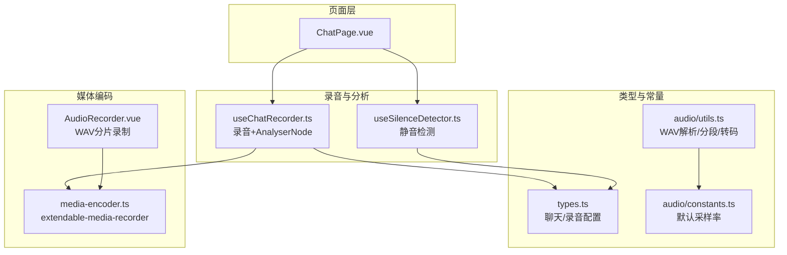
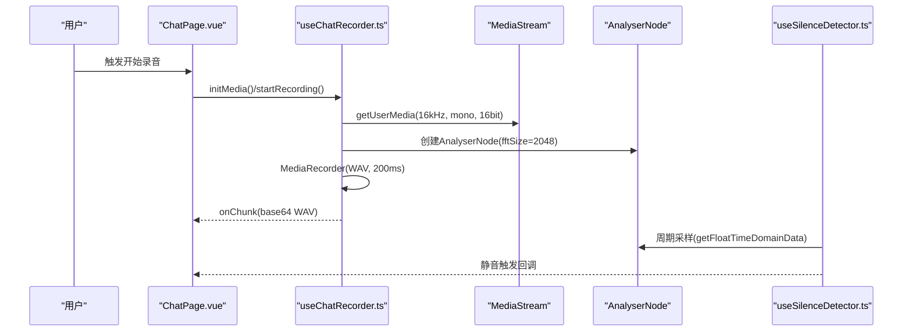
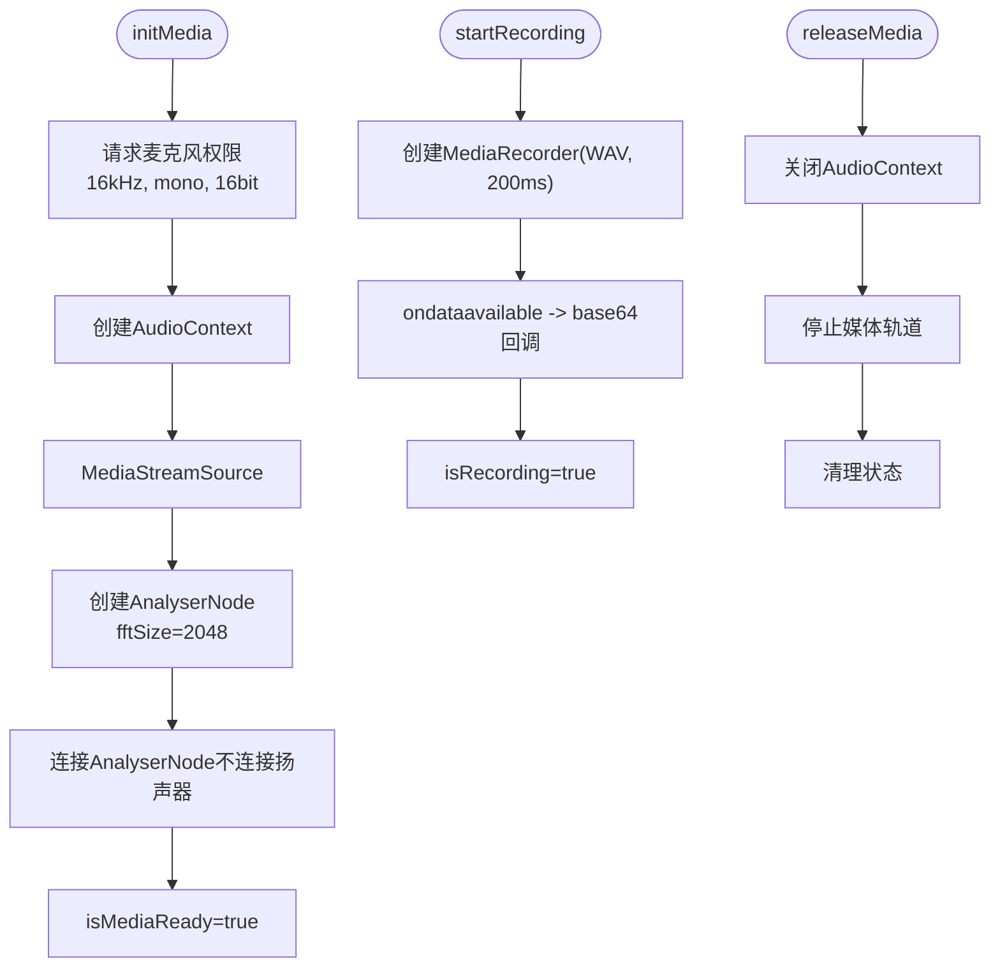
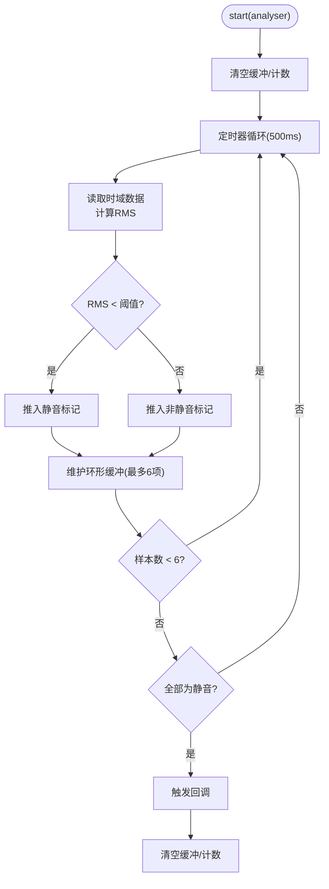
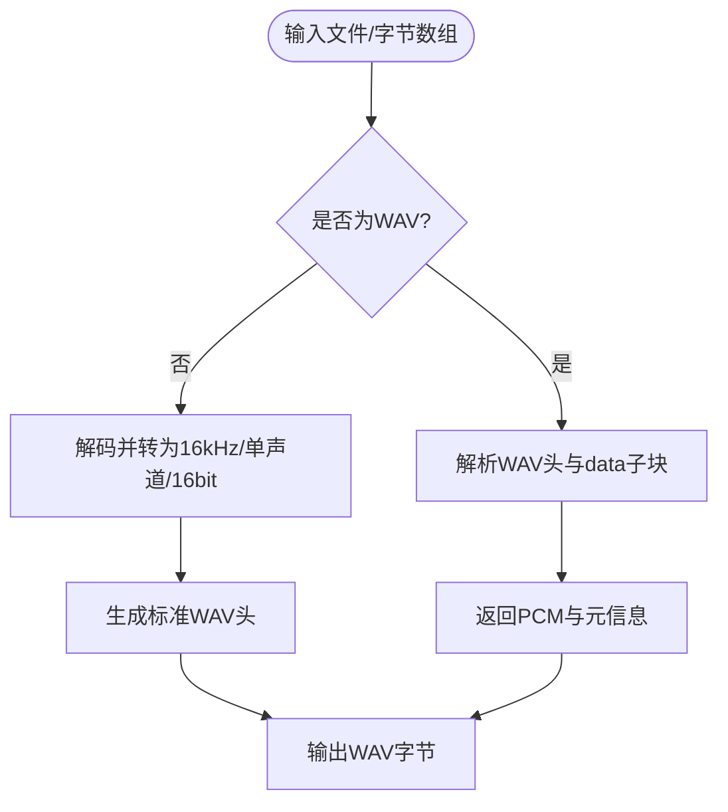
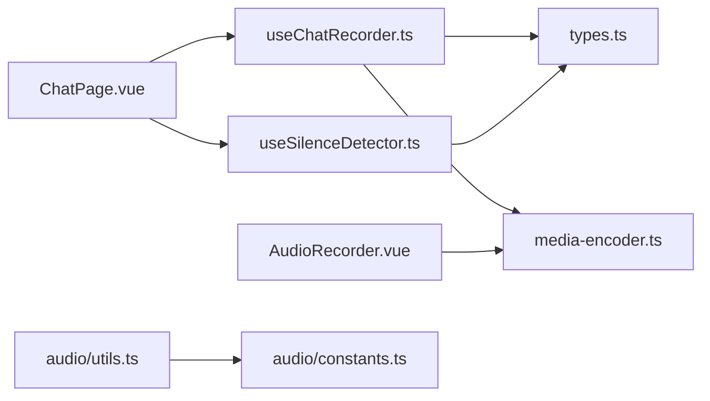

# 音频分析系统

<cite>
**本文引用的文件**
- [useSilenceDetector.ts](file://src/composables/useSilenceDetector.ts)
- [useChatRecorder.ts](file://src/composables/useChatRecorder.ts)
- [types.ts](file://src/types/chat/types.ts)
- [AudioRecorder.vue](file://src/components/AudioRecorder.vue)
- [media-encoder.ts](file://src/boot/media-encoder.ts)
- [audio.ts](file://src/utils/audio.ts)
- [utils.ts](file://src/types/audio/utils.ts)
- [constants.ts](file://src/types/audio/constants.ts)
- [ChatPage.vue](file://src/pages/stack/ChatPage.vue)
</cite>

## 目录
1. [简介](#简介)
2. [项目结构](#项目结构)
3. [核心组件](#核心组件)
4. [架构总览](#架构总览)
5. [详细组件分析](#详细组件分析)
6. [依赖关系分析](#依赖关系分析)
7. [性能考量](#性能考量)
8. [故障排查指南](#故障排查指南)
9. [结论](#结论)
10. [附录](#附录)

## 简介
本文件面向“音频分析系统”的技术文档，聚焦于静音检测算法的实现原理与工程实践，涵盖以下主题：
- 静音检测算法：RMS能量计算、时域采样与阈值判断、环形缓冲窗口与触发策略
- AnalyserNode配置与使用：时域数据采集、fftSize选择、与录音管线的集成
- 参数调优：阈值、采样间隔、连续静音计数等对灵敏度与误检的影响
- 音频质量评估与特征提取：WAV解析、分段、转码与基础统计
- 实时性能优化：CPU使用率控制、内存管理与事件驱动模型
- 可视化与调试：状态指示、日志与监控建议

## 项目结构
前端采用Vue生态与Web Audio API构建，音频分析与录音流程由可组合函数与类型定义支撑，页面层负责状态展示与交互。

图表来源
- [ChatPage.vue:1-179](file://src/pages/stack/ChatPage.vue#L1-L179)
- [useChatRecorder.ts:1-148](file://src/composables/useChatRecorder.ts#L1-L148)
- [useSilenceDetector.ts:1-104](file://src/composables/useSilenceDetector.ts#L1-L104)
- [types.ts:1-96](file://src/types/chat/types.ts#L1-L96)
- [utils.ts:1-312](file://src/types/audio/utils.ts#L1-L312)
- [constants.ts:1-2](file://src/types/audio/constants.ts#L1-L2)
- [media-encoder.ts:1-8](file://src/boot/media-encoder.ts#L1-L8)
- [AudioRecorder.vue:1-113](file://src/components/AudioRecorder.vue#L1-L113)

章节来源
- [ChatPage.vue:1-179](file://src/pages/stack/ChatPage.vue#L1-L179)
- [useChatRecorder.ts:1-148](file://src/composables/useChatRecorder.ts#L1-L148)
- [useSilenceDetector.ts:1-104](file://src/composables/useSilenceDetector.ts#L1-L104)
- [types.ts:1-96](file://src/types/chat/types.ts#L1-L96)
- [utils.ts:1-312](file://src/types/audio/utils.ts#L1-L312)
- [constants.ts:1-2](file://src/types/audio/constants.ts#L1-L2)
- [media-encoder.ts:1-8](file://src/boot/media-encoder.ts#L1-L8)
- [AudioRecorder.vue:1-113](file://src/components/AudioRecorder.vue#L1-L113)

## 核心组件
- useChatRecorder：初始化麦克风流、创建AudioContext与AnalyserNode，配置MediaRecorder以200ms分片输出WAV；提供AnalyserNode供静音检测使用。
- useSilenceDetector：基于RMS能量的静音检测器，周期采样、环形缓冲、阈值判断与触发回调。
- 类型与常量：统一静音检测参数、录音参数、采样率等配置。
- 工具模块：WAV解析、分段、转码与基础统计，支持外部音频文件处理。
- 页面与组件：页面展示连接状态与会话状态，录音组件负责实际录音与错误提示。

章节来源
- [useChatRecorder.ts:1-148](file://src/composables/useChatRecorder.ts#L1-L148)
- [useSilenceDetector.ts:1-104](file://src/composables/useSilenceDetector.ts#L1-L104)
- [types.ts:56-95](file://src/types/chat/types.ts#L56-L95)
- [utils.ts:1-312](file://src/types/audio/utils.ts#L1-L312)
- [AudioRecorder.vue:1-113](file://src/components/AudioRecorder.vue#L1-L113)

## 架构总览
系统采用“录音管线 + 分析管线”双线并行：
- 录音管线：getUserMedia → MediaRecorder（WAV，200ms分片）→ 上层消费
- 分析管线：同一MediaStream → AudioContext → AnalyserNode（时域数据）→ 静音检测
- 配置统一：采样率、通道数、位深、分片时长等均在类型中集中定义

图表来源
- [useChatRecorder.ts:47-91](file://src/composables/useChatRecorder.ts#L47-L91)
- [useSilenceDetector.ts:41-78](file://src/composables/useSilenceDetector.ts#L41-L78)
- [types.ts:85-95](file://src/types/chat/types.ts#L85-L95)

## 详细组件分析

### 组件一：useChatRecorder（录音与AnalyserNode）
职责与要点：
- 初始化媒体流：采样率、通道数、位深、自动回声消除/降噪/增益控制
- 创建AudioContext与AnalyserNode，设置fftSize=2048，仅分析不播放
- 启动MediaRecorder，按200ms分片输出WAV并通过回调传递
- 提供AnalyserNode引用给静音检测器
- 生命周期管理：释放资源、关闭AudioContext、停止媒体轨道

图表来源
- [useChatRecorder.ts:47-116](file://src/composables/useChatRecorder.ts#L47-L116)

章节来源
- [useChatRecorder.ts:1-148](file://src/composables/useChatRecorder.ts#L1-L148)
- [types.ts:85-95](file://src/types/chat/types.ts#L85-L95)

### 组件二：useSilenceDetector（静音检测）
算法与流程：
- RMS能量计算：从AnalyserNode读取时域数据，计算均方根作为能量指标
- 周期采样：默认每500ms一次
- 环形缓冲：保留最近6次采样（共3秒），满足阈值才触发
- 触发策略：全部采样均低于阈值时触发，触发后重置缓冲避免重复触发
- 回调注册：静音检测到后执行注册的回调

图表来源
- [useSilenceDetector.ts:41-78](file://src/composables/useSilenceDetector.ts#L41-L78)
- [types.ts:66-73](file://src/types/chat/types.ts#L66-L73)

章节来源
- [useSilenceDetector.ts:1-104](file://src/composables/useSilenceDetector.ts#L1-L104)
- [types.ts:56-73](file://src/types/chat/types.ts#L56-L73)

### 组件三：音频质量评估与特征提取
能力范围：
- WAV解析：校验RIFF/WAVE头、解析fmt与data子块，返回纯PCM数据与元信息
- 分段：按目标分片大小切分音频
- 转码：将任意音频文件转换为16kHz、单声道、16bit PCM的WAV
- 基础统计：通过解析WAV信息可推导采样点数、声道数、采样率等

图表来源
- [utils.ts:11-64](file://src/types/audio/utils.ts#L11-L64)
- [utils.ts:93-139](file://src/types/audio/utils.ts#L93-L139)
- [utils.ts:221-262](file://src/types/audio/utils.ts#L221-L262)

章节来源
- [utils.ts:1-312](file://src/types/audio/utils.ts#L1-L312)
- [constants.ts:1-2](file://src/types/audio/constants.ts#L1-L2)

### 组件四：录音组件与编码器
- AudioRecorder.vue：使用extendable-media-recorder进行WAV分片录制，200ms分片，错误通知
- media-encoder.ts：在应用启动时注册extendable-media-recorder与WAV编码器

章节来源
- [AudioRecorder.vue:1-113](file://src/components/AudioRecorder.vue#L1-L113)
- [media-encoder.ts:1-8](file://src/boot/media-encoder.ts#L1-L8)

## 依赖关系分析
- useChatRecorder依赖类型定义中的AUDIO_CONSTANTS，确保采样率、通道数、位深与分片时长一致
- useSilenceDetector依赖DEFAULT_SILENCE_CONFIG，统一静音检测阈值、采样间隔与连续计数
- utils.ts与constants.ts共同提供WAV处理与默认采样率
- 页面层通过useChatSession等组合逻辑协调录音与静音检测

图表来源
- [useChatRecorder.ts:1-148](file://src/composables/useChatRecorder.ts#L1-L148)
- [useSilenceDetector.ts:1-104](file://src/composables/useSilenceDetector.ts#L1-L104)
- [types.ts:1-96](file://src/types/chat/types.ts#L1-L96)
- [utils.ts:1-312](file://src/types/audio/utils.ts#L1-L312)
- [constants.ts:1-2](file://src/types/audio/constants.ts#L1-L2)
- [media-encoder.ts:1-8](file://src/boot/media-encoder.ts#L1-L8)
- [AudioRecorder.vue:1-113](file://src/components/AudioRecorder.vue#L1-L113)
- [ChatPage.vue:1-179](file://src/pages/stack/ChatPage.vue#L1-L179)

章节来源
- [useChatRecorder.ts:1-148](file://src/composables/useChatRecorder.ts#L1-L148)
- [useSilenceDetector.ts:1-104](file://src/composables/useSilenceDetector.ts#L1-L104)
- [types.ts:1-96](file://src/types/chat/types.ts#L1-L96)
- [utils.ts:1-312](file://src/types/audio/utils.ts#L1-L312)
- [constants.ts:1-2](file://src/types/audio/constants.ts#L1-L2)
- [media-encoder.ts:1-8](file://src/boot/media-encoder.ts#L1-L8)
- [AudioRecorder.vue:1-113](file://src/components/AudioRecorder.vue#L1-L113)
- [ChatPage.vue:1-179](file://src/pages/stack/ChatPage.vue#L1-L179)

## 性能考量
- CPU使用率控制
  - 采样频率与fftSize权衡：当前fftSize=2048，采样间隔500ms，适合低延迟与较低CPU占用的平衡
  - 事件驱动：使用定时器周期采样，避免轮询忙等
  - 不连接AnalyserNode到扬声器，仅分析，减少渲染压力
- 内存管理
  - 定时器清理：stop()清除interval，避免内存泄漏
  - 流与上下文释放：releaseMedia()关闭AudioContext、停止媒体轨道
  - 分片录制：200ms分片降低单次处理峰值，利于实时性
- 实时性与稳定性
  - 静音检测采用环形缓冲与“优雅期”（样本数不足时不触发），降低误检
  - 参数可调：阈值、采样间隔、连续计数，便于针对不同环境微调

章节来源
- [useChatRecorder.ts:81-116](file://src/composables/useChatRecorder.ts#L81-L116)
- [useSilenceDetector.ts:81-91](file://src/composables/useSilenceDetector.ts#L81-L91)
- [types.ts:66-73](file://src/types/chat/types.ts#L66-L73)

## 故障排查指南
- 无法开始录音
  - 检查浏览器权限与设备可用性；确认initMedia()已调用且isMediaReady为true
  - 关注AudioRecorder.vue中的错误通知与异常捕获
- 静音检测不触发或频繁误检
  - 调整rmsThreshold：增大提高稳健性，减小提升敏感度
  - 调整checkIntervalMs与consecutiveSilentCount：更长窗口降低抖动，更短响应更快
  - 确认AnalyserNode配置与fftSize一致，避免数据读取异常
- 录音分片问题
  - 确认MediaRecorder的mimeType为audio/wav，分片时长为200ms
  - 如需外部音频处理，使用utils.ts中的WAV解析与转码工具
- 资源未释放
  - 页面卸载或会话结束时调用releaseMedia()，确保AudioContext与媒体轨道被释放

章节来源
- [AudioRecorder.vue:31-60](file://src/components/AudioRecorder.vue#L31-L60)
- [useChatRecorder.ts:47-116](file://src/composables/useChatRecorder.ts#L47-L116)
- [useSilenceDetector.ts:27-34](file://src/composables/useSilenceDetector.ts#L27-L34)
- [utils.ts:221-262](file://src/types/audio/utils.ts#L221-L262)

## 结论
本系统以Web Audio API为核心，结合extendable-media-recorder实现低延迟、可调参的实时音频分析与录音。静音检测采用RMS能量与时域采样，配合环形缓冲与阈值策略，在保证实时性的前提下具备良好的鲁棒性。通过统一的类型与常量配置、清晰的生命周期管理与分片录制，系统在移动端与桌面端均可稳定运行。后续可在噪声抑制、频域特征与可视化方面进一步扩展。

## 附录

### 参数调优建议
- 阈值（rmsThreshold）：默认0.01，适用于Web Audio浮点范围；在安静环境可略下调，嘈杂环境可上调
- 采样间隔（checkIntervalMs）：默认500ms；更短响应更快，但增加CPU开销
- 连续计数（consecutiveSilentCount）：默认6（对应3秒窗口）；更长窗口降低误检，更短窗口提升响应速度

章节来源
- [types.ts:66-73](file://src/types/chat/types.ts#L66-L73)

### 音频特征与质量评估
- 可从WAV解析中获取：声道数、采样率、位深、采样点数、PCM数据长度
- 建议扩展：计算SNR、频谱质心、零交叉率等特征，用于动态阈值与环境适应

章节来源
- [utils.ts:11-64](file://src/types/audio/utils.ts#L11-L64)