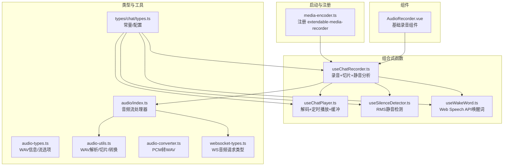
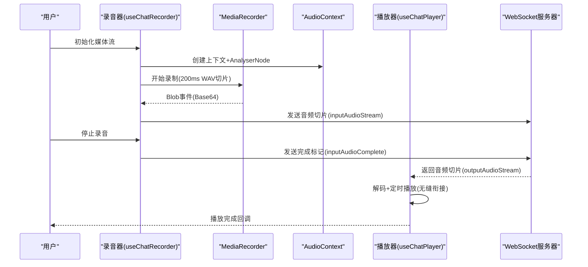
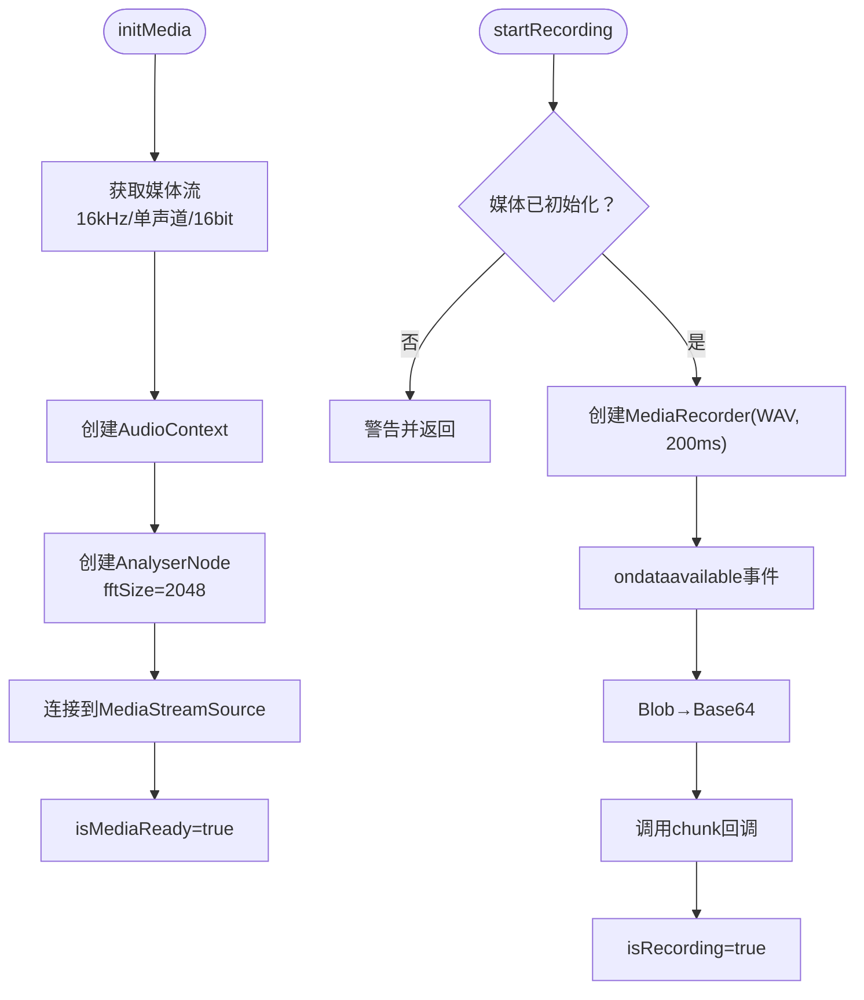
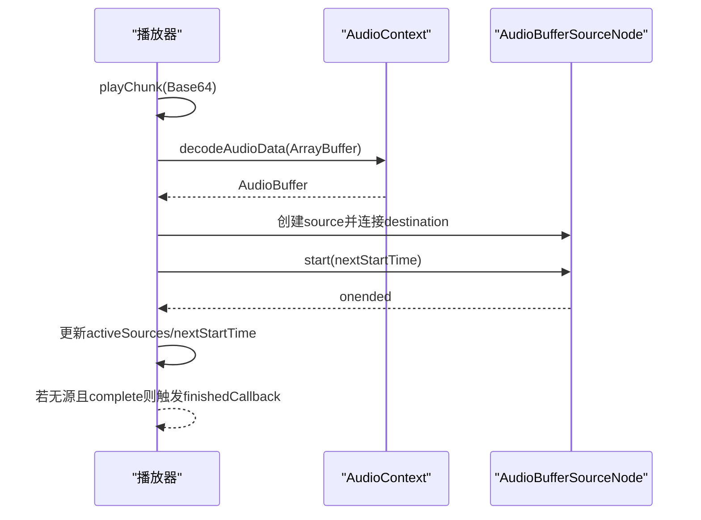
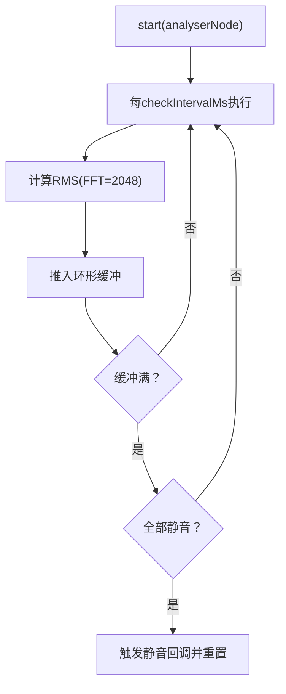
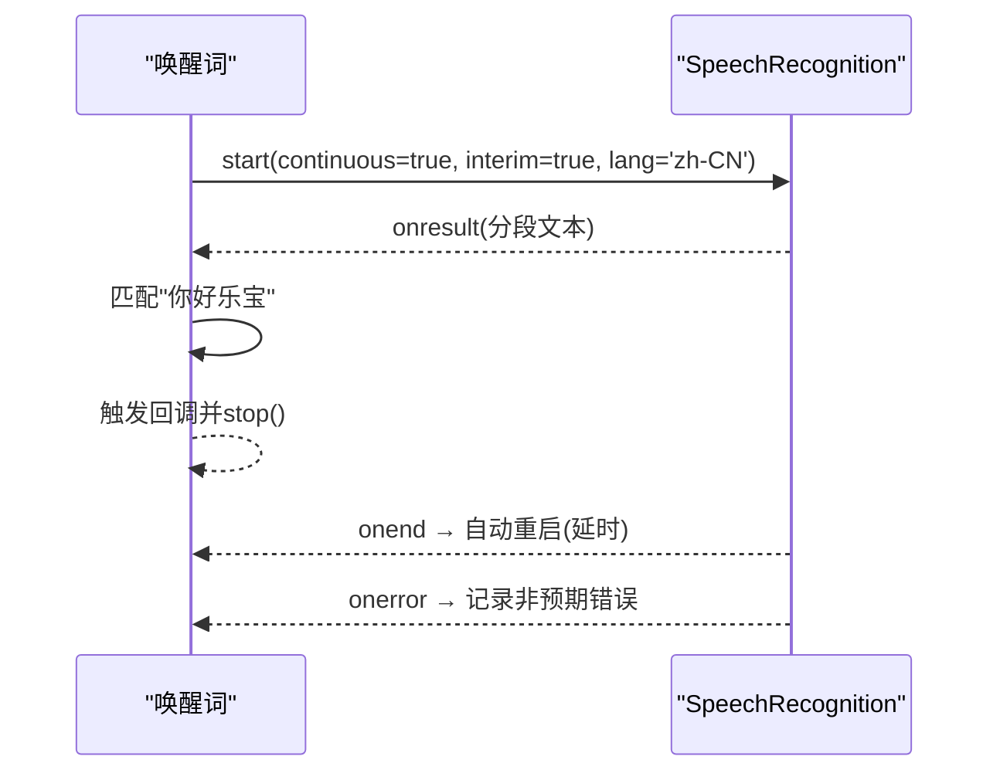
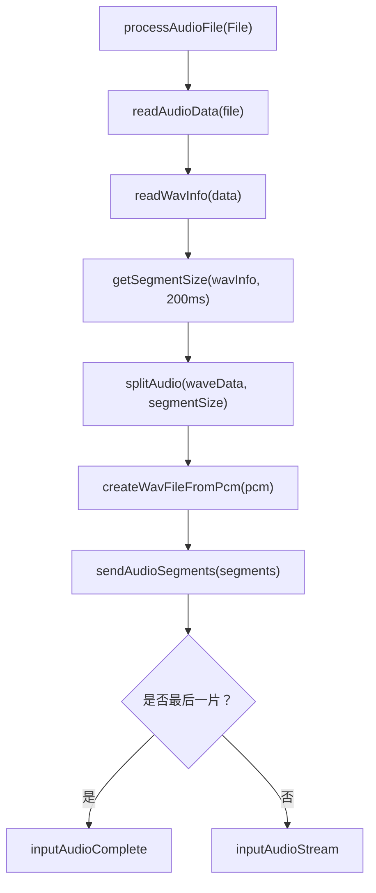
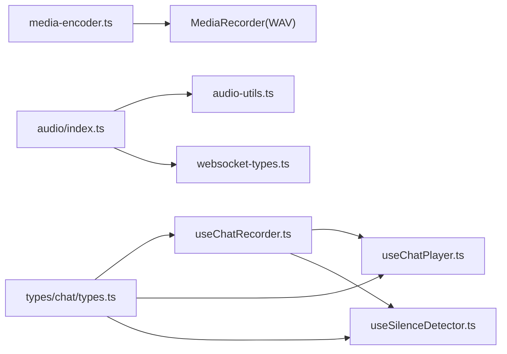

# 音频处理系统

<cite>
**本文引用的文件**
- [media-encoder.ts](file://src/boot/media-encoder.ts)
- [useChatRecorder.ts](file://src/composables/useChatRecorder.ts)
- [useChatPlayer.ts](file://src/composables/useChatPlayer.ts)
- [useSilenceDetector.ts](file://src/composables/useSilenceDetector.ts)
- [useWakeWord.ts](file://src/composables/useWakeWord.ts)
- [AudioRecorder.vue](file://src/components/AudioRecorder.vue)
- [types.ts](file://src/types/chat/types.ts)
- [audio.ts](file://src/types/audio/index.ts)
- [audio-utils.ts](file://src/types/audio/utils.ts)
- [audio-types.ts](file://src/types/audio/types.ts)
- [audio-constants.ts](file://src/types/audio/constants.ts)
- [audio-converter.ts](file://src/utils/audio.ts)
- [websocket-types.ts](file://src/types/websocket/types.ts)
- [chat-store.ts](file://src/stores/chat/index.ts)
</cite>

## 目录
1. [简介](#简介)
2. [项目结构](#项目结构)
3. [核心组件](#核心组件)
4. [架构总览](#架构总览)
5. [详细组件分析](#详细组件分析)
6. [依赖关系分析](#依赖关系分析)
7. [性能考量](#性能考量)
8. [故障排查指南](#故障排查指南)
9. [结论](#结论)
10. [附录](#附录)

## 简介
本文件面向 Le Bot 音频处理系统，系统围绕 Web Audio API 与 MediaRecorder API 构建，提供从麦克风采集、实时录音切片、静音检测、唤醒词识别，到音频播放与流式传输的完整链路。系统采用 16kHz 单声道、16bit 的统一采样参数，以 WAV 格式进行切片与传输，并通过 WebSocket 将音频流发送至服务端。同时，系统内置静音检测与唤醒词识别能力，支持跨浏览器兼容与资源释放。

## 项目结构
音频处理相关代码主要分布在以下模块：
- 启动注册：extendable-media-recorder 的注册与连接
- 组合式函数：录音、播放、静音检测、唤醒词识别
- 组件：基础录音组件
- 类型与工具：音频流处理、WAV 解析与转换、常量与配置
- WebSocket 类型：音频流请求/响应协议

**图表来源**
- [media-encoder.ts:1-8](file://src/boot/media-encoder.ts#L1-L8)
- [useChatRecorder.ts:1-148](file://src/composables/useChatRecorder.ts#L1-L148)
- [useChatPlayer.ts:1-161](file://src/composables/useChatPlayer.ts#L1-L161)
- [useSilenceDetector.ts:1-104](file://src/composables/useSilenceDetector.ts#L1-L104)
- [useWakeWord.ts:1-163](file://src/composables/useWakeWord.ts#L1-L163)
- [AudioRecorder.vue:1-113](file://src/components/AudioRecorder.vue#L1-L113)
- [types.ts:1-96](file://src/types/chat/types.ts#L1-L96)
- [audio-types.ts:1-14](file://src/types/audio/types.ts#L1-L14)
- [audio-utils.ts:1-312](file://src/types/audio/utils.ts#L1-L312)
- [audio.ts:1-150](file://src/types/audio/index.ts#L1-L150)
- [audio-converter.ts:1-47](file://src/utils/audio.ts#L1-L47)
- [websocket-types.ts:106-162](file://src/types/websocket/types.ts#L106-L162)

**章节来源**
- [media-encoder.ts:1-8](file://src/boot/media-encoder.ts#L1-L8)
- [types.ts:85-96](file://src/types/chat/types.ts#L85-L96)

## 核心组件
- 录音器 useChatRecorder：负责麦克风初始化、MediaRecorder 录制、200ms WAV 切片、Base64 传递、静音分析节点获取。
- 播放器 useChatPlayer：负责 Base64 音频解码、AudioBufferSourceNode 定时播放、无缝衔接、完成回调。
- 静音检测 useSilenceDetector：基于 AnalyserNode 的 RMS 计算，维护固定长度环形缓冲，判定持续静音。
- 唤醒词 useWakeWord：基于 Web Speech API（Chrome/Edge）连续监听“你好乐宝”，自动重启识别。
- 音频流处理器 AudioStreamProcessor：将本地音频文件按 200ms 切片，WAV 包装后通过 WebSocket 流式发送。
- 工具与类型：WAV 解析、切片、转换；聊天与音频常量；WebSocket 音频协议类型。

**章节来源**
- [useChatRecorder.ts:36-136](file://src/composables/useChatRecorder.ts#L36-L136)
- [useChatPlayer.ts:35-160](file://src/composables/useChatPlayer.ts#L35-L160)
- [useSilenceDetector.ts:27-103](file://src/composables/useSilenceDetector.ts#L27-L103)
- [useWakeWord.ts:64-162](file://src/composables/useWakeWord.ts#L64-L162)
- [audio.ts:14-149](file://src/types/audio/index.ts#L14-L149)
- [audio-utils.ts:11-312](file://src/types/audio/utils.ts#L11-L312)

## 架构总览
系统整体分为四层：
- 设备层：navigator.mediaDevices 获取媒体流
- 处理层：Web Audio API + MediaRecorder 实现录音、解码、播放与切片
- 协议层：WebSocket 传输音频切片与完成标记
- 应用层：状态机驱动（Idle → WaitingResponse → Active），配合静音检测与唤醒词

**图表来源**
- [useChatRecorder.ts:72-91](file://src/composables/useChatRecorder.ts#L72-L91)
- [useChatPlayer.ts:53-96](file://src/composables/useChatPlayer.ts#L53-L96)
- [websocket-types.ts:106-131](file://src/types/websocket/types.ts#L106-L131)

## 详细组件分析

### 录音器 useChatRecorder
- 功能要点
  - 初始化媒体流：16kHz、单声道、16bit，启用回声消除、降噪、自动增益
  - 创建 AudioContext 与 AnalyserNode，fftSize=2048，用于 RMS 分析
  - 使用 extendable-media-recorder 的 MediaRecorder，mimeType='audio/wav'，200ms timeslice
  - 将 Blob 转为 Base64 并回调上层
  - 提供停止录制与释放资源接口
- 数据流
  - getUserMedia → MediaStream → MediaRecorder(WAV) → ondataavailable(Blob) → Base64 → 上层
  - MediaStream → AudioContext → MediaStreamSource → AnalyserNode → RMS

**图表来源**
- [useChatRecorder.ts:47-91](file://src/composables/useChatRecorder.ts#L47-L91)

**章节来源**
- [useChatRecorder.ts:36-136](file://src/composables/useChatRecorder.ts#L36-L136)
- [types.ts:85-96](file://src/types/chat/types.ts#L85-L96)

### 播放器 useChatPlayer
- 功能要点
  - 接收 Base64 音频切片，解码为 AudioBuffer
  - 使用 AudioBufferSourceNode 定时播放，保证无缝衔接
  - 支持立即停止、清空缓冲、完成回调
  - 可合并为单一 Blob 用于消息展示
- 关键点
  - nextStartTime 跟踪下一播放时刻，避免重叠或延迟
  - activeSources 数组跟踪进行中的播放源，onended 时移除
  - setAudioComplete 标记服务端已完成，触发最终回调

**图表来源**
- [useChatPlayer.ts:53-96](file://src/composables/useChatPlayer.ts#L53-L96)

**章节来源**
- [useChatPlayer.ts:35-160](file://src/composables/useChatPlayer.ts#L35-L160)

### 静音检测 useSilenceDetector
- 算法要点
  - 每 checkIntervalMs 采样一次，计算 FFT 大小为 2048 的时域 RMS
  - 维护长度为 consecutiveSilentCount 的环形布尔数组
  - 在填充完整（grace period）后，若全部为静音，则触发回调
- 参数映射
  - 默认阈值、采样间隔、连续静音次数与 Go 客户端保持一致

**图表来源**
- [useSilenceDetector.ts:52-78](file://src/composables/useSilenceDetector.ts#L52-L78)

**章节来源**
- [useSilenceDetector.ts:27-103](file://src/composables/useSilenceDetector.ts#L27-L103)
- [types.ts:56-73](file://src/types/chat/types.ts#L56-L73)

### 唤醒词识别 useWakeWord
- 特性
  - 使用 SpeechRecognition（Chrome/Edge），continuous + interimResults
  - 语言 zh-CN，匹配“你好乐宝”变体（含标点与空格）
  - 自动重启：onend 时延时重新 start，避免长时间无语音导致的停止
  - 错误处理：过滤 no-speech/aborted，记录其他异常
- 生命周期
  - start → recognition.start → 监听结果 → 匹配成功 → 停止并回调
  - stop → 停止识别并清理

**图表来源**
- [useWakeWord.ts:81-136](file://src/composables/useWakeWord.ts#L81-L136)

**章节来源**
- [useWakeWord.ts:64-162](file://src/composables/useWakeWord.ts#L64-L162)

### 音频流处理器 AudioStreamProcessor
- 流程
  - 读取音频文件，必要时转换为 16kHz 单声道 16bit WAV
  - 解析 WAV 信息，按 200ms 计算分段大小，切分为 PCM 片段
  - 为每个片段添加 WAV 头，形成完整 WAV 片段
  - 通过 WebSocket 逐片发送，最后一片使用 inputAudioComplete
- 关键工具
  - readWavInfo：解析 WAV 头与 data 子块，返回纯 PCM
  - getSegmentSize/splitAudio：按采样率与通道数计算字节数并切片
  - createWavFileFromPcm：为 PCM 添加标准 WAV 头
  - uint8ArrayToBase64：二进制转 Base64

**图表来源**
- [audio.ts:26-131](file://src/types/audio/index.ts#L26-L131)
- [audio-utils.ts:11-87](file://src/types/audio/utils.ts#L11-L87)
- [audio-utils.ts:276-311](file://src/types/audio/utils.ts#L276-L311)
- [websocket-types.ts:106-131](file://src/types/websocket/types.ts#L106-L131)

**章节来源**
- [audio.ts:14-149](file://src/types/audio/index.ts#L14-L149)
- [audio-utils.ts:11-312](file://src/types/audio/utils.ts#L11-L312)
- [websocket-types.ts:106-131](file://src/types/websocket/types.ts#L106-L131)

### 基础录音组件 AudioRecorder.vue
- 功能
  - 直接使用 MediaRecorder 录制 WAV，200ms 切片
  - ondataavailable 直接透传 Blob 至父组件
  - 生命周期内自动释放媒体轨道
- 适用场景
  - 简化录音流程的通用组件，适合不需要静音检测与播放控制的场景

**章节来源**
- [AudioRecorder.vue:31-86](file://src/components/AudioRecorder.vue#L31-L86)

## 依赖关系分析
- 启动阶段
  - media-encoder.ts 注册 extendable-media-recorder 与 WAV 编码器，使 MediaRecorder 支持 audio/wav
- 组件间耦合
  - useChatRecorder 依赖 types/chat/types.ts 中的 AUDIO_CONSTANTS
  - useChatPlayer 与 useChatRecorder 共同消费 Base64 音频切片
  - useSilenceDetector 依赖 useChatRecorder 提供的 AnalyserNode
  - AudioStreamProcessor 依赖 audio-utils.ts 与 websocket-types.ts
- 外部依赖
  - extendable-media-recorder、extendable-media-recorder-wav-encoder
  - Web Audio API、MediaRecorder API、SpeechRecognition API

**图表来源**
- [media-encoder.ts:5-7](file://src/boot/media-encoder.ts#L5-L7)
- [types.ts:85-96](file://src/types/chat/types.ts#L85-L96)
- [useChatRecorder.ts:4-5](file://src/composables/useChatRecorder.ts#L4-L5)
- [audio.ts:5-12](file://src/types/audio/index.ts#L5-L12)

**章节来源**
- [media-encoder.ts:1-8](file://src/boot/media-encoder.ts#L1-L8)
- [useChatRecorder.ts:1-23](file://src/composables/useChatRecorder.ts#L1-L23)
- [audio.ts:1-14](file://src/types/audio/index.ts#L1-L14)

## 性能考量
- 采样与切片
  - 16kHz 单声道 16bit，降低带宽与处理开销
  - 200ms 切片平衡实时性与网络抖动
- 解码与播放
  - 使用 OfflineAudioContext 进行格式转换，确保目标参数一致
  - 播放采用 nextStartTime 定时，避免累积误差
- 内存与资源
  - 录音与播放完成后及时关闭 AudioContext、停止 Track、清理回调
  - 播放器维护 activeSources 数组，确保 onended 正确回收
- 网络与协议
  - 最后一片使用 inputAudioComplete，减少额外控制帧
  - 逐片发送时可设置 segmentDurationMs 模拟实时流

[本节为通用指导，无需列出具体文件来源]

## 故障排查指南
- MediaRecorder 不支持 audio/wav
  - 确认已在启动阶段注册 extendable-media-recorder 与 WAV 编码器
  - 检查浏览器兼容性（Chrome/Edge）
- 录音无声或音量过低
  - 检查 getUserMedia 参数与设备权限
  - 确认音频增强（回声消除、降噪、AGC）已启用
- 唤醒词识别频繁停止
  - SpeechRecognition 会因超时或静默自动结束，组件已实现自动重启
  - 检查 onerror 日志，过滤 no-speech/aborted
- 播放卡顿或断续
  - 确认 Base64 解码成功，AudioBuffer 时长与采样率匹配
  - 检查 nextStartTime 是否被意外重置
- 静音检测误判
  - 调整 rmsThreshold、checkIntervalMs、consecutiveSilentCount
  - 确认 AnalyserNode 来自同一 MediaStream

**章节来源**
- [media-encoder.ts:5-7](file://src/boot/media-encoder.ts#L5-L7)
- [useWakeWord.ts:105-128](file://src/composables/useWakeWord.ts#L105-L128)
- [useChatPlayer.ts:93-96](file://src/composables/useChatPlayer.ts#L93-L96)
- [useSilenceDetector.ts:52-78](file://src/composables/useSilenceDetector.ts#L52-L78)

## 结论
该音频处理系统以 Web Audio API 与 MediaRecorder API 为核心，结合 extendable-media-recorder 的 WAV 支持，实现了从采集、切片、静音检测、唤醒词识别到播放与流式传输的全链路功能。通过统一的采样参数与严格的切片策略，系统在保证质量的同时兼顾了实时性与资源消耗。配套的工具与类型定义进一步提升了可维护性与扩展性。

[本节为总结性内容，无需列出具体文件来源]

## 附录

### 配置与常量
- 录音常量（AUDIO_CONSTANTS）
  - 采样率：16kHz
  - 声道数：1（单声道）
  - 位深：16bit
  - 切片时长：200ms
- 静音检测默认配置（DEFAULT_SILENCE_CONFIG）
  - RMS 阈值：0.01
  - 采样间隔：500ms
  - 连续静音计数：6（对应 3 秒窗口）

**章节来源**
- [types.ts:85-96](file://src/types/chat/types.ts#L85-L96)
- [types.ts:66-73](file://src/types/chat/types.ts#L66-L73)

### WebSocket 音频协议
- 输入音频流：WsInputAudioStreamRequest（buffer: Base64）
- 输入音频完成：WsInputAudioCompleteRequest（buffer: Base64）
- 输出音频流/完成：WsOutputAudioStreamResponseSuccess/WsOutputAudioCompleteResponseSuccess

**章节来源**
- [websocket-types.ts:106-162](file://src/types/websocket/types.ts#L106-L162)

### PCM 到 WAV 转换
- 支持指定采样率、声道数、位深
- 生成标准 WAV 头，便于外部服务识别

**章节来源**
- [audio-converter.ts:1-47](file://src/utils/audio.ts#L1-L47)