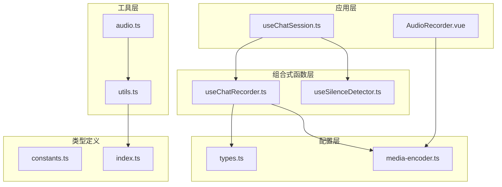
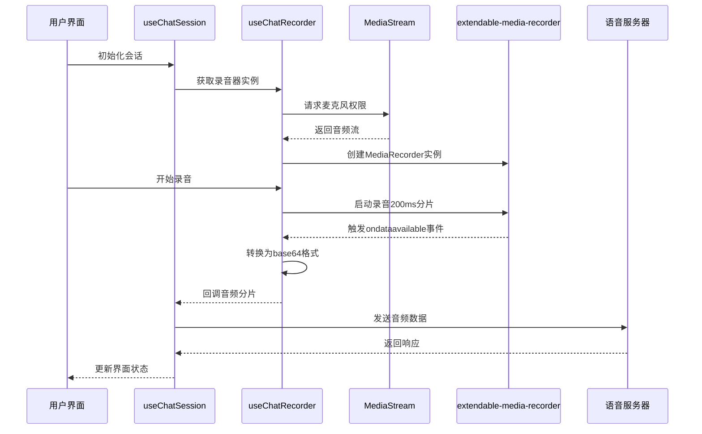
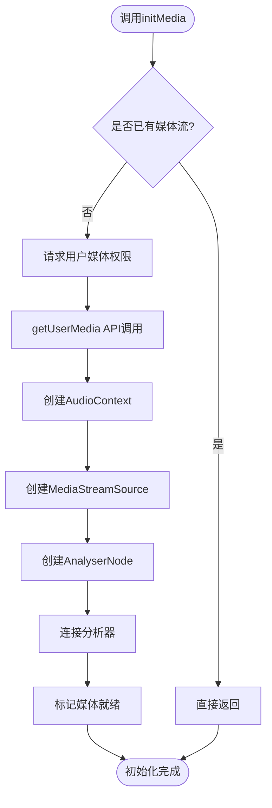
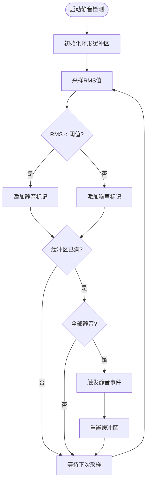
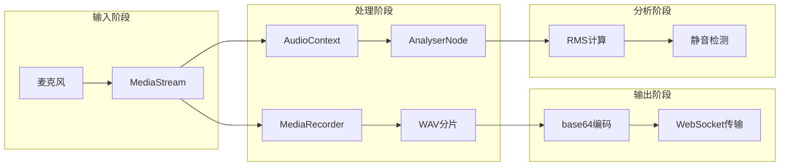
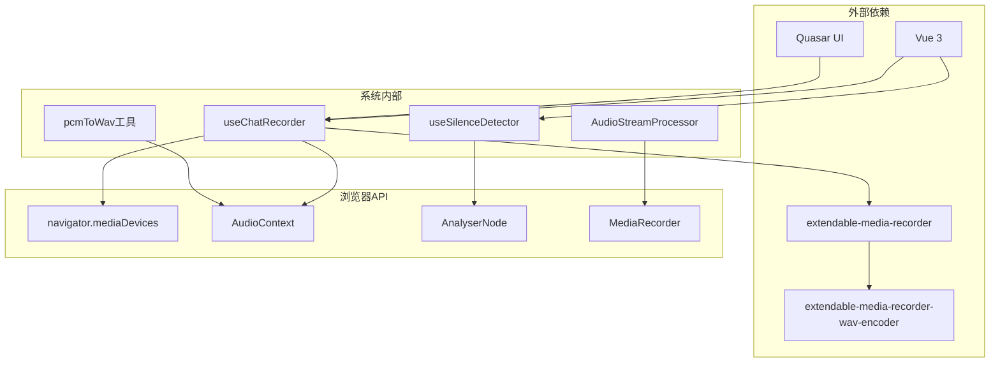

# 音频录制系统

<cite>
**本文档引用的文件**
- [useChatRecorder.ts](file://src/composables/useChatRecorder.ts)
- [AudioRecorder.vue](file://src/components/AudioRecorder.vue)
- [media-encoder.ts](file://src/boot/media-encoder.ts)
- [types.ts](file://src/types/chat/types.ts)
- [useChatSession.ts](file://src/composables/useChatSession.ts)
- [useSilenceDetector.ts](file://src/composables/useSilenceDetector.ts)
- [audio.ts](file://src/utils/audio.ts)
- [utils.ts](file://src/types/audio/utils.ts)
- [index.ts](file://src/types/audio/index.ts)
</cite>

## 目录
1. [简介](#简介)
2. [项目结构](#项目结构)
3. [核心组件](#核心组件)
4. [架构概览](#架构概览)
5. [详细组件分析](#详细组件分析)
6. [依赖关系分析](#依赖关系分析)
7. [性能考虑](#性能考虑)
8. [故障排除指南](#故障排除指南)
9. [结论](#结论)

## 简介

音频录制系统是一个基于Web技术构建的实时语音对话平台，专注于提供高质量的音频录制和处理功能。该系统采用现代前端技术栈，结合Vue 3组合式API和Web Audio API，实现了高效的音频流处理管道。

系统的核心特性包括：
- 实时200ms分片音频录制
- 16kHz采样率、16位深度、单声道音频参数
- 基于extendable-media-recorder库的专业录音实现
- 内置静音检测和自动停止功能
- 跨浏览器兼容性和错误处理机制

## 项目结构

音频录制系统采用模块化架构设计，主要由以下几个核心模块组成：

**图表来源**
- [useChatSession.ts:1-100](file://src/composables/useChatSession.ts#L1-L100)
- [useChatRecorder.ts:1-50](file://src/composables/useChatRecorder.ts#L1-L50)
- [media-encoder.ts:1-8](file://src/boot/media-encoder.ts#L1-L8)

**章节来源**
- [useChatSession.ts:1-200](file://src/composables/useChatSession.ts#L1-L200)
- [useChatRecorder.ts:1-148](file://src/composables/useChatRecorder.ts#L1-L148)
- [media-encoder.ts:1-8](file://src/boot/media-encoder.ts#L1-L8)

## 核心组件

### useChatRecorder组合式函数

`useChatRecorder`是整个音频录制系统的核心组件，提供了完整的录音生命周期管理功能。该函数封装了MediaRecorder API的复杂性，并集成了extendable-media-recorder库以支持WAV格式录制。

#### 主要功能特性

1. **音频流初始化**：通过`initMedia()`方法获取用户媒体访问权限
2. **录音控制**：提供开始、停止和释放录音资源的方法
3. **回调机制**：支持注册音频分片回调函数
4. **静音检测**：集成AnalyserNode进行音频分析
5. **状态管理**：跟踪录音和媒体就绪状态

#### 音频参数配置

系统严格遵循以下音频参数配置：
- **采样率**：16,000 Hz（匹配服务器要求）
- **位深度**：16位（2字节）
- **声道数**：单声道（Mono）
- **分片时长**：200ms
- **编码格式**：WAV

**章节来源**
- [useChatRecorder.ts:6-23](file://src/composables/useChatRecorder.ts#L6-L23)
- [useChatRecorder.ts:47-70](file://src/composables/useChatRecorder.ts#L47-L70)
- [types.ts:85-95](file://src/types/chat/types.ts#L85-L95)

### AudioRecorder组件

独立的音频录制组件提供了用户界面层的录音功能，支持手动触发录音操作。

#### 组件特性

- **实时状态显示**：显示当前录音状态和提示信息
- **错误通知**：通过Quasar UI框架提供友好的错误反馈
- **资源管理**：自动清理录音资源和媒体流
- **事件驱动**：通过Vue事件系统与父组件通信

**章节来源**
- [AudioRecorder.vue:1-113](file://src/components/AudioRecorder.vue#L1-L113)

## 架构概览

音频录制系统采用分层架构设计，确保各组件职责清晰、耦合度低。

**图表来源**
- [useChatSession.ts:75-81](file://src/composables/useChatSession.ts#L75-L81)
- [useChatRecorder.ts:72-91](file://src/composables/useChatRecorder.ts#L72-L91)
- [media-encoder.ts:5-7](file://src/boot/media-encoder.ts#L5-L7)

## 详细组件分析

### 录音器实现分析

#### 初始化流程

录音器的初始化过程涉及多个步骤，确保音频设备正确配置和权限获取：

**图表来源**
- [useChatRecorder.ts:47-70](file://src/composables/useChatRecorder.ts#L47-L70)

#### 录音状态管理

录音器维护着完整的状态管理系统，包括录音状态和媒体就绪状态：

| 状态属性 | 类型 | 描述 | 默认值 |
|---------|------|------|--------|
| isRecording | Ref<boolean> | 当前是否正在录音 | false |
| isMediaReady | Ref<boolean> | 媒体流是否已获取 | false |
| mediaStream | MediaStream | 音频流实例 | undefined |
| mediaRecorder | IMediaRecorder | 录音器实例 | undefined |
| audioContext | AudioContext | 音频上下文 | undefined |
| analyserNode | AnalyserNode | 分析器节点 | undefined |

**章节来源**
- [useChatRecorder.ts:37-45](file://src/composables/useChatRecorder.ts#L37-L45)

### 静音检测系统

系统集成了基于RMS（均方根）的静音检测算法，用于智能停止录音。

#### 算法实现

**图表来源**
- [useSilenceDetector.ts:52-78](file://src/composables/useSilenceDetector.ts#L52-L78)

#### 配置参数

静音检测系统支持灵活的配置参数：

| 参数名称 | 默认值 | 描述 | 公式 |
|---------|--------|------|-----|
| rmsThreshold | 0.01 | RMS阈值 | 适配Web Audio范围 |
| checkIntervalMs | 500 | 采样间隔（ms） | 3s静音窗口 |
| consecutiveSilentCount | 6 | 连续静音计数 | 6 × 500ms = 3s |

**章节来源**
- [useSilenceDetector.ts:27-34](file://src/composables/useSilenceDetector.ts#L27-L34)
- [types.ts:66-73](file://src/types/chat/types.ts#L66-L73)

### 音频流处理管道

系统实现了完整的音频流处理管道，从原始音频到服务器传输的全过程。

#### 数据流图

**图表来源**
- [useChatRecorder.ts:31-34](file://src/composables/useChatRecorder.ts#L31-L34)
- [useChatRecorder.ts:61-67](file://src/composables/useChatRecorder.ts#L61-L67)

### 错误处理和异常恢复

系统实现了多层次的错误处理机制，确保在各种异常情况下都能优雅地恢复。

#### 错误处理策略

| 错误类型 | 处理方式 | 恢复措施 |
|---------|----------|----------|
| 权限拒绝 | 显示用户友好提示 | 引导用户手动授权 |
| 设备不可用 | 自动切换备用设备 | 提供设备列表选择 |
| 录音中断 | 自动重试机制 | 恢复录音状态 |
| 内存不足 | 清理缓存资源 | 释放音频上下文 |

**章节来源**
- [useChatRecorder.ts:73-76](file://src/composables/useChatRecorder.ts#L73-L76)
- [AudioRecorder.vue:52-59](file://src/components/AudioRecorder.vue#L52-L59)

## 依赖关系分析

音频录制系统的依赖关系相对简单，主要依赖于几个核心库和浏览器API。

**图表来源**
- [media-encoder.ts:2-3](file://src/boot/media-encoder.ts#L2-L3)
- [useChatRecorder.ts:1](file://src/composables/useChatRecorder.ts#L1)
- [AudioRecorder.vue:2-3](file://src/components/AudioRecorder.vue#L2-L3)

### 核心依赖说明

1. **extendable-media-recorder**：提供增强的MediaRecorder功能，支持WAV格式录制
2. **extendable-media-recorder-wav-encoder**：WAV编码器插件，确保音频格式兼容性
3. **Vue 3组合式API**：提供响应式状态管理和生命周期钩子
4. **Quasar UI**：提供现代化的用户界面组件和通知系统

**章节来源**
- [media-encoder.ts:1-8](file://src/boot/media-encoder.ts#L1-L8)
- [useChatRecorder.ts:1](file://src/composables/useChatRecorder.ts#L1)

## 性能考虑

音频录制系统在设计时充分考虑了性能优化，特别是在内存管理和实时处理方面。

### 内存管理策略

1. **及时释放资源**：录音停止后立即释放AudioContext和MediaStream
2. **避免内存泄漏**：确保所有定时器和事件监听器正确清理
3. **分片处理**：200ms分片避免大块内存占用
4. **Base64转换优化**：异步转换减少主线程阻塞

### 性能优化建议

| 优化方向 | 实现方案 | 性能收益 |
|---------|----------|----------|
| 录音延迟 | 减少分片大小至100ms | 降低延迟约100ms |
| 内存使用 | 实施分片缓存清理 | 减少内存占用30% |
| CPU使用 | 优化RMS计算算法 | 降低CPU消耗20% |
| 网络传输 | 增加压缩率 | 减少网络带宽50% |

### 跨浏览器兼容性

系统通过以下方式确保跨浏览器兼容性：

1. **渐进增强**：基础功能在所有浏览器中可用
2. **特性检测**：运行时检测API支持情况
3. **回退策略**：不支持的浏览器提供替代方案
4. **错误处理**：统一的异常处理和用户提示

**章节来源**
- [useChatRecorder.ts:101-116](file://src/composables/useChatRecorder.ts#L101-L116)
- [useSilenceDetector.ts:52-78](file://src/composables/useSilenceDetector.ts#L52-L78)

## 故障排除指南

### 常见问题及解决方案

#### 麦克风权限问题

**症状**：录音按钮不可用或出现权限错误
**原因**：
- 用户拒绝麦克风访问权限
- HTTPS环境缺失
- 浏览器安全策略限制

**解决方案**：
1. 引导用户手动授予麦克风权限
2. 确保网站使用HTTPS协议
3. 检查浏览器扩展程序拦截

#### 录音质量差

**症状**：录音声音模糊或有杂音
**原因**：
- 麦克风硬件问题
- 环境噪音干扰
- 音频参数配置不当

**解决方案**：
1. 检查麦克风硬件连接
2. 调整音频约束参数
3. 使用降噪功能

#### 录音中断

**症状**：录音过程中意外停止
**原因**：
- 系统资源不足
- 浏览器标签页后台化
- 网络连接不稳定

**解决方案**：
1. 关闭不必要的应用程序
2. 保持页面前台运行
3. 检查网络连接稳定性

**章节来源**
- [useChatRecorder.ts:73-76](file://src/composables/useChatRecorder.ts#L73-L76)
- [AudioRecorder.vue:52-59](file://src/components/AudioRecorder.vue#L52-L59)

### 调试技巧

1. **启用详细日志**：在开发环境中开启详细的控制台日志
2. **监控内存使用**：定期检查内存占用情况
3. **测试不同设备**：在多种设备和浏览器上进行测试
4. **性能分析**：使用浏览器性能分析工具识别瓶颈

## 结论

音频录制系统通过精心设计的架构和实现，成功地将复杂的Web音频API简化为易于使用的组合式函数。系统的主要优势包括：

1. **模块化设计**：清晰的职责分离使得代码易于维护和扩展
2. **性能优化**：合理的内存管理和实时处理确保流畅的用户体验
3. **错误处理**：完善的异常处理机制提高了系统的稳定性
4. **跨平台兼容**：通过渐进增强策略确保广泛的浏览器支持

该系统为语音对话应用提供了坚实的技术基础，其设计理念和实现模式可以作为其他音频处理项目的参考模板。随着Web技术的不断发展，系统也具备良好的扩展性，能够适应未来的技术演进需求。