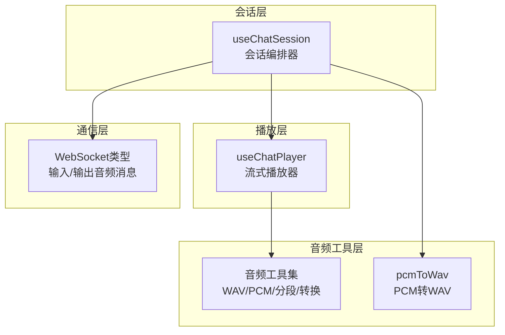
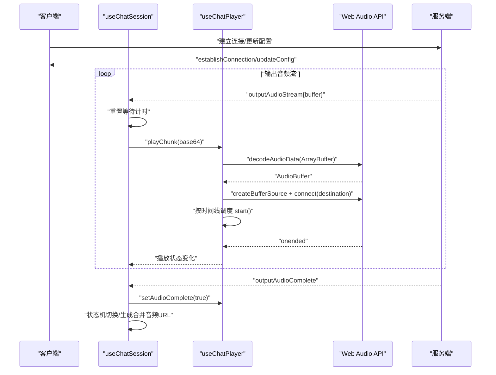
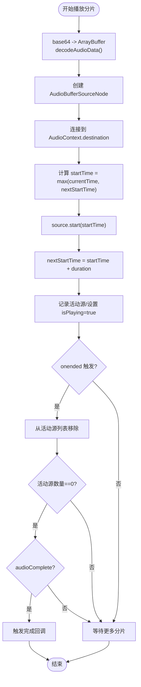
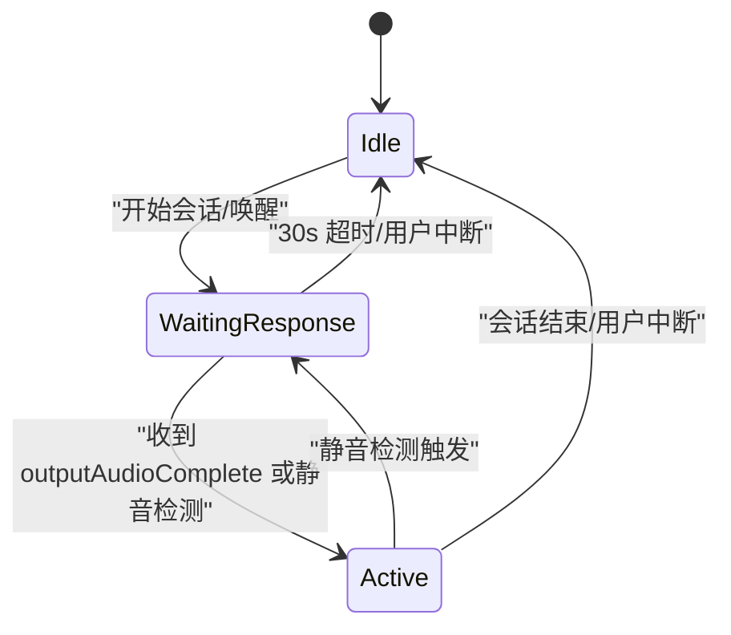
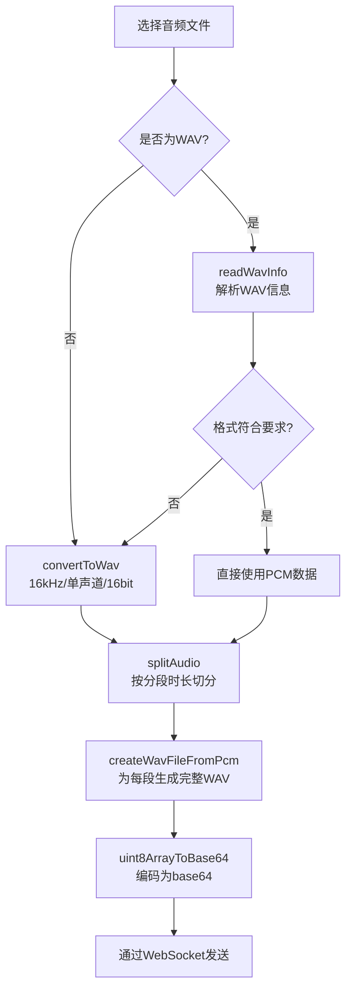
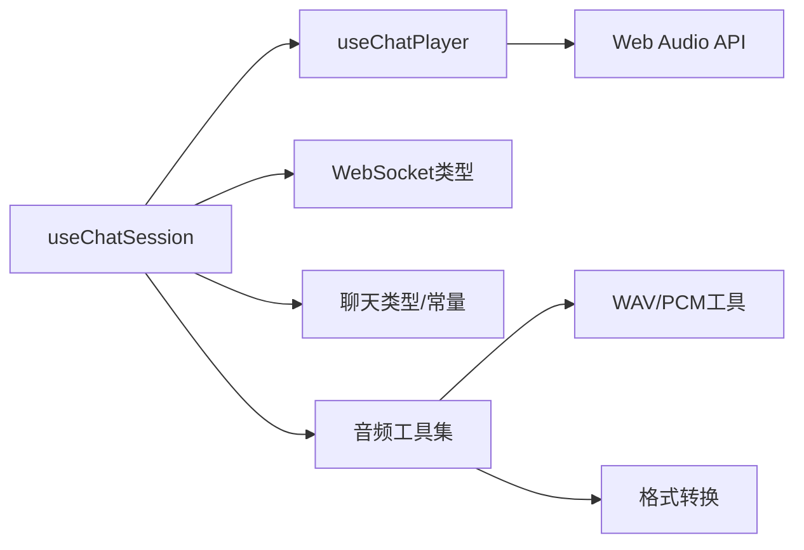

# 音频播放系统

<cite>
**本文引用的文件列表**
- [useChatPlayer.ts](file://src/composables/useChatPlayer.ts)
- [useChatSession.ts](file://src/composables/useChatSession.ts)
- [types.ts](file://src/types/audio/types.ts)
- [utils.ts](file://src/types/audio/utils.ts)
- [constants.ts](file://src/types/audio/constants.ts)
- [audio.ts](file://src/utils/audio.ts)
- [types.ts](file://src/types/websocket/types.ts)
- [types.ts](file://src/types/chat/types.ts)
- [index.ts](file://src/stores/chat/index.ts)
</cite>

## 目录
1. [简介](#简介)
2. [项目结构](#项目结构)
3. [核心组件](#核心组件)
4. [架构总览](#架构总览)
5. [详细组件分析](#详细组件分析)
6. [依赖关系分析](#依赖关系分析)
7. [性能考量](#性能考量)
8. [故障排查指南](#故障排查指南)
9. [结论](#结论)
10. [附录](#附录)

## 简介
本技术文档围绕前端音频播放系统，重点解析 useChatPlayer 组合式函数的实现机制，涵盖以下方面：
- AudioContext 的创建与生命周期管理
- 音频解码与播放调度（基于 Web Audio API）
- 音频格式处理（WAV/PCM）与分段传输
- 播放队列管理与并发播放控制
- 音量调节、播放进度跟踪与播放状态监听
- 音频缓冲区管理、播放延迟优化与音频同步机制
- 错误处理、网络音频加载与本地音频缓存策略
- 播放性能监控、音频质量控制与用户体验优化

## 项目结构
音频播放系统主要由以下模块构成：
- useChatPlayer：面向聊天场景的流式音频播放器，负责接收服务端推送的音频分片并进行解码与调度播放
- useChatSession：会话编排器，负责 WebSocket 事件处理、消息状态机与播放器实例管理
- 音频工具集：WAV/PCM 工具、分段与格式转换、Base64 编解码等
- WebSocket 类型：定义输入/输出音频消息协议
- 类型与常量：消息结构、状态机、采样率与分段时长等

图表来源
- [useChatSession.ts:100-166](file://src/composables/useChatSession.ts#L100-L166)
- [useChatPlayer.ts:35-160](file://src/composables/useChatPlayer.ts#L35-L160)
- [utils.ts:1-312](file://src/types/audio/utils.ts#L1-L312)
- [audio.ts:1-47](file://src/utils/audio.ts#L1-L47)
- [types.ts:105-131](file://src/types/websocket/types.ts#L105-L131)

章节来源
- [useChatPlayer.ts:1-161](file://src/composables/useChatPlayer.ts#L1-L161)
- [useChatSession.ts:1-589](file://src/composables/useChatSession.ts#L1-L589)
- [utils.ts:1-312](file://src/types/audio/utils.ts#L1-L312)
- [audio.ts:1-47](file://src/utils/audio.ts#L1-L47)
- [types.ts:1-226](file://src/types/websocket/types.ts#L1-L226)
- [types.ts:1-96](file://src/types/chat/types.ts#L1-L96)

## 核心组件
- useChatPlayer：提供 isPlaying 状态、播放分片、标记完成、停止播放、清空缓冲、注册完成回调、合并 Blob、销毁资源等能力
- useChatSession：封装 WebSocket 事件处理、消息状态机、录音与播放器实例管理、中断与超时控制
- 音频工具集：WAV/PCM 解析、分段、格式转换、Base64 编解码、WAV 头部生成
- WebSocket 类型：定义 inputAudioStream/inputAudioComplete/outputAudioStream/outputAudioComplete 等消息协议

章节来源
- [useChatPlayer.ts:3-20](file://src/composables/useChatPlayer.ts#L3-L20)
- [useChatSession.ts:32-61](file://src/composables/useChatSession.ts#L32-L61)
- [utils.ts:11-262](file://src/types/audio/utils.ts#L11-L262)
- [types.ts:3-15](file://src/types/websocket/types.ts#L3-L15)

## 架构总览
系统采用“会话编排器 + 流式播放器 + 音频工具集”的分层设计：
- 会话编排器负责状态机与事件路由，将服务端输出音频分片交给播放器
- 播放器负责解码与调度，确保无间断播放
- 音频工具集负责格式转换与分段，保证与服务端协议一致

图表来源
- [useChatSession.ts:130-166](file://src/composables/useChatSession.ts#L130-L166)
- [useChatPlayer.ts:53-96](file://src/composables/useChatPlayer.ts#L53-L96)
- [types.ts:145-152](file://src/types/websocket/types.ts#L145-L152)

## 详细组件分析

### useChatPlayer 组件分析
- AudioContext 创建与复用
  - 首次调用 ensureContext 时创建 AudioContext，并以 currentTime 初始化 nextStartTime
  - 播放结束后可销毁，释放资源
- 音频解码与播放调度
  - 接收 base64 音频分片，解码为 ArrayBuffer 后交由 decodeAudioData 获取 AudioBuffer
  - 创建 AudioBufferSourceNode 并连接到 destination
  - 通过 Math.max(ctx.currentTime, nextStartTime) 实现严格的时间线调度，避免重叠或间隙
  - 每个源节点 onended 时从 activeSources 中移除；当无活动源且已标记完成时触发完成回调
- 播放控制
  - stopPlayback：停止并断开所有活动源，重置 nextStartTime
  - clearBuffer：清空原始分片缓存与完成标记
  - setAudioComplete：标记服务端已完成，若当前无活动源则立即触发完成回调
  - onPlaybackFinished：注册播放完成回调
  - getAudioBlob：将累积的原始分片合并为 Blob（用于消息音频 URL）
  - destroy：停止播放、清理缓冲、关闭 AudioContext
- 状态与并发
  - isPlaying 由活动源数量与完成标记共同决定
  - 支持多段连续播放，通过 nextStartTime 串联

图表来源
- [useChatPlayer.ts:53-96](file://src/composables/useChatPlayer.ts#L53-L96)

章节来源
- [useChatPlayer.ts:35-160](file://src/composables/useChatPlayer.ts#L35-L160)

### useChatSession 组件分析
- 事件处理与状态机
  - onAction 注册 outputAudioStream/outputAudioComplete/outputTextStream/outputTextComplete/chatComplete/cancelOutput 等处理器
  - 状态机：Idle → WaitingResponse → Active，结合超时与静音检测驱动状态切换
- 输出音频流处理
  - handleOutputAudioStream：将 base64 分片转为 Blob 存入消息，调用 currentTurnPlayer.playChunk 播放
  - handleOutputAudioComplete：合并音频 Blob，生成对象 URL，标记播放完成，必要时切换状态
- 中断与清理
  - cancelOutput：停止播放并清空缓冲；根据 cancelType 决定是否回到 Active
  - interruptCurrentSession：手动中断，停止播放与检测，发送取消请求
- 播放器实例管理
  - 每轮助手回复使用独立播放器实例，完成后销毁并重建，避免跨轮干扰

图表来源
- [useChatSession.ts:244-303](file://src/composables/useChatSession.ts#L244-L303)

章节来源
- [useChatSession.ts:100-238](file://src/composables/useChatSession.ts#L100-L238)
- [types.ts:11-19](file://src/types/chat/types.ts#L11-L19)

### 音频格式处理与分段传输
- WAV/PCM 解析与分段
  - readWavInfo：解析 WAV 文件头，提取声道数、采样率、每样本字节数与纯 PCM 数据
  - getSegmentSize：按分段时长计算分段字节数
  - splitAudio：将 PCM 数据按固定字节数切分为片段
- 格式转换与校验
  - convertToWav：将任意音频文件转换为 16kHz 单声道 16bit WAV
  - readAudioData：自动判断是否为 WAV，不符合要求则转换
- Base64 编解码
  - uint8ArrayToBase64：将二进制数组编码为 base64 字符串
  - base64ToBlob：将 base64 解码为 Blob
- WAV 头部生成
  - createWavFileFromPcm：为每个 PCM 片段生成带完整 WAV 头的文件，确保服务端正确识别
  - audioBufferToWav：将 AudioBuffer 转换为标准 WAV（含头部）

图表来源
- [utils.ts:93-139](file://src/types/audio/utils.ts#L93-L139)
- [utils.ts:221-262](file://src/types/audio/utils.ts#L221-L262)
- [utils.ts:276-311](file://src/types/audio/utils.ts#L276-L311)
- [utils.ts:267-270](file://src/types/audio/utils.ts#L267-L270)

章节来源
- [utils.ts:11-262](file://src/types/audio/utils.ts#L11-L262)
- [audio.ts:1-47](file://src/utils/audio.ts#L1-L47)
- [types.ts:1-14](file://src/types/audio/types.ts#L1-L14)
- [constants.ts:1-2](file://src/types/audio/constants.ts#L1-L2)

### WebSocket 协议与消息流
- 输入音频消息
  - inputAudioStream：持续发送音频分片（base64）
  - inputAudioComplete：最后一片音频，同时通知服务端音频发送完成
- 输出音频消息
  - outputAudioStream：持续接收助手回复的音频分片（base64）
  - outputAudioComplete：服务端确认音频发送完成
- 其他消息
  - outputTextStream/outputTextComplete：文本流与完成
  - cancelOutput：取消输出（手动/语音）
  - updateConfig：会话配置（如语音参数、时区等）

章节来源
- [types.ts:105-152](file://src/types/websocket/types.ts#L105-L152)
- [types.ts:1-226](file://src/types/websocket/types.ts#L1-L226)

## 依赖关系分析
- useChatSession 依赖 useChatPlayer、WebSocket 类型、聊天类型与存储
- useChatPlayer 依赖 Web Audio API（AudioContext/AudioBufferSourceNode）
- 音频工具集提供格式解析、转换与分段能力，被 useChatSession 与工具函数调用
- 会话状态与超时控制贯穿播放流程

图表来源
- [useChatSession.ts:1-589](file://src/composables/useChatSession.ts#L1-L589)
- [useChatPlayer.ts:1-161](file://src/composables/useChatPlayer.ts#L1-L161)
- [utils.ts:1-312](file://src/types/audio/utils.ts#L1-L312)

章节来源
- [useChatSession.ts:1-589](file://src/composables/useChatSession.ts#L1-L589)
- [useChatPlayer.ts:1-161](file://src/composables/useChatPlayer.ts#L1-L161)
- [utils.ts:1-312](file://src/types/audio/utils.ts#L1-L312)

## 性能考量
- 播放延迟优化
  - 严格的时间线调度：以 nextStartTime 与 currentTime 的最大值作为起播时间，避免重叠与延迟累积
  - 无间断播放：通过 activeSources 计数与 onended 回调，确保无缝衔接
- 音频缓冲与内存管理
  - rawChunks 仅保存原始分片，便于最终合并；播放后可 clearBuffer 清理
  - destroy 时关闭 AudioContext，释放资源
- 网络与解码开销
  - 分段传输减少单次解码压力；Base64 编码增加体积，建议在服务端侧尽可能优化
- 同步与一致性
  - 通过 setAudioComplete 与完成回调确保播放结束与状态机切换一致
  - 合并音频 URL 在 outputAudioComplete 时生成，保证消息级音频可用

[本节为通用性能讨论，无需特定文件引用]

## 故障排查指南
- 播放失败
  - 现象：播放分片报错或无法解码
  - 排查：确认服务端发送的是完整 WAV 片段（createWavFileFromPcm 已生成完整头部），检查 base64 是否正确
  - 参考：播放器内部捕获解码异常并记录警告
- 播放卡顿或延迟
  - 现象：播放出现停顿或延迟累积
  - 排查：检查 nextStartTime 是否被重置；确认分段时长与采样率匹配（默认 16kHz 单声道）
  - 参考：播放器在 stopPlayback 时重置 nextStartTime
- 中断无效
  - 现象：用户说话或手动中断后仍继续播放
  - 排查：确认 cancelOutput 与 voice interrupt 逻辑是否触发 stopPlayback
  - 参考：会话处理器中对 cancelOutput 与 outputTextStream 的处理
- 超时未结束
  - 现象：WaitingResponse 状态长时间不结束
  - 排查：确认 outputAudioComplete 是否到达；检查 isPlaying 状态与定时器逻辑
  - 参考：等待响应超时检查与状态切换

章节来源
- [useChatPlayer.ts:93-95](file://src/composables/useChatPlayer.ts#L93-L95)
- [useChatPlayer.ts:107-123](file://src/composables/useChatPlayer.ts#L107-L123)
- [useChatSession.ts:179-184](file://src/composables/useChatSession.ts#L179-L184)
- [useChatSession.ts:346-365](file://src/composables/useChatSession.ts#L346-L365)

## 结论
该音频播放系统通过 useChatPlayer 提供了稳定、低延迟的流式播放能力，配合 useChatSession 的状态机与事件处理，实现了从录音、发送、到播放、中断与超时控制的完整闭环。音频工具集确保了格式一致性与分段传输的可靠性。整体架构清晰、职责分离明确，具备良好的扩展性与可维护性。

[本节为总结性内容，无需特定文件引用]

## 附录
- 关键接口与类型
  - UseChatPlayerReturn：播放器对外暴露的能力集合
  - ChatMessage：消息结构，包含音频分片与合并后的 URL
  - WebSocket Action：输入/输出音频消息协议
- 默认配置
  - 采样率：16kHz
  - 声道：单声道
  - 位深：16bit
  - 分段时长：200ms

章节来源
- [useChatPlayer.ts:3-20](file://src/composables/useChatPlayer.ts#L3-L20)
- [types.ts:86-95](file://src/types/chat/types.ts#L86-L95)
- [types.ts:3-15](file://src/types/websocket/types.ts#L3-L15)