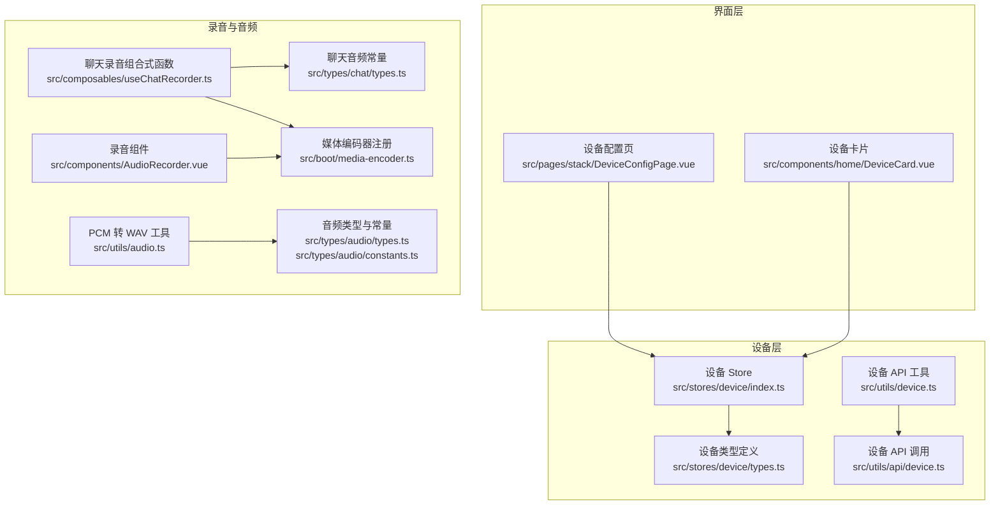
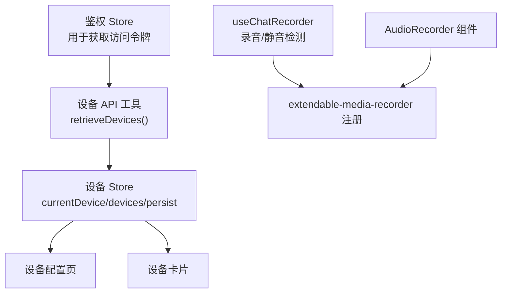
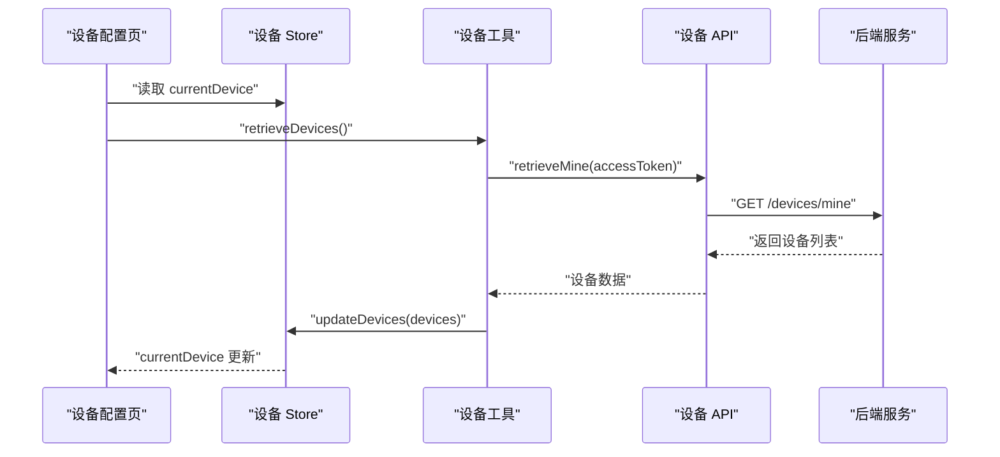
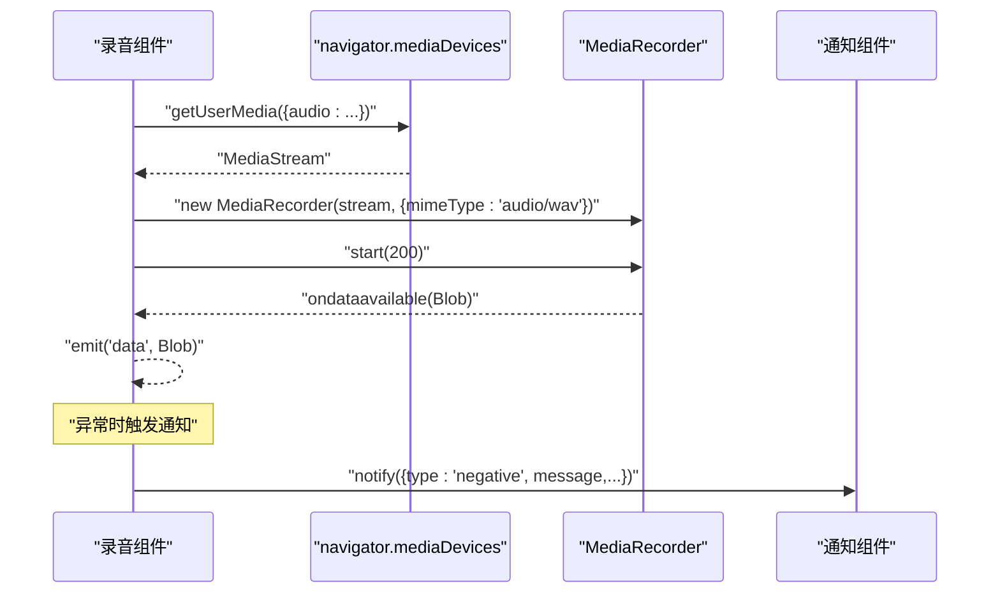
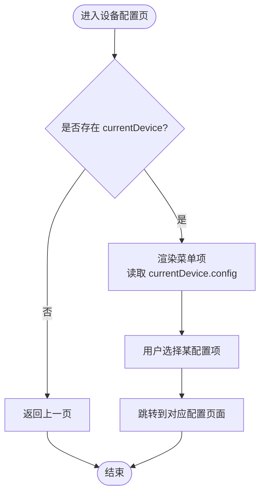
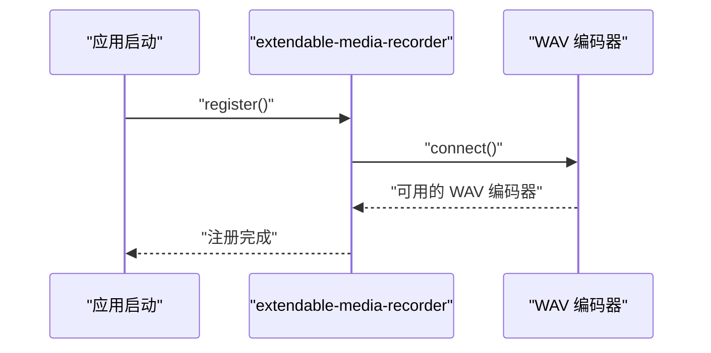
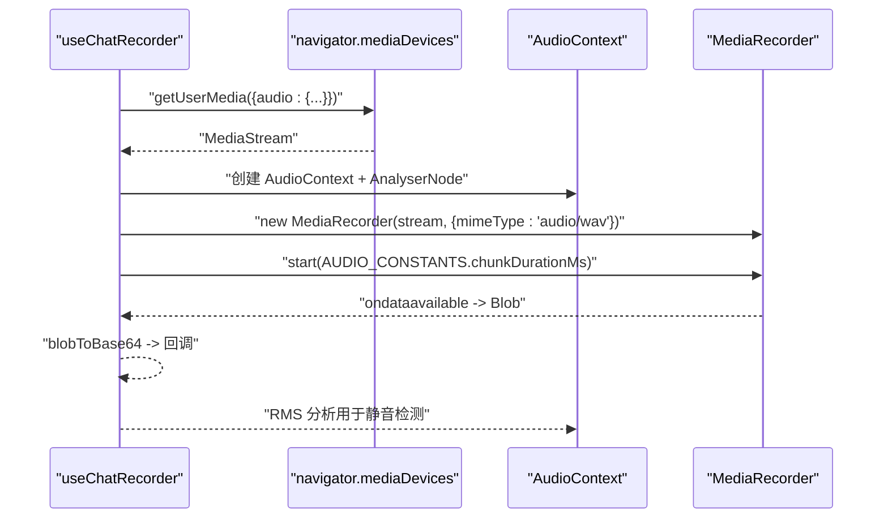
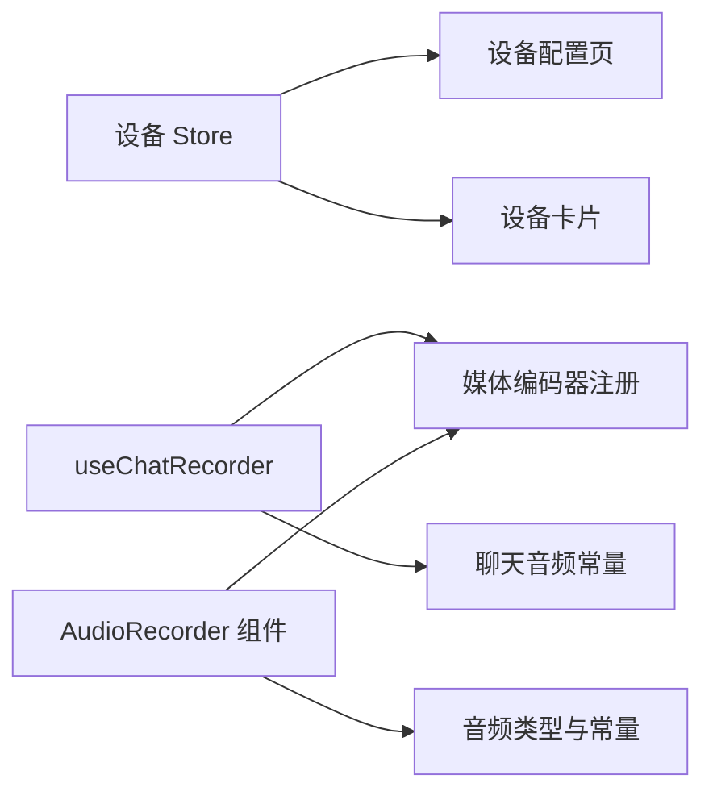

# 音频设备管理系统

<cite>
**本文档引用的文件**
- [src/stores/device/index.ts](file://src/stores/device/index.ts)
- [src/stores/device/types.ts](file://src/stores/device/types.ts)
- [src/utils/device.ts](file://src/utils/device.ts)
- [src/utils/api/device.ts](file://src/utils/api/device.ts)
- [src/pages/stack/DeviceConfigPage.vue](file://src/pages/stack/DeviceConfigPage.vue)
- [src/components/home/DeviceCard.vue](file://src/components/home/DeviceCard.vue)
- [src/composables/useChatRecorder.ts](file://src/composables/useChatRecorder.ts)
- [src/components/AudioRecorder.vue](file://src/components/AudioRecorder.vue)
- [src/boot/media-encoder.ts](file://src/boot/media-encoder.ts)
- [src/types/audio/types.ts](file://src/types/audio/types.ts)
- [src/types/audio/constants.ts](file://src/types/audio/constants.ts)
- [src/types/chat/types.ts](file://src/types/chat/types.ts)
- [src/utils/audio.ts](file://src/utils/audio.ts)
</cite>

## 目录
1. [简介](#简介)
2. [项目结构](#项目结构)
3. [核心组件](#核心组件)
4. [架构总览](#架构总览)
5. [详细组件分析](#详细组件分析)
6. [依赖关系分析](#依赖关系分析)
7. [性能考虑](#性能考虑)
8. [故障排除指南](#故障排除指南)
9. [结论](#结论)
10. [附录](#附录)

## 简介
本文件为音频设备管理系统的详细技术文档，聚焦以下方面：
- 音频设备检测、枚举与选择：设备列表获取、当前设备维护与持久化。
- 设备权限申请与授权管理：媒体访问权限的获取与状态监控。
- 多设备支持、设备切换与状态同步：设备配置与状态在应用内的流转。
- 兼容性处理与浏览器差异适配：extendable-media-recorder 的注册与使用。
- 设备配置持久化、用户偏好与历史记录：Pinia 持久化与本地存储策略。
- 诊断工具、故障排除与用户体验优化：错误提示、资源释放与静音检测。

## 项目结构
系统围绕“设备信息模型 + 设备数据流 + 录音能力 + 媒体编码器”组织，关键模块如下：
- 设备模型与状态：Pinia store 维护设备列表与当前设备，并启用持久化。
- 设备数据获取：通过鉴权令牌调用后端接口获取用户设备列表。
- 录音与音频处理：基于 Web Audio 和 MediaRecorder 实现录音、分片与静音检测。
- 编码器注册：extendable-media-recorder 与 WAVE 编码器在启动阶段完成注册。

**图表来源**
- [src/stores/device/index.ts:1-27](file://src/stores/device/index.ts#L1-L27)
- [src/stores/device/types.ts:1-17](file://src/stores/device/types.ts#L1-L17)
- [src/utils/device.ts:1-18](file://src/utils/device.ts#L1-L18)
- [src/utils/api/device.ts:1-11](file://src/utils/api/device.ts#L1-L11)
- [src/pages/stack/DeviceConfigPage.vue:1-84](file://src/pages/stack/DeviceConfigPage.vue#L1-L84)
- [src/components/home/DeviceCard.vue:1-31](file://src/components/home/DeviceCard.vue#L1-L31)
- [src/composables/useChatRecorder.ts:1-148](file://src/composables/useChatRecorder.ts#L1-L148)
- [src/components/AudioRecorder.vue:1-113](file://src/components/AudioRecorder.vue#L1-L113)
- [src/boot/media-encoder.ts:1-7](file://src/boot/media-encoder.ts#L1-L7)
- [src/types/audio/types.ts:1-14](file://src/types/audio/types.ts#L1-L14)
- [src/types/audio/constants.ts:1-2](file://src/types/audio/constants.ts#L1-L2)
- [src/types/chat/types.ts:85-96](file://src/types/chat/types.ts#L85-L96)
- [src/utils/audio.ts:1-47](file://src/utils/audio.ts#L1-L47)

**章节来源**
- [src/stores/device/index.ts:1-27](file://src/stores/device/index.ts#L1-L27)
- [src/stores/device/types.ts:1-17](file://src/stores/device/types.ts#L1-L17)
- [src/utils/device.ts:1-18](file://src/utils/device.ts#L1-L18)
- [src/utils/api/device.ts:1-11](file://src/utils/api/device.ts#L1-L11)
- [src/pages/stack/DeviceConfigPage.vue:1-84](file://src/pages/stack/DeviceConfigPage.vue#L1-L84)
- [src/components/home/DeviceCard.vue:1-31](file://src/components/home/DeviceCard.vue#L1-L31)
- [src/composables/useChatRecorder.ts:1-148](file://src/composables/useChatRecorder.ts#L1-L148)
- [src/components/AudioRecorder.vue:1-113](file://src/components/AudioRecorder.vue#L1-L113)
- [src/boot/media-encoder.ts:1-7](file://src/boot/media-encoder.ts#L1-L7)
- [src/types/audio/types.ts:1-14](file://src/types/audio/types.ts#L1-L14)
- [src/types/audio/constants.ts:1-2](file://src/types/audio/constants.ts#L1-L2)
- [src/types/chat/types.ts:85-96](file://src/types/chat/types.ts#L85-L96)
- [src/utils/audio.ts:1-47](file://src/utils/audio.ts#L1-L47)

## 核心组件
- 设备 Store（Pinia）
  - 维护设备列表与当前设备，提供更新方法；启用持久化以保留用户选择。
  - 关键路径：[src/stores/device/index.ts:1-27](file://src/stores/device/index.ts#L1-L27)
- 设备类型定义
  - 定义设备标识、类型、模型、名称、状态与配置等字段。
  - 关键路径：[src/stores/device/types.ts:1-17](file://src/stores/device/types.ts#L1-L17)
- 设备数据获取工具
  - 通过鉴权令牌调用后端接口获取用户设备列表；失败时抛出错误。
  - 关键路径：[src/utils/device.ts:1-18](file://src/utils/device.ts#L1-L18)，[src/utils/api/device.ts:1-11](file://src/utils/api/device.ts#L1-L11)
- 设备配置页
  - 展示设备相关设置入口，读取当前设备配置用于显示。
  - 关键路径：[src/pages/stack/DeviceConfigPage.vue:1-84](file://src/pages/stack/DeviceConfigPage.vue#L1-L84)
- 聊天录音组合式函数
  - 提供录音初始化、开始/停止、资源释放、静音检测分析节点获取等能力。
  - 关键路径：[src/composables/useChatRecorder.ts:1-148](file://src/composables/useChatRecorder.ts#L1-L148)
- 录音组件
  - 基于 MediaRecorder 进行录音，按 200ms 分片输出 Blob 数据。
  - 关键路径：[src/components/AudioRecorder.vue:1-113](file://src/components/AudioRecorder.vue#L1-L113)
- 媒体编码器注册
  - 在应用启动时注册 extendable-media-recorder 与 WAVE 编码器。
  - 关键路径：[src/boot/media-encoder.ts:1-7](file://src/boot/media-encoder.ts#L1-L7)
- 音频类型与常量
  - 定义音频分片参数、采样率等常量，统一录音配置。
  - 关键路径：[src/types/audio/types.ts:1-14](file://src/types/audio/types.ts#L1-L14)，[src/types/audio/constants.ts:1-2](file://src/types/audio/constants.ts#L1-L2)，[src/types/chat/types.ts:85-96](file://src/types/chat/types.ts#L85-L96)
- PCM 转 WAV 工具
  - 将 PCM 数据封装为 WAV 文件头，便于后续处理或上传。
  - 关键路径：[src/utils/audio.ts:1-47](file://src/utils/audio.ts#L1-L47)

**章节来源**
- [src/stores/device/index.ts:1-27](file://src/stores/device/index.ts#L1-L27)
- [src/stores/device/types.ts:1-17](file://src/stores/device/types.ts#L1-L17)
- [src/utils/device.ts:1-18](file://src/utils/device.ts#L1-L18)
- [src/utils/api/device.ts:1-11](file://src/utils/api/device.ts#L1-L11)
- [src/pages/stack/DeviceConfigPage.vue:1-84](file://src/pages/stack/DeviceConfigPage.vue#L1-L84)
- [src/composables/useChatRecorder.ts:1-148](file://src/composables/useChatRecorder.ts#L1-L148)
- [src/components/AudioRecorder.vue:1-113](file://src/components/AudioRecorder.vue#L1-L113)
- [src/boot/media-encoder.ts:1-7](file://src/boot/media-encoder.ts#L1-L7)
- [src/types/audio/types.ts:1-14](file://src/types/audio/types.ts#L1-L14)
- [src/types/audio/constants.ts:1-2](file://src/types/audio/constants.ts#L1-L2)
- [src/types/chat/types.ts:85-96](file://src/types/chat/types.ts#L85-L96)
- [src/utils/audio.ts:1-47](file://src/utils/audio.ts#L1-L47)

## 架构总览
系统采用“数据层（设备）—界面层（配置/卡片）—录音层（组合式函数/组件）—编码器注册”的分层设计，确保设备信息与录音能力解耦且可扩展。

**图表来源**
- [src/utils/device.ts:1-18](file://src/utils/device.ts#L1-L18)
- [src/stores/device/index.ts:1-27](file://src/stores/device/index.ts#L1-L27)
- [src/pages/stack/DeviceConfigPage.vue:1-84](file://src/pages/stack/DeviceConfigPage.vue#L1-L84)
- [src/components/home/DeviceCard.vue:1-31](file://src/components/home/DeviceCard.vue#L1-L31)
- [src/composables/useChatRecorder.ts:1-148](file://src/composables/useChatRecorder.ts#L1-L148)
- [src/components/AudioRecorder.vue:1-113](file://src/components/AudioRecorder.vue#L1-L113)
- [src/boot/media-encoder.ts:1-7](file://src/boot/media-encoder.ts#L1-L7)

## 详细组件分析

### 设备枚举与选择
- 设备枚举流程
  - 通过鉴权 Store 获取访问令牌，调用 retrieveMine 接口获取用户设备列表。
  - 将返回的设备数组更新到 Pinia store 的 devices 字段，并默认选择第一个设备作为 currentDevice。
- 设备持久化
  - 设备 Store 启用持久化，确保刷新后仍能保持用户选择的设备。
- 设备配置页联动
  - 设备配置页读取 currentDevice 并展示语音风格等配置项。

**图表来源**
- [src/pages/stack/DeviceConfigPage.vue:12-12](file://src/pages/stack/DeviceConfigPage.vue#L12-L12)
- [src/stores/device/index.ts:12-15](file://src/stores/device/index.ts#L12-L15)
- [src/utils/device.ts:5-17](file://src/utils/device.ts#L5-L17)
- [src/utils/api/device.ts:5-10](file://src/utils/api/device.ts#L5-L10)

**章节来源**
- [src/utils/device.ts:1-18](file://src/utils/device.ts#L1-L18)
- [src/utils/api/device.ts:1-11](file://src/utils/api/device.ts#L1-L11)
- [src/stores/device/index.ts:1-27](file://src/stores/device/index.ts#L1-L27)
- [src/pages/stack/DeviceConfigPage.vue:1-84](file://src/pages/stack/DeviceConfigPage.vue#L1-L84)

### 权限申请与授权管理
- 权限申请
  - 录音组件与聊天录音组合式函数均通过 navigator.mediaDevices.getUserMedia 请求麦克风权限。
  - 录音组件在挂载时请求权限；聊天录音组合式函数在 initMedia 中请求权限。
- 授权状态监控
  - 录音组件在录制开始前检查录制状态；聊天录音组合式函数在 startRecording 前检查媒体流是否已初始化。
- 错误处理
  - 录音组件在异常时通过通知组件提示错误信息；聊天录音组合式函数在未初始化时输出警告日志。

**图表来源**
- [src/components/AudioRecorder.vue:69-86](file://src/components/AudioRecorder.vue#L69-L86)
- [src/components/AudioRecorder.vue:31-60](file://src/components/AudioRecorder.vue#L31-L60)
- [src/components/AudioRecorder.vue:52-59](file://src/components/AudioRecorder.vue#L52-L59)

**章节来源**
- [src/components/AudioRecorder.vue:1-113](file://src/components/AudioRecorder.vue#L1-L113)
- [src/composables/useChatRecorder.ts:47-70](file://src/composables/useChatRecorder.ts#L47-L70)
- [src/composables/useChatRecorder.ts:72-91](file://src/composables/useChatRecorder.ts#L72-L91)

### 多设备支持、设备切换与状态同步
- 多设备支持
  - 设备列表由后端返回，前端以数组形式维护；当前设备为数组首项，具备可扩展性。
- 设备切换
  - 切换逻辑通过更新 currentDevice 实现；设备配置页读取 currentDevice 展示配置。
- 状态同步
  - 设备 Store 启用持久化，保证设备选择在页面刷新后仍然有效。

**图表来源**
- [src/pages/stack/DeviceConfigPage.vue:48-52](file://src/pages/stack/DeviceConfigPage.vue#L48-L52)
- [src/pages/stack/DeviceConfigPage.vue:14-46](file://src/pages/stack/DeviceConfigPage.vue#L14-L46)

**章节来源**
- [src/stores/device/index.ts:12-15](file://src/stores/device/index.ts#L12-L15)
- [src/pages/stack/DeviceConfigPage.vue:1-84](file://src/pages/stack/DeviceConfigPage.vue#L1-L84)

### 设备兼容性处理与浏览器差异适配
- 编码器注册
  - 应用启动时注册 extendable-media-recorder 与 WAVE 编码器，确保在不支持原生 MediaRecorder WAV 的环境中也能生成 WAV 片段。
- 浏览器差异
  - 通过 extendable-media-recorder 统一录音输出格式，避免不同浏览器对 MIME 类型支持差异带来的问题。

**图表来源**
- [src/boot/media-encoder.ts:5-7](file://src/boot/media-encoder.ts#L5-L7)

**章节来源**
- [src/boot/media-encoder.ts:1-7](file://src/boot/media-encoder.ts#L1-L7)

### 设备配置持久化、用户偏好与历史记录
- 配置持久化
  - 设备 Store 启用持久化，确保设备选择与配置在刷新后保持。
- 用户偏好
  - 设备配置中包含 voiceStyle 等用户偏好的展示与跳转入口。
- 历史记录
  - 当前代码未实现设备使用历史记录功能；如需扩展，可在设备 Store 或后端新增相应字段与接口。

**章节来源**
- [src/stores/device/index.ts:24-25](file://src/stores/device/index.ts#L24-L25)
- [src/pages/stack/DeviceConfigPage.vue:18-22](file://src/pages/stack/DeviceConfigPage.vue#L18-L22)

### 录音与静音检测
- 录音管线
  - 使用 MediaRecorder 以 WAV 格式、200ms 时间片进行录音，输出 Blob 数据。
  - 聊天录音组合式函数同时创建 AudioContext 与 AnalyserNode，用于静音检测。
- 静音检测
  - 通过 AnalyserNode 计算 RMS 值，结合阈值与连续静默次数判断是否结束录音。
- 常量配置
  - 采样率、通道数、位深、分片时长等参数集中定义，便于统一管理。

**图表来源**
- [src/composables/useChatRecorder.ts:47-70](file://src/composables/useChatRecorder.ts#L47-L70)
- [src/composables/useChatRecorder.ts:79-91](file://src/composables/useChatRecorder.ts#L79-L91)
- [src/composables/useChatRecorder.ts:139-147](file://src/composables/useChatRecorder.ts#L139-L147)
- [src/types/chat/types.ts:85-96](file://src/types/chat/types.ts#L85-L96)

**章节来源**
- [src/composables/useChatRecorder.ts:1-148](file://src/composables/useChatRecorder.ts#L1-L148)
- [src/types/chat/types.ts:85-96](file://src/types/chat/types.ts#L85-L96)

### PCM 转 WAV 工具
- 功能概述
  - 将 PCM 数据与 WAV 头部拼接，生成标准 WAV Blob，便于上传或进一步处理。
- 参数控制
  - 支持采样率、声道数与位深配置，默认采样率为 16kHz、单声道、16bit。

**章节来源**
- [src/utils/audio.ts:1-47](file://src/utils/audio.ts#L1-L47)

## 依赖关系分析
- 组件耦合
  - 设备 Store 与设备配置页松耦合，通过 Pinia 状态共享实现。
  - 录音组件与聊天录音组合式函数均依赖 extendable-media-recorder 注册。
- 外部依赖
  - extendable-media-recorder 与 extendable-media-recorder-wav-encoder 用于录音编码。
  - Quasar UI 组件用于通知与按钮等交互元素。

**图表来源**
- [src/stores/device/index.ts:1-27](file://src/stores/device/index.ts#L1-L27)
- [src/pages/stack/DeviceConfigPage.vue:1-84](file://src/pages/stack/DeviceConfigPage.vue#L1-L84)
- [src/components/home/DeviceCard.vue:1-31](file://src/components/home/DeviceCard.vue#L1-L31)
- [src/composables/useChatRecorder.ts:1-148](file://src/composables/useChatRecorder.ts#L1-L148)
- [src/components/AudioRecorder.vue:1-113](file://src/components/AudioRecorder.vue#L1-L113)
- [src/boot/media-encoder.ts:1-7](file://src/boot/media-encoder.ts#L1-L7)
- [src/types/chat/types.ts:85-96](file://src/types/chat/types.ts#L85-L96)
- [src/types/audio/types.ts:1-14](file://src/types/audio/types.ts#L1-L14)

**章节来源**
- [src/stores/device/index.ts:1-27](file://src/stores/device/index.ts#L1-L27)
- [src/pages/stack/DeviceConfigPage.vue:1-84](file://src/pages/stack/DeviceConfigPage.vue#L1-L84)
- [src/components/home/DeviceCard.vue:1-31](file://src/components/home/DeviceCard.vue#L1-L31)
- [src/composables/useChatRecorder.ts:1-148](file://src/composables/useChatRecorder.ts#L1-L148)
- [src/components/AudioRecorder.vue:1-113](file://src/components/AudioRecorder.vue#L1-L113)
- [src/boot/media-encoder.ts:1-7](file://src/boot/media-encoder.ts#L1-L7)
- [src/types/chat/types.ts:85-96](file://src/types/chat/types.ts#L85-L96)
- [src/types/audio/types.ts:1-14](file://src/types/audio/types.ts#L1-L14)

## 性能考虑
- 录音分片与时延
  - 200ms 分片平衡了实时性与网络传输效率；可根据场景调整分片时长。
- 静音检测开销
  - AnalyserNode 的 FFT 大小与采样率影响 CPU 占用；建议在移动端适度降低分析频率。
- 资源释放
  - 录音结束后及时停止 Track、关闭 AudioContext、销毁 MediaRecorder，避免内存泄漏。
- 编码器选择
  - 使用 extendable-media-recorder 的 WAVE 编码器可减少浏览器差异带来的性能波动。

## 故障排除指南
- 无法获取麦克风权限
  - 检查浏览器安全设置与 HTTPS 环境；确认摄像头/麦克风未被其他应用占用。
- 录音无输出或无声
  - 确认 MediaRecorder 初始化成功且分片时长设置正确；检查 ondataavailable 是否触发。
- 静音检测不生效
  - 检查 AnalyserNode 是否连接到 AudioContext；确认 RMS 阈值与采样间隔合理。
- 页面刷新后设备丢失
  - 确认设备 Store 已启用持久化；若仍丢失，检查浏览器本地存储权限。
- 录音组件报错
  - 查看通知组件提示的具体错误信息；必要时回退到浏览器开发者工具查看控制台日志。

**章节来源**
- [src/components/AudioRecorder.vue:52-59](file://src/components/AudioRecorder.vue#L52-L59)
- [src/composables/useChatRecorder.ts:72-76](file://src/composables/useChatRecorder.ts#L72-L76)
- [src/stores/device/index.ts:24-25](file://src/stores/device/index.ts#L24-L25)

## 结论
本系统通过清晰的分层设计实现了设备枚举、权限申请、录音与静音检测等功能。设备 Store 的持久化保障了用户体验的一致性；extendable-media-recorder 的引入提升了跨浏览器的兼容性。未来可扩展方向包括：设备使用历史记录、更精细的权限状态监控、以及针对移动端的性能优化与静音检测参数自适应。

## 附录
- 关键配置常量
  - 采样率：16kHz
  - 通道数：1（单声道）
  - 位深：16bit
  - 分片时长：200ms
- 相关实现路径
  - 设备 Store：[src/stores/device/index.ts:1-27](file://src/stores/device/index.ts#L1-L27)
  - 设备类型定义：[src/stores/device/types.ts:1-17](file://src/stores/device/types.ts#L1-L17)
  - 设备数据获取：[src/utils/device.ts:1-18](file://src/utils/device.ts#L1-L18)，[src/utils/api/device.ts:1-11](file://src/utils/api/device.ts#L1-L11)
  - 录音与静音检测：[src/composables/useChatRecorder.ts:1-148](file://src/composables/useChatRecorder.ts#L1-L148)
  - 录音组件：[src/components/AudioRecorder.vue:1-113](file://src/components/AudioRecorder.vue#L1-L113)
  - 编码器注册：[src/boot/media-encoder.ts:1-7](file://src/boot/media-encoder.ts#L1-L7)
  - 音频类型与常量：[src/types/audio/types.ts:1-14](file://src/types/audio/types.ts#L1-L14)，[src/types/audio/constants.ts:1-2](file://src/types/audio/constants.ts#L1-L2)，[src/types/chat/types.ts:85-96](file://src/types/chat/types.ts#L85-L96)
  - PCM 转 WAV：[src/utils/audio.ts:1-47](file://src/utils/audio.ts#L1-L47)