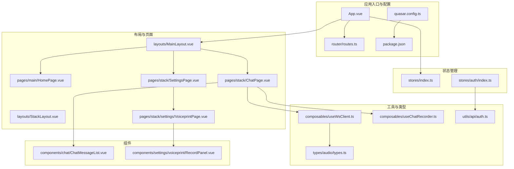
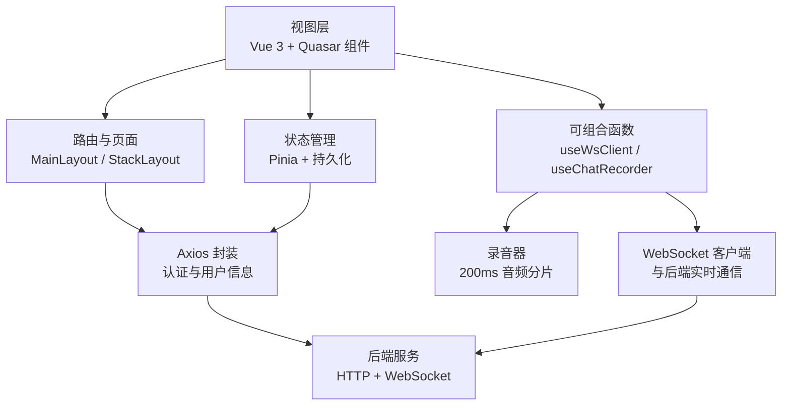
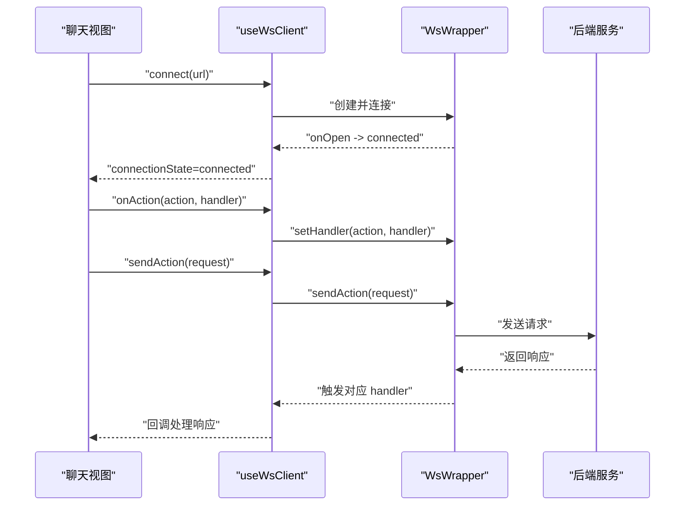
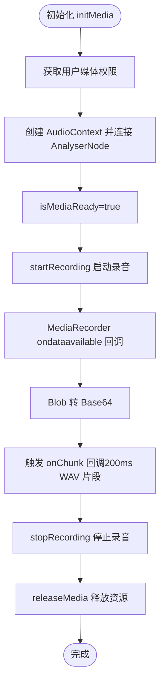
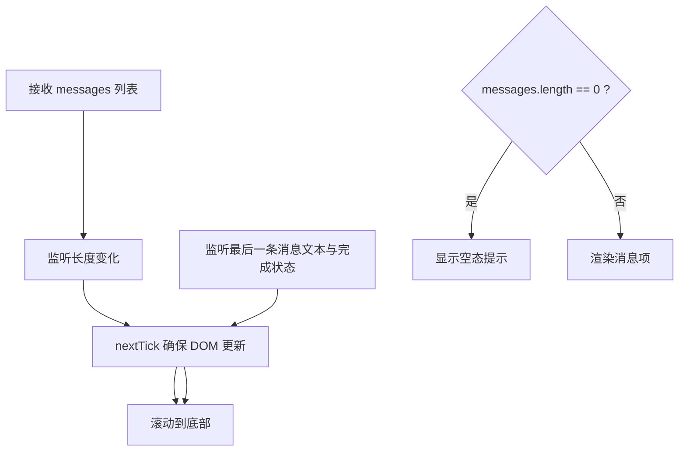
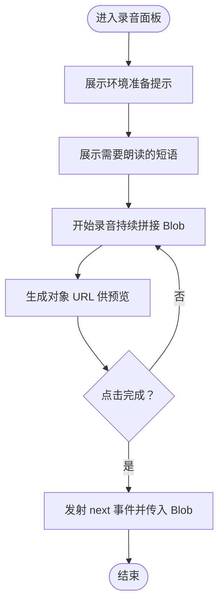
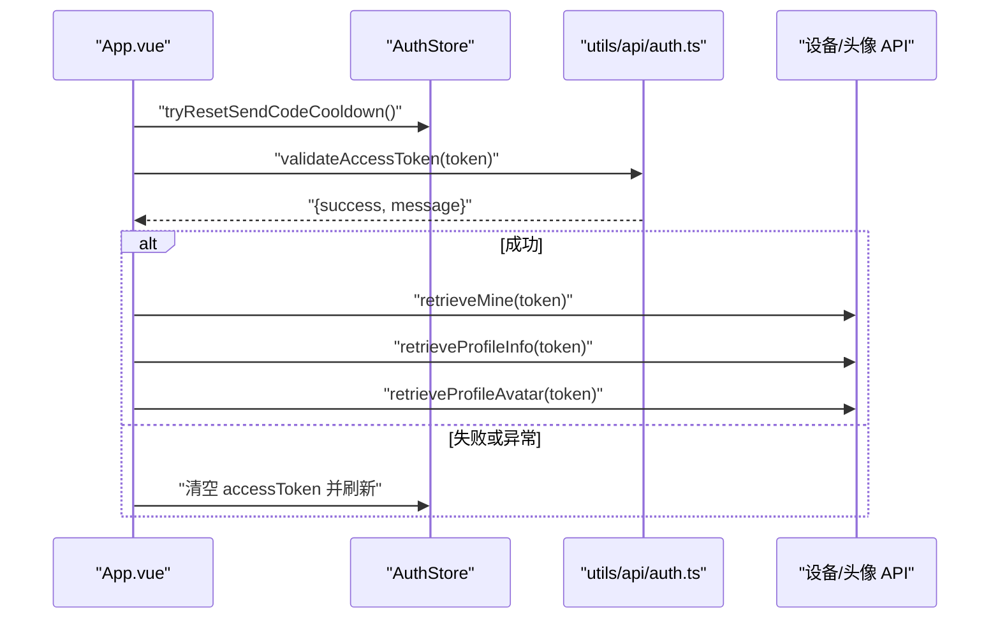
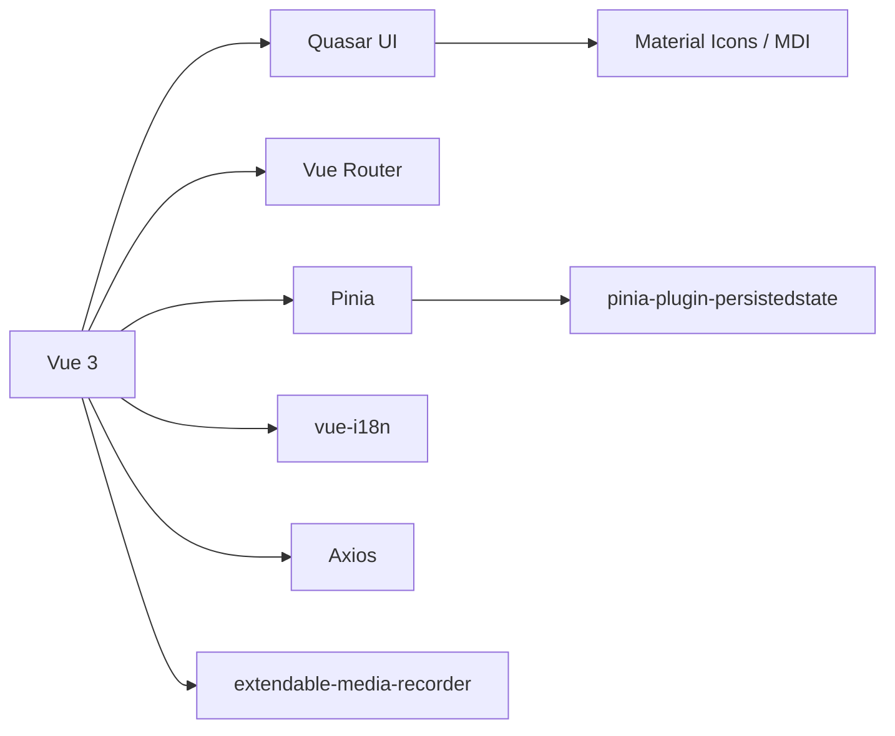

# 项目概述

<cite>
**本文引用的文件**
- [README.md](file://README.md)
- [package.json](file://package.json)
- [quasar.config.ts](file://quasar.config.ts)
- [src\App.vue](file://src\App.vue)
- [src\router\routes.ts](file://src\router\routes.ts)
- [src\stores\index.ts](file://src\stores\index.ts)
- [src\components\chat\ChatMessageList.vue](file://src\components\chat\ChatMessageList.vue)
- [src\components\settings\voiceprint\RecordPanel.vue](file://src\components\settings\voiceprint\RecordPanel.vue)
- [src\composables\useWsClient.ts](file://src\composables\useWsClient.ts)
- [src\composables\useChatRecorder.ts](file://src\composables\useChatRecorder.ts)
- [src\layouts\MainLayout.vue](file://src\layouts\MainLayout.vue)
- [src\stores\auth\index.ts](file://src\stores\auth\index.ts)
- [src\types\audio\types.ts](file://src\types\audio\types.ts)
- [src\utils\api\auth.ts](file://src\utils\api\auth.ts)
- [AGENTS.md](file://AGENTS.md)
</cite>

## 目录
1. [引言](#引言)
2. [项目结构](#项目结构)
3. [核心组件](#核心组件)
4. [架构总览](#架构总览)
5. [详细组件分析](#详细组件分析)
6. [依赖分析](#依赖分析)
7. [性能考虑](#性能考虑)
8. [故障排除指南](#故障排除指南)
9. [结论](#结论)
10. [附录](#附录)

## 引言
本项目是 Le Bot 智能语音助手平台的前端应用，面向设备管理、用户认证与语音特征（声纹）管理等场景，提供实时语音对话能力。项目采用 Vue 3 + Quasar 技术栈，结合 Pinia 状态管理、Axios 网络请求、国际化（i18n）、PWA 能力以及可插拔的媒体录制与 WebSocket 客户端封装，构建跨平台、可扩展且用户体验友好的语音交互界面。

Le Bot 前端与后端及嵌入式客户端共同组成完整的“乐宝”AI 机器人生态：前端负责用户交互与数据展示；后端提供业务逻辑与服务编排；嵌入式客户端运行于机器人硬件，实现唤醒词检测、音频采集与回放、与后端的 WebSocket 通信。

## 项目结构
项目采用按功能域划分的目录组织方式，核心模块包括：
- 应用入口与布局：App.vue、MainLayout.vue、StackLayout.vue
- 路由与页面：router/routes.ts、各功能页面（主页、聊天页、设置页、声纹页等）
- 组件库：chat、settings、auth、growth-data、home、me 等子目录
- 状态管理：stores 下按领域拆分（auth、chat、device、profile、settings）
- 工具与类型：utils、types（API 类型、音频类型、WebSocket 类型）
- 可组合函数：composables（useWsClient、useChatRecorder、useChatSession 等）
- 配置：quasar.config.ts（Quasar CLI 配置）、package.json（依赖与脚本）

图表来源
- [src\App.vue:1-85](file://src\App.vue#L1-L85)
- [src\router\routes.ts:1-160](file://src\router\routes.ts#L1-L160)
- [quasar.config.ts:1-278](file://quasar.config.ts#L1-L278)
- [src\stores\index.ts:1-36](file://src\stores\index.ts#L1-L36)
- [src\stores\auth\index.ts:1-35](file://src\stores\auth\index.ts#L1-L35)
- [src\components\chat\ChatMessageList.vue:1-68](file://src\components\chat\ChatMessageList.vue#L1-L68)
- [src\components\settings\voiceprint\RecordPanel.vue:1-104](file://src\components\settings\voiceprint\RecordPanel.vue#L1-L104)
- [src\composables\useWsClient.ts:1-103](file://src\composables\useWsClient.ts#L1-L103)
- [src\composables\useChatRecorder.ts:1-148](file://src\composables\useChatRecorder.ts#L1-L148)
- [src\types\audio\types.ts:1-14](file://src\types\audio\types.ts#L1-L14)
- [src\utils\api\auth.ts:1-28](file://src\utils\api\auth.ts#L1-L28)

章节来源
- [README.md:1-41](file://README.md#L1-L41)
- [package.json:1-61](file://package.json#L1-L61)
- [quasar.config.ts:1-278](file://quasar.config.ts#L1-L278)
- [src\router\routes.ts:1-160](file://src\router\routes.ts#L1-L160)

## 核心组件
- 应用入口与初始化：在应用挂载时进行访问令牌校验、设备与个人资料的本地同步，并根据登录状态决定是否重置状态与刷新页面。
- 路由与布局：支持移动端与桌面端差异化布局，主布局包含头部、侧边抽屉、页脚等区域；堆叠布局用于设置类页面的头部导航。
- 状态管理：使用 Pinia 进行全局状态管理，并启用持久化插件，确保用户会话与主题等状态在刷新后仍可用。
- 实时语音对话：通过可组合函数封装 WebSocket 客户端与录音器，实现与后端的双向流式音频与文本传输。
- 语音特征管理：提供声纹录入流程，包含环境提示、朗读短语引导、录音合并与下一步事件发射。
- 用户认证：提供邮箱验证码挑战、验证码登录、密码登录、重置密码等接口封装与冷却时间控制。

章节来源
- [src\App.vue:1-85](file://src\App.vue#L1-L85)
- [src\layouts\MainLayout.vue:1-51](file://src\layouts\MainLayout.vue#L1-L51)
- [src\stores\index.ts:1-36](file://src\stores\index.ts#L1-L36)
- [src\stores\auth\index.ts:1-35](file://src\stores\auth\index.ts#L1-L35)
- [src\components\chat\ChatMessageList.vue:1-68](file://src\components\chat\ChatMessageList.vue#L1-L68)
- [src\components\settings\voiceprint\RecordPanel.vue:1-104](file://src\components\settings\voiceprint\RecordPanel.vue#L1-L104)
- [src\composables\useWsClient.ts:1-103](file://src\composables\useWsClient.ts#L1-L103)
- [src\composables\useChatRecorder.ts:1-148](file://src\composables\useChatRecorder.ts#L1-L148)
- [src\utils\api\auth.ts:1-28](file://src\utils\api\auth.ts#L1-L28)

## 架构总览
前端采用分层架构：
- 视图层：Vue 3 单文件组件，配合 Quasar UI 提供响应式布局与交互控件。
- 业务层：可组合函数封装 WebSocket 与录音器，路由与页面组件协调视图与状态。
- 数据层：Pinia 状态管理，持久化存储用户会话与设置；Axios 封装 API 请求。
- 外部集成：后端 WebSocket 服务（实时语音）、HTTP 接口（认证与用户信息）、PWA 与国际化资源。

图表来源
- [src\composables\useWsClient.ts:1-103](file://src\composables\useWsClient.ts#L1-L103)
- [src\composables\useChatRecorder.ts:1-148](file://src\composables\useChatRecorder.ts#L1-L148)
- [src\utils\api\auth.ts:1-28](file://src\utils\api\auth.ts#L1-L28)
- [src\stores\index.ts:1-36](file://src\stores\index.ts#L1-L36)

## 详细组件分析

### WebSocket 客户端封装（useWsClient）
该可组合函数提供连接状态管理、动作处理器注册、请求发送与自动重连能力，屏蔽底层 WebSocket 生命周期细节，便于在聊天组件中统一处理服务端消息与错误。

图表来源
- [src\composables\useWsClient.ts:1-103](file://src\composables\useWsClient.ts#L1-L103)

章节来源
- [src\composables\useWsClient.ts:1-103](file://src\composables\useWsClient.ts#L1-L103)

### 实时录音器（useChatRecorder）
录音器基于 extendable-media-recorder 与 Web Audio API，提供 200ms 分片的 WAV 音频输出，并生成 AnalyserNode 用于静音检测。其设计兼顾实时性与准确性，适合语音对话场景。

图表来源
- [src\composables\useChatRecorder.ts:1-148](file://src\composables\useChatRecorder.ts#L1-L148)
- [src\types\audio\types.ts:1-14](file://src\types\audio\types.ts#L1-L14)

章节来源
- [src\composables\useChatRecorder.ts:1-148](file://src\composables\useChatRecorder.ts#L1-L148)
- [src\types\audio\types.ts:1-14](file://src\types\audio\types.ts#L1-L14)

### 聊天消息列表（ChatMessageList）
组件负责消息列表渲染与自动滚动，支持空态提示与流式文本更新时的滚动行为，提升用户阅读体验。

图表来源
- [src\components\chat\ChatMessageList.vue:1-68](file://src\components\chat\ChatMessageList.vue#L1-L68)

章节来源
- [src\components\chat\ChatMessageList.vue:1-68](file://src\components\chat\ChatMessageList.vue#L1-L68)

### 声纹录入面板（RecordPanel）
提供环境准备提示、朗读短语引导、录音合并与下一步事件发射，形成完整的声纹特征采集流程。

图表来源
- [src\components\settings\voiceprint\RecordPanel.vue:1-104](file://src\components\settings\voiceprint\RecordPanel.vue#L1-L104)

章节来源
- [src\components\settings\voiceprint\RecordPanel.vue:1-104](file://src\components\settings\voiceprint\RecordPanel.vue#L1-L104)

### 认证与会话管理
- 访问令牌校验：应用启动时对本地保存的令牌进行验证，成功则拉取设备与个人资料，失败或异常则清空登录状态。
- 冷却时间控制：验证码发送冷却时间计算与重置逻辑，避免频繁请求。
- Axios 封装：提供邮箱挑战、验证码登录、密码登录、重置密码等接口方法。

图表来源
- [src\App.vue:1-85](file://src\App.vue#L1-L85)
- [src\stores\auth\index.ts:1-35](file://src\stores\auth\index.ts#L1-L35)
- [src\utils\api\auth.ts:1-28](file://src\utils\api\auth.ts#L1-L28)

章节来源
- [src\App.vue:1-85](file://src\App.vue#L1-L85)
- [src\stores\auth\index.ts:1-35](file://src\stores\auth\index.ts#L1-L35)
- [src\utils\api\auth.ts:1-28](file://src\utils\api\auth.ts#L1-L28)

## 依赖分析
- 核心依赖：Vue 3、Quasar UI、Pinia、Vue Router、Axios、vue-i18n、extendable-media-recorder、vue-advanced-cropper 等。
- 开发依赖：Vite、TypeScript、ESLint、Prettier、Workbox（PWA）、unplugin-vue-i18n 等。
- 引擎要求：Node.js 18~28、npm 6.13.4+、yarn 1.21.1+。
- 配置要点：Quasar CLI 配置中启用 PWA、国际化插件、类型严格模式、浏览器目标与环境变量注入等。

图表来源
- [package.json:17-53](file://package.json#L17-L53)
- [quasar.config.ts:18-137](file://quasar.config.ts#L18-L137)

章节来源
- [package.json:1-61](file://package.json#L1-L61)
- [quasar.config.ts:1-278](file://quasar.config.ts#L1-L278)

## 性能考虑
- 录音分片与静音检测：200ms 分片降低延迟，配合 RMS 阈值与比例参数减少无效传输。
- 自动滚动优化：仅在消息数量变化或最后一条消息文本更新时滚动，避免频繁 DOM 操作。
- 状态持久化：Pinia 持久化减少重复请求与登录状态丢失带来的重绘成本。
- PWA 与缓存策略：Workbox 注入清单与缓存策略，提升离线与弱网场景下的加载速度。
- 浏览器目标：针对现代浏览器（Chrome/Firefox/Safari）优化打包与运行时性能。

## 故障排除指南
- WebSocket 未连接：检查连接状态与自动重连日志，确认后端地址与网络可达性。
- 录音无声音或权限被拒绝：确认浏览器权限已授予，麦克风设备可用，采样率与通道数符合预期。
- 消息不滚动：检查消息列表是否正确监听长度与文本变化，确保 DOM 更新后再滚动。
- 登录状态异常：核对访问令牌是否有效，必要时清除本地存储并重新登录。
- PWA 图标与清单路径：构建后检查 HTML 中 meta 与 manifest 的路径修正逻辑。

章节来源
- [src\composables\useWsClient.ts:1-103](file://src\composables\useWsClient.ts#L1-L103)
- [src\composables\useChatRecorder.ts:1-148](file://src\composables\useChatRecorder.ts#L1-L148)
- [src\components\chat\ChatMessageList.vue:1-68](file://src\components\chat\ChatMessageList.vue#L1-L68)
- [src\App.vue:1-85](file://src\App.vue#L1-L85)
- [quasar.config.ts:44-56](file://quasar.config.ts#L44-L56)

## 结论
Le Bot 前端项目以 Vue 3 + Quasar 为核心，围绕实时语音对话、用户认证与声纹管理构建了清晰的功能边界与可维护的代码结构。通过可组合函数抽象 WebSocket 与录音器、借助 Pinia 管理状态与持久化、配合国际化与 PWA 能力，项目在易用性、可扩展性与跨平台兼容性方面具备良好基础。结合嵌入式客户端与后端服务，整体形成从硬件到云端的一体化语音交互解决方案。

## 附录

### 系统要求
- Node.js 版本：^28 || ^26 || ^24 || ^22 || ^20 || ^18
- npm 版本：>= 6.13.4
- yarn 版本：>= 1.21.1
- 浏览器：现代浏览器（Chrome/Firefox/Safari），支持 Web Audio API 与 MediaRecorder

章节来源
- [package.json:54-58](file://package.json#L54-L58)

### 许可证信息
- 项目名称：le-bot-frontend
- 产品名称：Le Bot
- 作者：ParticleG <particle_g@outlook.com>
- 私有项目：true

章节来源
- [package.json:1-10](file://package.json#L1-L10)

### 版本历史
- 当前版本：1.2.6

章节来源
- [package.json:2-4](file://package.json#L2-L4)

### 技术选型背景
- Vue 3：组合式 API 提升逻辑复用与开发体验；与 Quasar 生态契合度高。
- Quasar：提供丰富的 UI 组件与响应式布局，快速实现跨平台界面。
- Pinia：轻量级状态管理，天然支持 TypeScript 与持久化插件。
- Axios：简洁的 HTTP 客户端，适配 REST API。
- extendable-media-recorder：可扩展的媒体录制器，支持 WAV 输出与分片。
- PWA：Workbox 注入清单，提升离线与缓存体验。
- 国际化：vue-i18n 与 unplugin-vue-i18n 插件，支持多语言资源管理。

章节来源
- [package.json:17-29](file://package.json#L17-L29)
- [quasar.config.ts:107-136](file://quasar.config.ts#L107-L136)

### 项目定位与生态
- 前端职责：设备管理、用户管理、数据可视化、声纹管理与实时语音对话。
- 后端职责：业务编排、鉴权、ASR/TTS 服务对接与 WebSocket 信令。
- 嵌入式客户端：运行于机器人硬件，负责唤醒词检测、音频采集与回放、与后端通信。

章节来源
- [AGENTS.md:1-163](file://AGENTS.md#L1-L163)